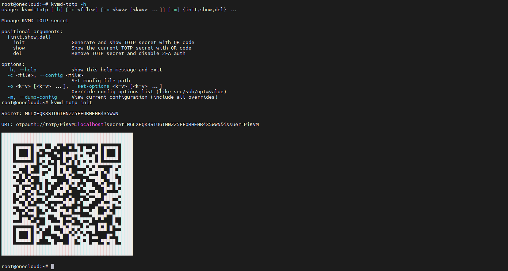
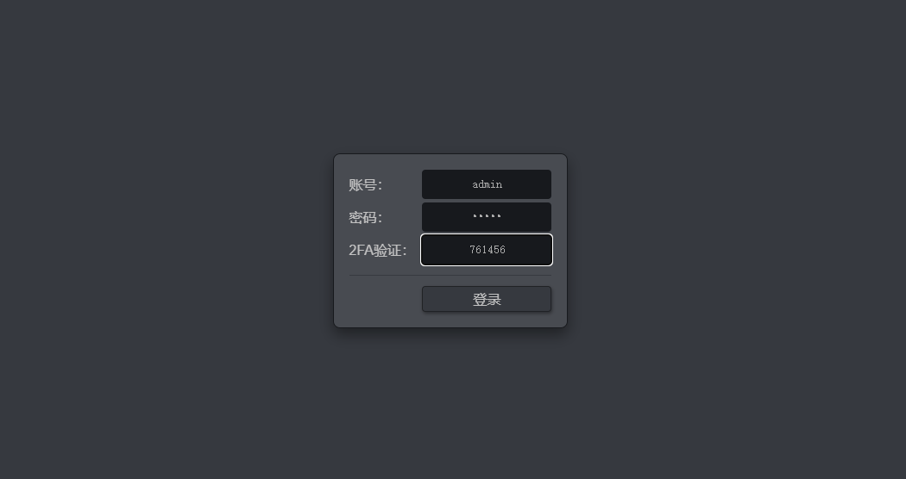

# 开启2FA验证

双重身份验证 2FA 是登录网站或应用时使用的额外保护层。启用 2FA 时，必须使用您的用户名和密码登录，并提供基于时间的一次性密码 TOTP。

首先登录 One-KVM 终端并切换至由 root 账户，执行命令 `kvmd-totp init` 生成 TOTP 密钥。

```bash
#查看PiKVM 2FA命令帮助
kvmd-totp -h

#生成2FA密钥并开启2FA验证
kvmd-totp init

#展示已有密钥
kvmd-totp show

#删除所有密钥并关闭2FA验证
kvmd-totp del
```



对于安卓移动设备，可以使用您喜欢的2FA程序，如 [Google Authenticator](https://play.google.com/store/apps/details?id=com.google.android.apps.authenticator2)，基本功能大同小异，这里以 Authing 令牌为例说明 2FA 使用方法：首先扫描二维码或手动输入添加密钥，然后再登入 PiKVM 网页时多输入一项6位数的一次性密码。

