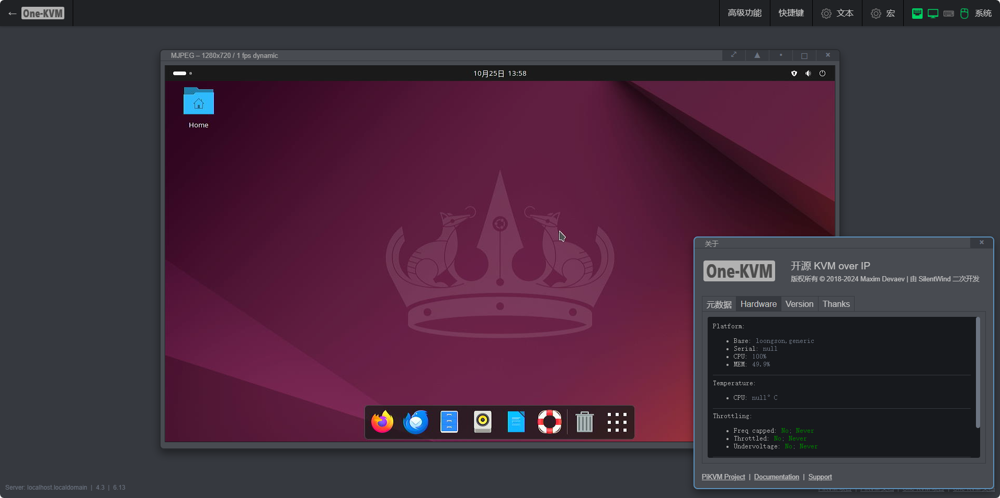
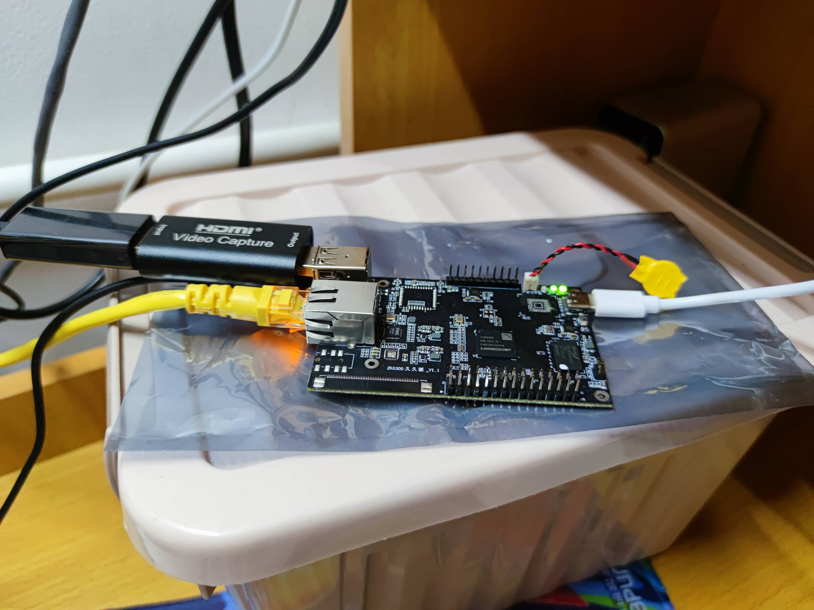

龙芯派 2K0300 久久派采用龙芯 2K0300 处理器，自主 LoongArch 架构，主频 1GHz，支持低功耗，支持触屏输入、力积 DDR4，提供千兆网口和多功能接口，采用标准 Type-C 接口供电。

龙芯久久派 One-KVM 整合包基于 loongnix 系统（旧世界）打包而成。

需要硬件：龙芯久久派、USB HDMI 采集卡、CH9329+CH340 一体线

**整合包说明**

!!! warning "提醒"
    虚拟存储驱动器（MSD）、虚拟 USB 网卡等虚拟USB设备等功能仅使用 OTG 端口模式时可用，请注意**使用 CH9329 HID 时不支持这些虚拟 USB 设备扩展功能**。

- 系统基于 loongix 预装 One-KVM 开箱即用，打包方式为系统 rootfs 压缩包，启动后访问 https://IP:443 即可。

- 受限于内存大小，包含 1g swap（文件位于/swap.img），系统原始文件总大小约为4.8G，对于久久派 TF 版本建议使用大于8G（含）的高速 TF 卡。

- 由于 OTG 功能需要按照官方文档进行硬改，所以这里使用 CH9329+CH340 一体线。内核已经加入了 OTG 模块并且 usb gadget 新建正常，如有需要高阶玩家可自行测试 OTG。

- 如果是久久派 TF 卡版本，理论上不用修改文件。如果是久久派 WIFI 卡版本，压缩包 /boot/ 目录下包含 vmlinuz-tf 和 vmlinuz-wifi，使用时按需重命名为 vmlinuz，再编辑 boot.cfg 设置启动项即可。

命令实例：

```bash
sudo fdisk -l
#假定 TF 卡路径为 /dev/sdc1
sudo mkfs.ext4 /dev/sdc1
mkdir /mnt/sdc1
sudo mount /dev/sdc1 /mnt/sdc1
#注意 --strip-components=2 参数去掉外面两层文件夹
sudo tar -zvxf One-KVM_by-SilentWind_2k0300_241025.tar.gz --strip-components=2 -C /mnt/sdc1 && sync
sudo nano boot.cfg
sudo cd /mnt/sdc1/boot
#按需重命名成 vmlinuz，修改boot.cfg
cp vmlinuz-tf vmlinuz
sudo nano boot.cfg
sudo umount /dev/sdc1
```


### 使用实例



