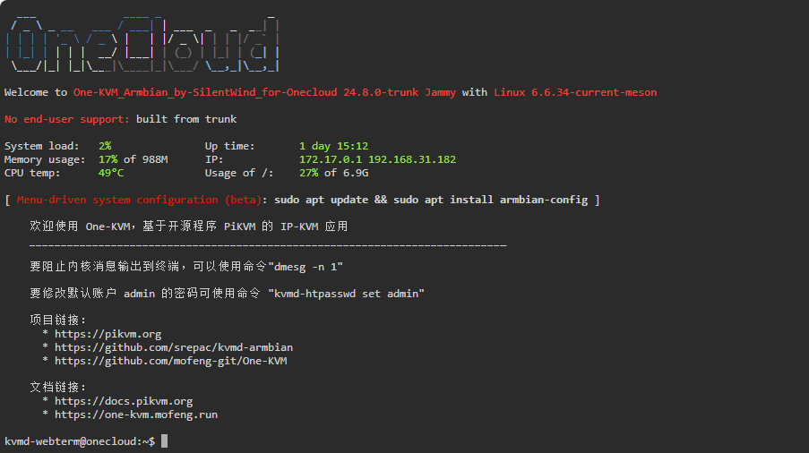

### 说明

网页终端默认登入的账户为 kvmd-webterm，根据用户需求，最新包 One-KVM_Armbian_by-SilentWind_for-Onecloud_24.6.18 中已将 kvmd-webterm 用户加入 sudo 权限组，可以直接使用 sudo 进行提权执行特权命令。

更早的版本中未配置此功能，kvmd-webterm 用户无法使用 `sudo` 命令，如需执行需要root权限的命令请先执行 `su root` 切换到 root 账户。

