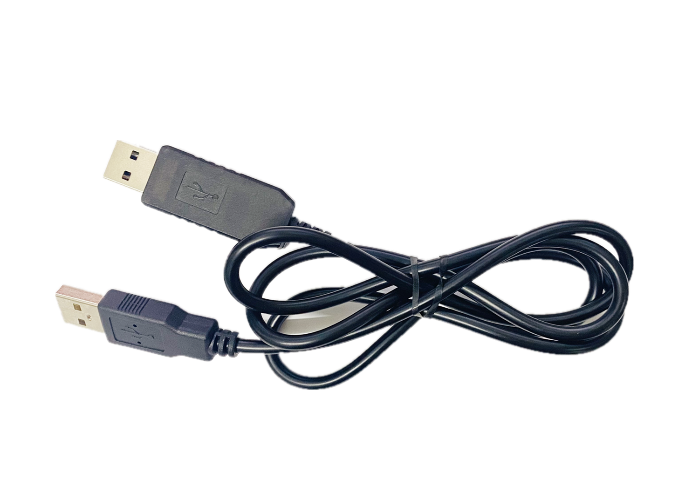

### 硬件介绍

CH9329 是一款串口转标准USB HID设备芯片，支持转换为键盘、鼠标或自定义HID设备。根据配置的工作模式，可在电脑上被识别为相应的标准USB设备。



!!! warning "使用注意"
    根据用户反馈，实际使用中可能出现设备断联的情况，建议采取以下措施来提高稳定性：

    - 将波特率调整为115200
    - 开启无操作 [鼠标抖动器](mouse_jiggler.md)

### 配置方法

可通过以下两种方式配置CH9329参数：

1. Docker部署时通过环境变量设置
2. 直接修改配置文件 `/etc/kvmd/override.yaml`

配置文件示例：
```yaml
kvmd:
    hid:
        type: ch9329
        device: /dev/ttyUSB0
        speed: 9600        # 串口通信速度
        read_timeout: 0.3
```

### 性能优化

使用[CH9329配置&测试工具](https://www.wch.cn/downloads/CH9329EVT_ZIP.html)可对设备进行以下优化：

1. **提升响应速度**

    - 将波特率从9600提升到115200
    - 同步修改One-KVM配置文件中的speed参数

    此调整有助于改善远程控制的操控体验。

2. **自定义设备标识**

    - 可修改USB设备的VID和PID
    - 支持配置USB字符串描述符


