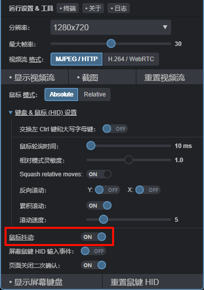

### 介绍

鼠标抖动器是一种用于模拟电脑鼠标运动的功能。它可以防止睡眠模式、待机模式或屏保启动。当目标主机上正在进行某些冗长的进程（如安装软件），而用户需要用侧视功能监控进程时，该功能就非常有用，用户无需手动移动鼠标来避开屏幕保护程序。

### 启用
要启用鼠标抖动器功能，必须更新到最新版本，并在 `/etc/kvmd/override.yaml` 中添加一些配置。

`active: true` 此行配置将允许鼠标抖动器功能在重启后自动激活运行，如果不希望这样，可以删除此行。

```yaml
kvmd:
    hid:
        jiggler:
            enabled: true
            active: true
```

添加配置后需要重启 kvmd 服务使配置生效。

```bash
sudo systemctl restart kvmd
```



### 算法

当鼠标抖动器功能处于启用状态时，程序会倒计时上次用户输入（即键盘或鼠标的任何操作）后的时间。如果超过 60 秒没有任何操作，标抖动器功能就会执行一次鼠标移动，然后再等待 60 秒，直到下一次迭代。

绝对模式：坐标会根据屏幕分辨率进行转换：`(-100, -100), wait, (100, 100), wait...` 相对坐标：`(-10, -10), wait, (10, 10), wait...`
即使网页关闭，鼠标抖动器功能也能在后台继续工作。

当然，此功能不会干扰用户的正常工作，如果用户正在使用键盘和鼠标进行交互，此程序不会引入干扰，直到它发现闲置时间超过了 60 秒的阈值。

