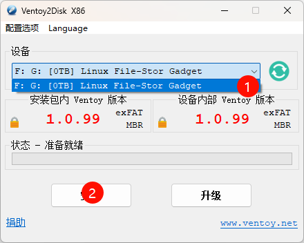
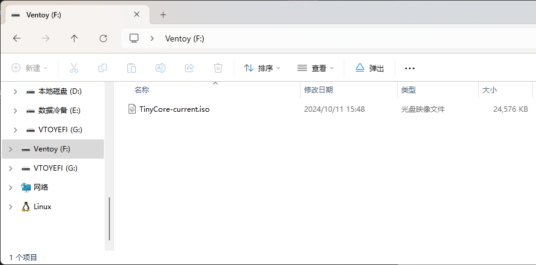
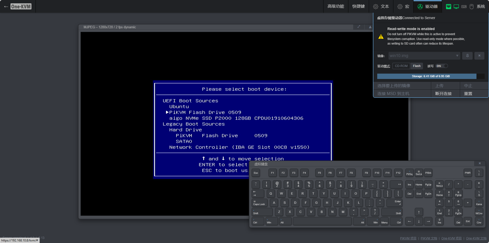
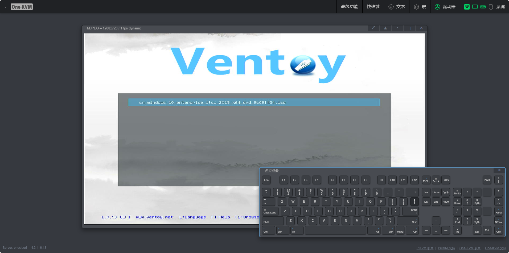
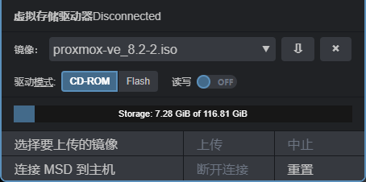
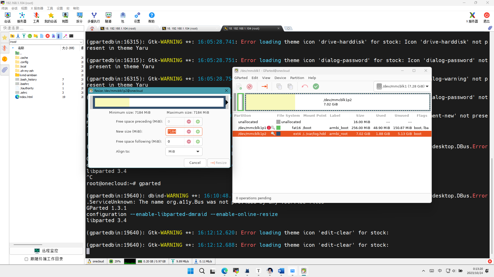

**MSD**（Mass Storage Drive）是一个强大的大容量存储设备功能，可以让 One-KVM 模拟虚拟 CD/DVD 或闪存驱动器。这使得您可以在 BIOS/UEFI 中使用实时磁盘来恢复操作系统或重新安装系统。

!!! info "MSD 功能说明"

    - CD-ROM 镜像文件最大支持 2.2 GB（Linux 内核限制），特别适配的 Linux 系统无此限制（暂支持玩客云和私家云二代）
    - Flash 格式镜像文件大小无限制

!!! warning "注意事项"
    对于玩客云，请不要在 USB 双公线（OTG线）与被控机断开或被控机关机时使用解除镜像挂载功能（断开连接），否则会因 USB OTG 端口操作不可用导致内核持续报错，日志服务占用 CPU 100%，系统稳定性下降。这时除非 USB OTG 连接恢复正常，MSD 功能会一直保持不可用状态。

-----

### MSD 功能使用

#### 基本配置

20241004 版本以后，MSD 功能默认启用（使用 /var/lib/kvmd/msd 目录），由挂载分区变化为直接使用目录。

#### 手动上传镜像

One-KVM 将镜像文件存储在 `/var/lib/kvmd/msd` 目录，将镜像文件上传到此目录即可。

#### 修改 MSD 路径

整合包 201204 版本以后，MSD 功能可在配置文件 `/etc/kvmd/override.yaml` 中任意指定目录。若无权限可执行 `chown kvmd -R /var/lib/kvmd/msd/` 使自定义目录可写。

```yaml
kvmd:
    msd:
        msd_path: /var/lib/kvmd/msd
```

#### 可写闪存驱动器

在 One-KVM 上模拟闪存驱动器时，您可以允许目标主机将文件写入镜像。停止驱动器后，可以在本地主机上下载并打开此映像。这对于从目标主机获取文件非常有用。

#### 制作 ventoy 可引导镜像

对于 20241004 （不包含）以下版本，操作目录时需要先执行 `kvmd-helper-otgmsd-remount rw` 手动将内部存储重新挂载为读写模式。

1. 在 `/var/lib/kvmd/msd` 目录创建一个空的镜像文件，大小按需设置。本例中文件名为flash.img，大小为 4096MB。

    ```bash
    dd if=/dev/zero of=/var/lib/kvmd/msd/flash.img bs=1M count=4096 status=progress
    ```

2. 网页菜单选择驱动器 --> 镜像 --> flash.img，并将驱动模式由 cd-rom 切换为 flash，单击连接 MSD 至主机。

3. 被控机打开 ventoy ，选择虚拟的磁盘安装软件。
    

4. 将系统镜像放入 ventoy 分区文件夹。
    

结束后此 flash 镜像制作完成，在需要的时候挂载引导即可。






-----

### 附录：旧版本 MSD 分区挂载说明

!!! note "MSD 分区挂载（20241004 版本之前）"

    若仍然需要新建分区挂载，需在 `/etc/kvmd/override.yaml` 中注释 msd 的子选项 `remount_cmd: /bin/true` 为 `#remount_cmd: /bin/true`，使 MSD 分区具有正确的权限。

    下面三种方式任选其一即可。对于新手，第三种方法更为推荐，使用虚拟磁盘文件做 MSD 分区，无需对物理磁盘进行分区，操作更加安全和简单。

    ??? note "使用玩客云 EMMC 空间"
        作者在安装篇的网盘链接中提供了包含此软件的系统镜像（网盘路径：/One-KVM 相关/gparted_on_armbain_usbdisk.zip），刷入U盘后将U盘插到玩客云网口旁的USB口插电启动，连接ssh（root/1234）输入`gparted`即可启动磁盘分区软件。

        如果没有打开如图所示的Gparted软件界面请检查你的ssh终端是否支持X11转发功能。

        在打开的Gparted界面右键 /dev/mmcblp1p2 选择 Resize/Move 来调整分区，在Free space following框中输入新建分区的大小（可输入4096），再将分出来的空闲空间格式化为ext4格式，最后点击主界面选项卡下的"√"应用刚才的选择即可。

        

        

    ??? note "使用SD卡"
        建议不要使用杂牌储存卡（部分杂牌储存卡反应为Windows正常、Linux能识别但无法访问和读写）。

        ```bash
        #查看TF卡位置
        fdisk -l
        #将其格式化为ext4文件格式（将sdx替换为你的设备地址）
        mkfs.ext4 /dev/sdx
        ```

    ??? note "使用虚拟磁盘文件"
        通过新建一个新的 img 文件用作 MSD 文件系统，此方法已经过测试。

        ```bash
        #虚拟磁盘创建示例代码，512单位为 1M 的倍数，这个数字可以替换成你所需要的容量
        dd if=/dev/zero of=/root/diska.img bs=1M count=512
        mkfs.ext4 /root/diska.img
        ```

    **挂载分区**

    请确认要挂载的分区路径，不要出错（如/dev/mmcblk1、/dev/mmcblk0p3、/root/diska.img），这里以 /dev/mmcblk0 为例。

    ```bash
    #查看系统所有分区
    df -h

    #在文件末尾添加如下挂载，如为/dev/mmcblk0需自行替换
    nano /etc/fstab

    /dev/mmcblk0p3 /var/lib/kvmd/msd  ext4  nofail,nodev,nosuid,noexec,rw,errors=remount-ro,data=journal,X-kvmd.otgmsd-root=/var/lib/kvmd/msd,X-kvmd.otgmsd-user=kvmd  0 0

    #如果挂载操作报错请检查并修正错误
    mount /dev/mmcblk0p3

    #开启MSD功能，到/etc/kvmd/override.yaml修改msd选项为otg
    nano /etc/kvmd/override.yaml
    systemctl restart kvmd-otg kvmd
    ```

    **手动上传镜像**。

    One-KVM 将镜像文件存储在一个特殊的分区中，该分区挂载在 `/var/lib/kvmd/msd` 目录。如果该分区无法写入说明该分区是只读的，可执行下列命令。

    ```bash
    #使 MSD 分区可写
    sudo kvmd-helper-otgmsd-remount rw

    #手动上传镜像文件到 /var/lib/kvmd/msd 目录

    #使 MSD 分区只读
    sudo kvmd-helper-otgmsd-remount ro
    ```