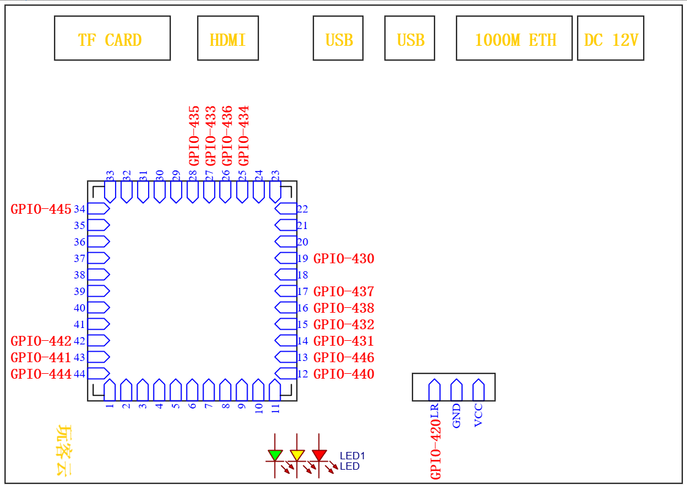
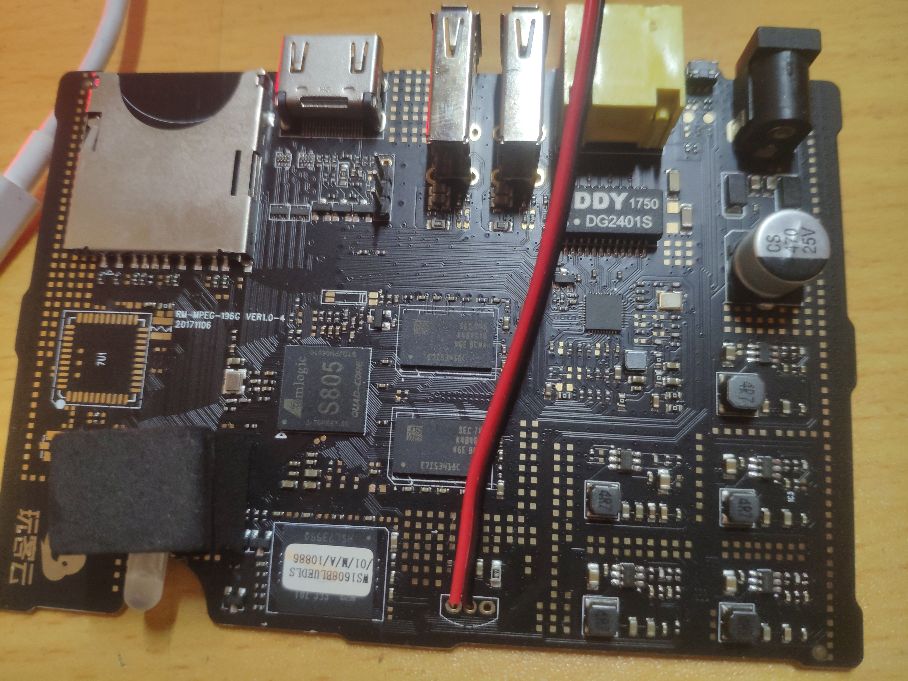
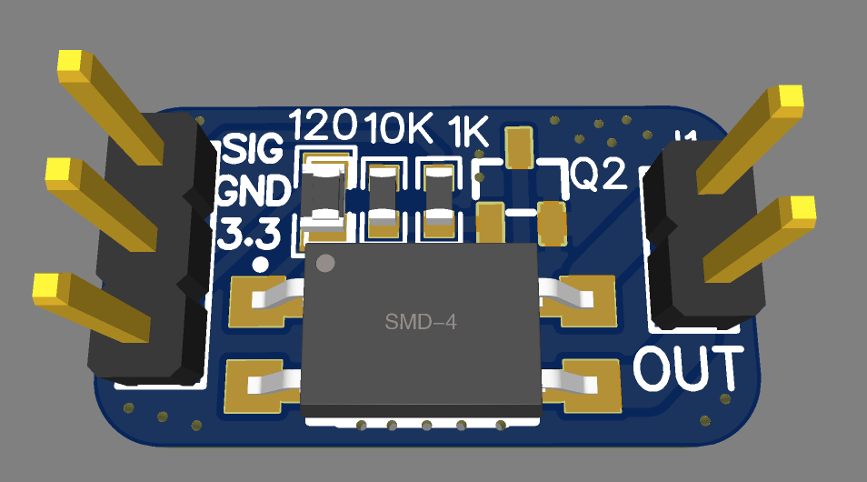

### 玩客云 GPIO 引脚介绍
玩客云 WIFI 焊盘计数规则，从左下角开始逆时针增加。



引脚编号对照关系如下表。

```
GPIO-430 默认in 1 可用 连接焊盘19脚
GPIO-431 默认in 1 可用 连接焊盘14脚
GPIO-432 默认in 1 可用 连接焊盘15脚
GPIO-433 默认in 1 可用 连接焊盘27脚
GPIO-434 默认in 1 可用 连接焊盘25脚
GPIO-435 默认in 1 可用 连接焊盘28脚
GPIO-436 默认in 1 可用 连接焊盘26脚
GPIO-437 默认in 1 可用 连接焊盘17脚
GPIO-438 默认in 1 可用 连接焊盘16脚
GPIO-440 默认in 1 可用 连接焊盘12脚
GPIO-441 默认in 1 可用 连接焊盘43脚
GPIO-442 默认in 1 可用 连接焊盘42脚
GPIO-444 默认in 1 可用 连接焊盘44脚
GPIO-445 默认in 1 可用 连接焊盘34脚
GPIO-446 默认in 1 可用 连接焊盘13脚
```

以26号焊盘为例：

1. 由物理 WIFI 空焊盘位置26空位，根据焊盘表格得到 sysfs gpio 编号 gpio-436，如果是 6.x 高 Linux 内核系统需要加上91的偏移量为 gpio-527。

2. 再根据gpio软件标识名称 "J2 Header Pin 16" 找到 gpioinfo 编号 gpiochip0 line7。

3. 得到脚本文件所需内容，将内容替换写入 `/etc/kvmd/custom_atx/gpio.sh`。

    ```bash
    gpioset -m time -s 1 gpiochip0 7=0
    gpioset gpiochip0 7=1
    ```

### GPIO直连

!!! warning
    可能不适于非标准定义的ATX电源管理设备。<br><br>
    用户反馈：若使用华南金牌X99-F8和K9-ETH主板，GPIO脚要插入开机跳线7脚，GND脚需要插入9脚（普通RST开机跳线是57脚），如果插入57脚RST键将不会起作用；如果GPIO和GND插反了主板跑码FF，无法开机。

此教程在新旧版玩客云上测试通过，操作无差别，适合DIY玩家参考。通过使用玩客云红外接口预留的GPIO接口连接主板9PIN中的开机针脚实现物理控制开机、关机和强制关机的功能。

物理控制开关机只需要一个GPIO接口（两者都是3.3V）。

整个操作并不复杂，首先需要在玩客云主板的红外模块预留接口焊上两根引线（接在图中GPIO-420和GND位置），然后接驳开机线（GPIO接开机引脚正极，GND接开机引脚负极）。





<!--无用内容，等待清理-->

### 光耦开机小板




