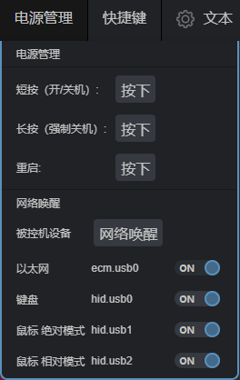

### 动态 USB 配置

One-KVM 模拟许多 USB 设备以确保正常运行：键盘、鼠标和大容量存储驱动器。 此外，还可能存在额外的相对鼠标， 或用户配置的 USB 以太网或串行端口。

在极少数情况下，被控机 BIOS/UEFI 可能无法识别单个 USB 端口上如此多的模拟设备， 因此其中一些可能需要禁用。USB 重新配置一般需要重新启动，但使用此命令临时禁用已配置的现有模拟设备说可以无需重新冷启动。

该命令可以实时查看和修改 USB 配置，它需要root权限才能运行：`kvmd-otgconf`

```bash
#查看配置
root@onecloud:~#  kvmd-otgconf
+ ecm.usb0  # Ethernet
+ hid.usb0  # Keyboard
+ hid.usb1  # Absolute Mouse
+ hid.usb2  # Relative Mouse
```

每行代表一个设备（功能），行首是加号或减号（表示设备打开或关闭），然后是设备的名称及其描述。

```bash
#禁用设备和启用设备
root@onecloud:~# kvmd-otgconf --disable-function ecm.usb0
- ecm.usb0  # Ethernet
+ hid.usb0  # Keyboard
+ hid.usb1  # Absolute Mouse
+ hid.usb2  # Relative Mous
root@onecloud:~# kvmd-otgconf --enable-function ecm.usb0
+ ecm.usb0  # Ethernet
+ hid.usb0  # Keyboard
+ hid.usb1  # Absolute Mouse
+ hid.usb2  # Relative Mouse
```

### 网页菜单

你还可以通过网页界面中的菜单控制伪 GPIO 驱动程序。

要设置伪 GPIO 驱动程序菜单，可以使用 `kvmd-otgconf --make-gpio-config` 生成配置，并将其合并到  `/etc/kvmd/override.yaml`。

```yaml
root@onecloud:~# kvmd-otgconf --make-gpio-config
kvmd:
    gpio:
        drivers:
            otgconf:
                type: otgconf
        scheme:
            ecm.usb0:
                driver: otgconf
                mode: output
                pin: ecm.usb0
                pulse: false
            hid.usb0:
                driver: otgconf
                mode: output
                pin: hid.usb0
                pulse: false
            hid.usb1:
                driver: otgconf
                mode: output
                pin: hid.usb1
                pulse: false
            hid.usb2:
                driver: otgconf
                mode: output
                pin: hid.usb2
                pulse: false
        view:
            table:
                - ['#Ethernet', '#ecm.usb0', ecm.usb0]
                - ['#Keyboard', '#hid.usb0', hid.usb0]
                - ['#Absolute Mouse', '#hid.usb1', hid.usb1]
                - ['#Relative Mouse', '#hid.usb2', hid.usb2]
```

