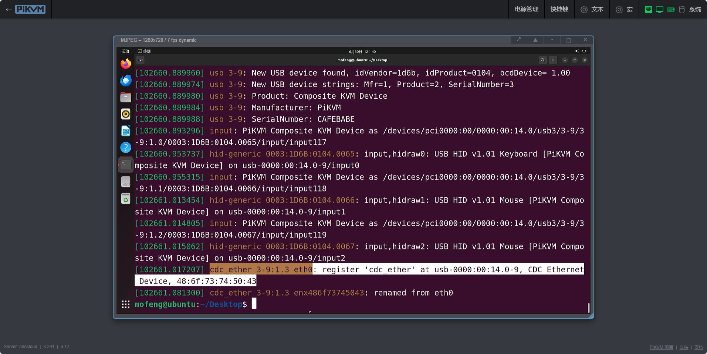
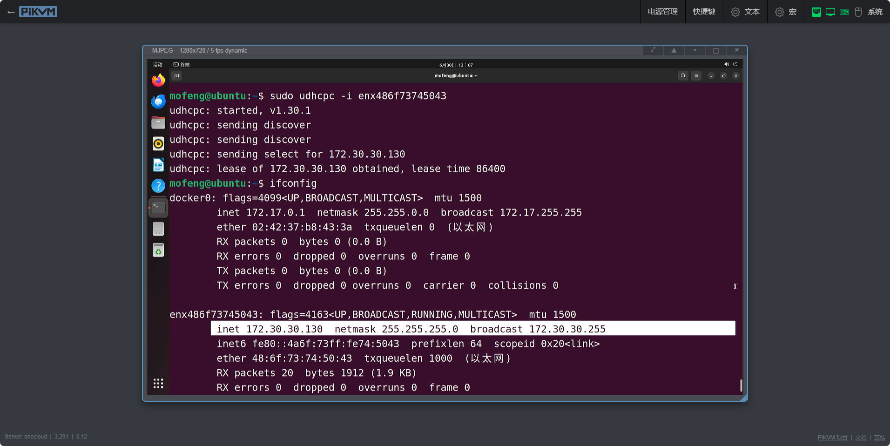
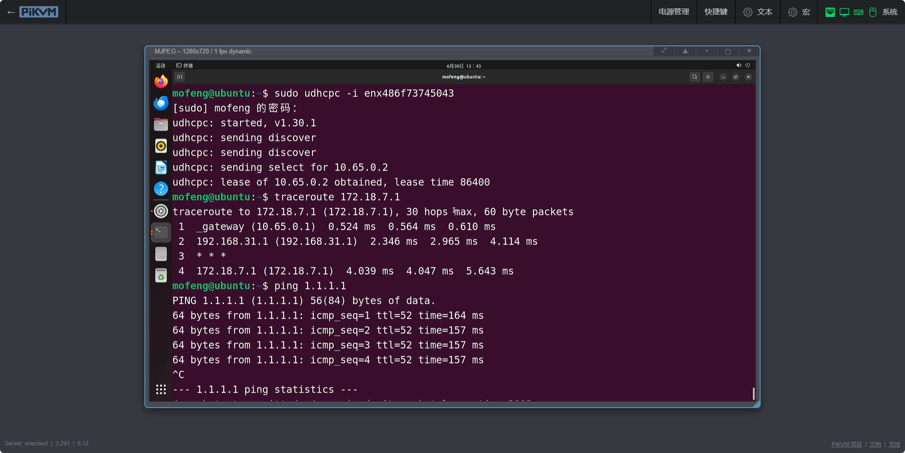

### 基本配置

1. 编辑 `/etc/kvmd/override.yaml` 文件添加配置：
    ```yaml
    otg:
        devices:
            ethernet:
                enabled: true
                driver: ecm
                host_mac: 48:6f:73:74:50:43  # 被控机网络接口的MAC地址
                kvm_mac: 42:61:64:55:53:42   # PiKVM usb0接口的MAC地址
    ```

    **驱动程序兼容性：**

    | 驱动程序 | 操作系统                               |
    | :------- | :------------------------------------- |
    | ecm      | Linux macOS                            |
    | eem      | Linux                                  |
    | rndis5   | 从Windows XP到Windows 7 Linux > 2.6.13 |
    | rndis    | Windows 7及以上 Linux > 2.6.13         |
    | ncm      | Windows 10及以上 Linux > 2.6.37 macOS  |

    

2. 启用 `kvmd-otgnet` 服务进行自动配置：
    ```bash
    sudo systemctl start kvmd-otgnet
    sudo systemctl enable kvmd-otgnet
    ```

    > 注意：服务启动后，被控机可能需要手动获取IP：
    ```bash
    # Ubuntu 22.04测试通过
    ifconfig -a                # 查看网络接口名称
    sudo apt install udhcpc   # 安装 DHCP 客户端
    udhcpc -i <接口名称>      # 获取 IP 地址
    ```

    
    如果要允许从被控机访问 One-KVM 界面，则、需要使用 `/etc/kvmd/override.yaml` 文件在白名单中添加端口 80 和 443，如下所示：
    ```yaml
    otgnet:
        firewall:
            allow_tcp: [80, 443]
    ```

### 路由转发

要启用被控机访问外部网络的功能，需要：

1. 开启IPv4转发：
    ```bash
    echo "net.ipv4.ip_forward = 1" > /etc/sysctl.d/99-kvmd-extra.conf
    ```

2. 配置网络参数（在 `/etc/kvmd/override.yaml` 中）：
    ```yaml
    otgnet:
        firewall:
            forward_iface: eth0    # 指定外部网络接口
        commands:
            post_start_cmd_append:
            - "--dhcp-option=6,8.8.8.8"    # 配置DNS服务器
        iface:
            net: 10.65.0.0/28    # 设置不同于主网络的地址段
    ```

3. 重启 One-KVM。`reboot`
    

### Windows 系统配置

对于 Windows 系统：

1. 使用 `rndis` 驱动
2. Windows 7 及以上版本会自动安装驱动
3. Windows XP 至 Windows 7 需要手动安装 RNDIS 5 驱动

配置完成后，可以通过 ping 命令测试连接。

   


