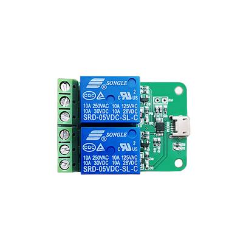
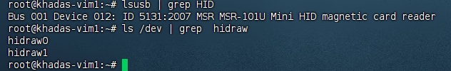

### USB 继电器实现 ATX 电源管理

#### 硬件要求

- 设备型号：LCUS_HID USB 继电器
- 设备路径：`/dev/hidraw0`




#### 配置说明

在启动 Docker 容器时，需要：

1. 映射继电器设备
2. 设置环境变量 `ATX=USBRELAY_HID`

#### 部署示例

以下是私家云二代的完整部署命令：

```bash
docker run --name kvmd -itd --privileged=true \
    -v /dev:/dev -v /sys/kernel/config:/sys/kernel/config \
    -v /lib/modules:/lib/modules:ro -e OTG=1 -e VIDEONUM=1 -e ATX=USBRELAY_HID \
    -p 8080:8080 -p 4430:4430 -p 5900:5900 -p 623:623 \
    silentwind0/kvmd
```

#### 演示视频


