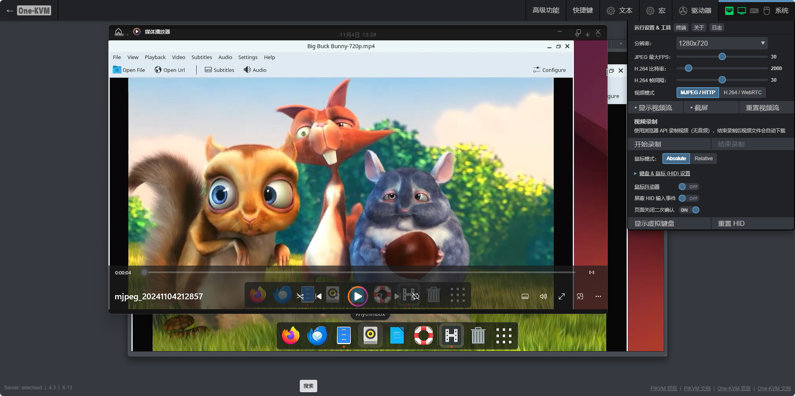

### 视频录制功能

One-KVM 支持前端和后端两种视频录制方式，您可以根据需求选择合适的方案。

#### 前端录制

!!! note "浏览器录制"
    前端录制功能由浏览器的 MediaStream Recording API 实现，支持：
    
    - MJPEG 视频模式（无音频）
    - H.264/WebRTC 视频模式（可包含音频）
    - 自动下载录制文件（WebM 格式）

**使用方法**

1. 点击网页右上角 --> 系统 --> 开始录制
2. 系统开始录制当前视频画面
3. 点击结束录制后，浏览器自动下载录制文件



#### 后端录制

!!! tip "命令行录制"
    后端录制使用 ustreamer-dump 工具，支持：

    - 多种视频编码格式
    - 实时转码功能
    - 灵活的命令行选项

**录制原始码流**

```bash
# 录制 H.264 视频码流（需启用 H.264）
ustreamer-dump -s kvmd::ustreamer::h264 -o video-record.h264

# 录制 MJPEG 视频码流（需启用 MJPEG）
ustreamer-dump -s kvmd::ustreamer::jpeg -o video-record.mjpeg

# 录制 YUYV 视频码流（需启用 YUYV）
ustreamer-dump -s kvmd::ustreamer::yuyv -o video-record.yuyv
```

**实时转码为 MP4**

```bash
# MJPEG 转 MP4
ustreamer-dump -s kvmd::ustreamer::jpeg -o - | \
    ffmpeg -use_wallclock_as_timestamps 1 -i pipe: -c:v libx264 video-record.mp4

# H.264 转 MP4
ustreamer-dump -s kvmd::ustreamer::h264 -o - | \
    ffmpeg -use_wallclock_as_timestamps 1 -i pipe: -c:v libx264 video-record.mp4
```

!!! tip "查看帮助"
    使用 `ustreamer-dump --help` 可以查看更多命令行选项和用法说明。
