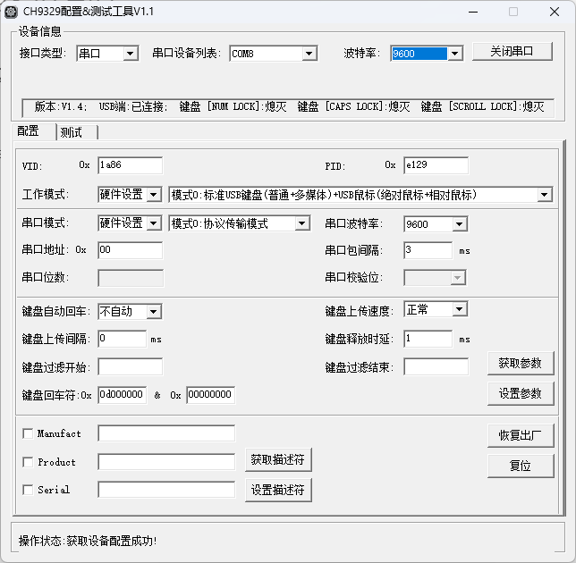

### 硬件介绍

CH9329 是一款串口转标准USB HID设备(键盘、鼠标、自定义HID)芯片，根据不同的工作模式，在电脑上可被识别为标准的USB键盘设备、USB鼠标设备或自定义HID类设备。


### 配置示例

对于Docker 版用户，可在部署时通过环境变量设置 CH9329 参数。

也可到 `/etc/kvmd/override.yaml` 替换添加如下配置内容，`speed` 参数为串口通信速度。

```yaml
kvmd:
    hid:
        type: ch9329
        device: /dev/ttyUSB0
        speed: 9600
        read_timeout: 0.3
```

### 参数优化

可下载[CH9329配置&测试工具](https://www.wch.cn/downloads/CH9329EVT_ZIP.html)对硬件参数进行修改。

通过提供的上位机软件，用户可自行配置芯片工作模式、串口通信模式、串口通信波特率、多种超时时间、VID、PID，以及各种USB字符串描述符。

这里推荐用户将串口通信波特率从 9600 修改为 115200 （同时还需要修改 One-KVM 配置文件的CH9329 speed 参数），CH9329 延迟将大幅减小，网页远程控制体验将大幅提升。

如有对抗检测的需要，也可以自行修改 USB 设备标识 VID 和 PID。



