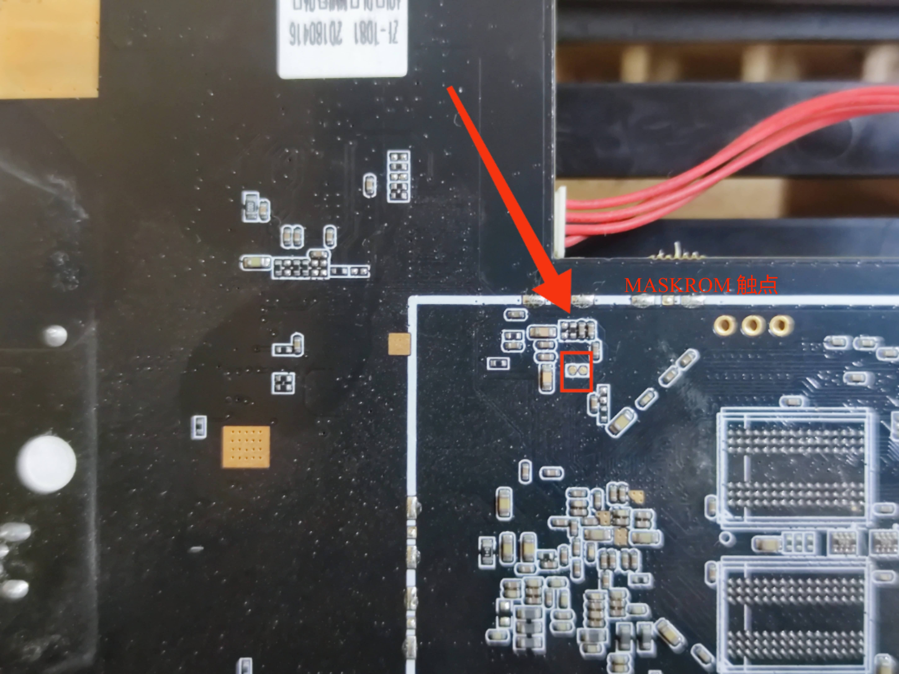
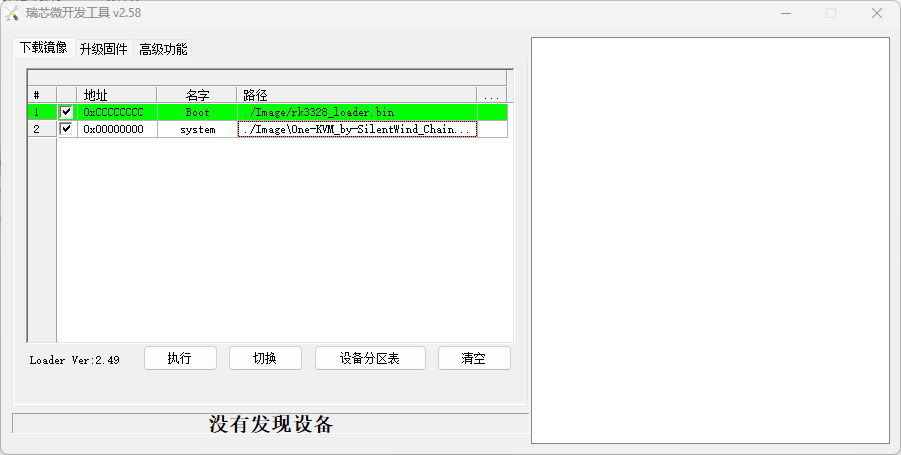
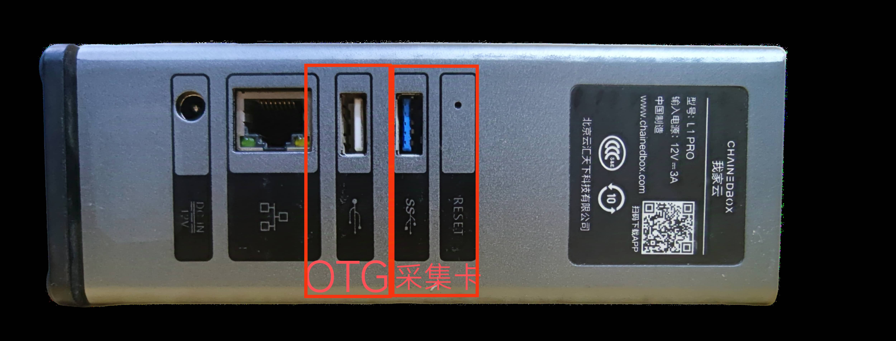

### 硬件介绍

我家云盒子采用了 RK3328 CPU，搭配 1GB 内存和 8GB 内部储存空间。它内置了一个3.5寸SATA硬盘位，配备了一个千兆网络接口、一个 USB 3.0接口和一个 USB 2.0接口（后者可作为 OTG 口使用）。

### 整合包部署

1. **准备工作**：准备好One-KVM整合包文件，在电脑上安装打开瑞芯微开发工具。
2. **拆机短接**：USB 双工线连接盒子 USB 2.0接口，短接盒子主板 MASKROM 触点后通电，我家云盒子将进入MASKROM模式。此时，瑞芯微开发工具软件应能识别到设备。
3. **刷入固件**：在瑞芯微开发工具中选择您准备好的 One-KVM 整合包文件，并执行刷机流程。刷机完成后，重新给我家云盒子通电会启动新刷入的 One-KVM 系统。

### 使用说明

!!! tip "提醒"
    部分低功耗设备在未接通电源时可能通过 USB 线从我家云 OTG 口取电并启动至异常状态，再接通电源也无法启动。要解决此问题，您可以剥开 USB 线剪断红色5V细电线。

**SSH**

Armbian 系统默认开启 SSH，SSH 初始用户密码为 root/1234。

!!! warning "警告"
    不建议使用 `apt upgrade` 升级内核和设备树，可能会出现系统异常，OTG 功能无法使用。

**硬件连接**

我家云 USB2.0 口为 OTG 口接 USB 双公线，USB3.0 口为普通 USB 口接 USB HDMI 采集卡。

