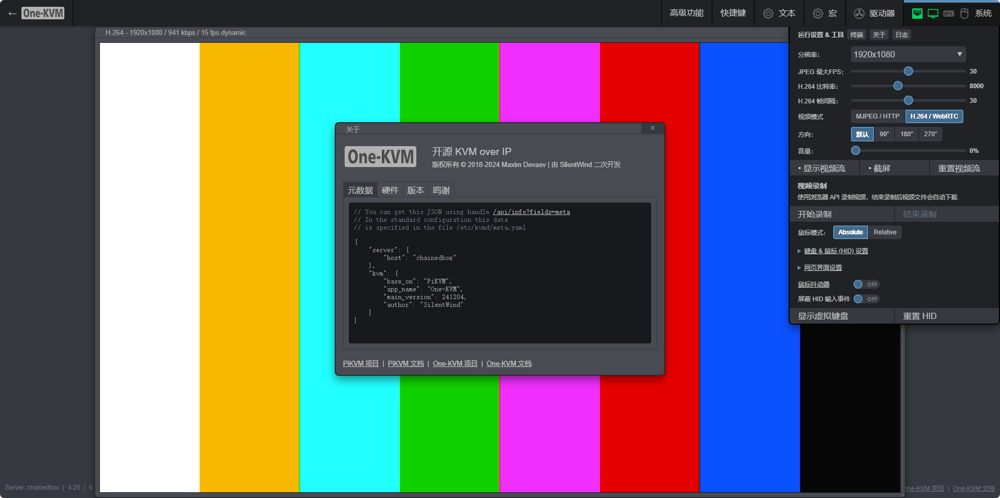

### 硬件介绍

我家云使用了 RK3328 CPU，1GB DDR3 的内存和 8GB 的 ROM 储存空间，以及，内置了 3.5 寸 SATA 硬盘位，配备了一个千兆网络接口，一个 USB3.0 接口和一个 USB2.0 接口，机身大小为 187*57*157mm。

### 整合包部署

大致流程：

- 电脑安装好驱动，打开瑞芯微开发工具软件界面，选择 One-KVM 整合包文件。

- 我家云拆机，USB.20 接口连接电脑，然后短接我家云主板 MASKROM 触点并通电使其进入 MASKROM 模式

- 待瑞芯微开发工具软件界面提示找到 MASKROM 设备后点击执行刷入作者提供的整合包即可。刷完之后重新给我家云通电就能启动 One-KVM 系统。

我家云主板 MASKROM 触点位置如下图。

### 使用说明

!!! tip
    部分低功耗设备在未接通电源时可能通过 USB 线从我家云 OTG 口取电并启动至异常状态，再接通电源也无法启动。要解决此问题，您可以剥开 USB 线剪断红色5V细电线。

**SSH**

Armbian 系统默认开启 SSH，SSH 初始用户密码为 root/1234。

**硬件连接**

我家云 USB2.0 口为 OTG 口接 USB 双公线，USB3.0 口为普通 USB 口接 USB HDMI 采集卡。

**软件截图**

