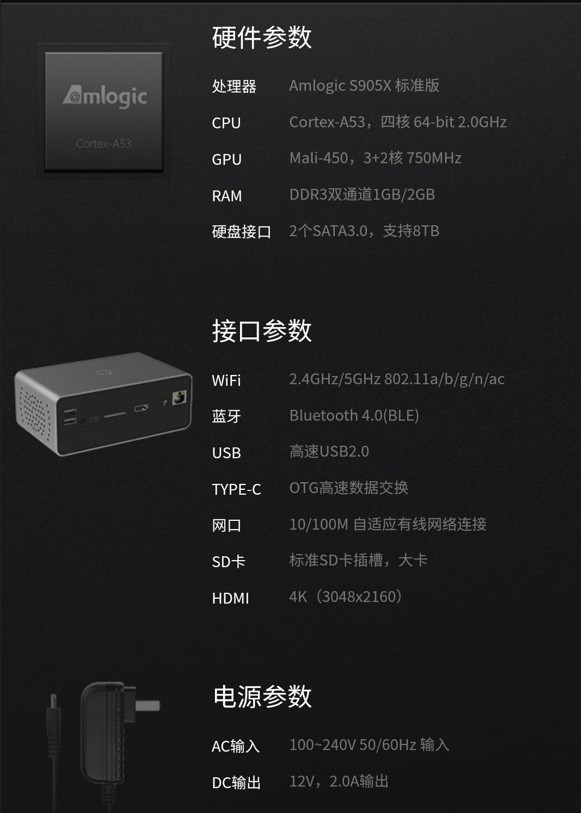
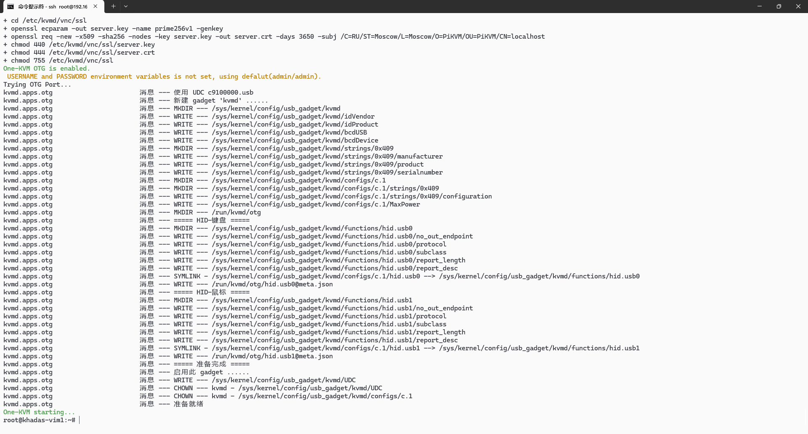
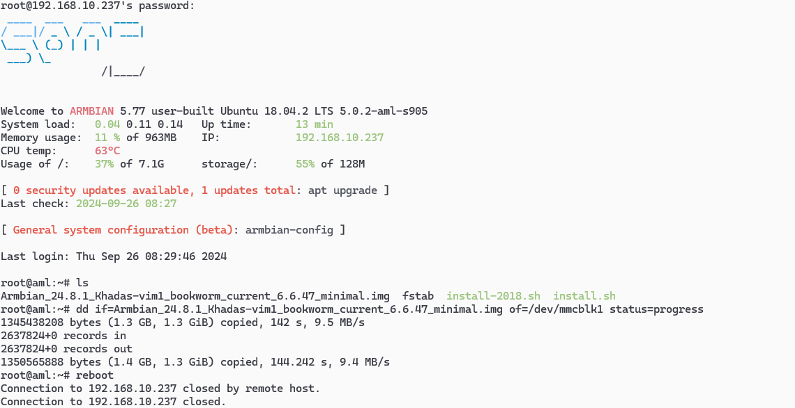
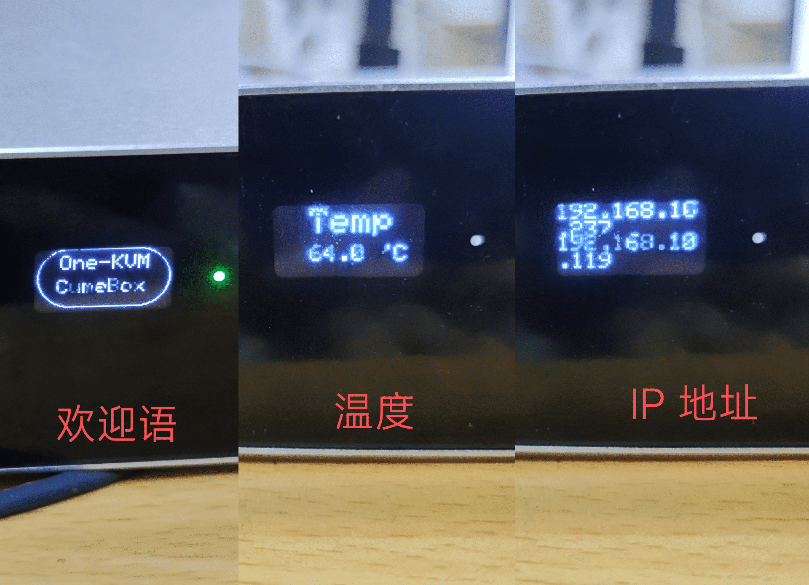
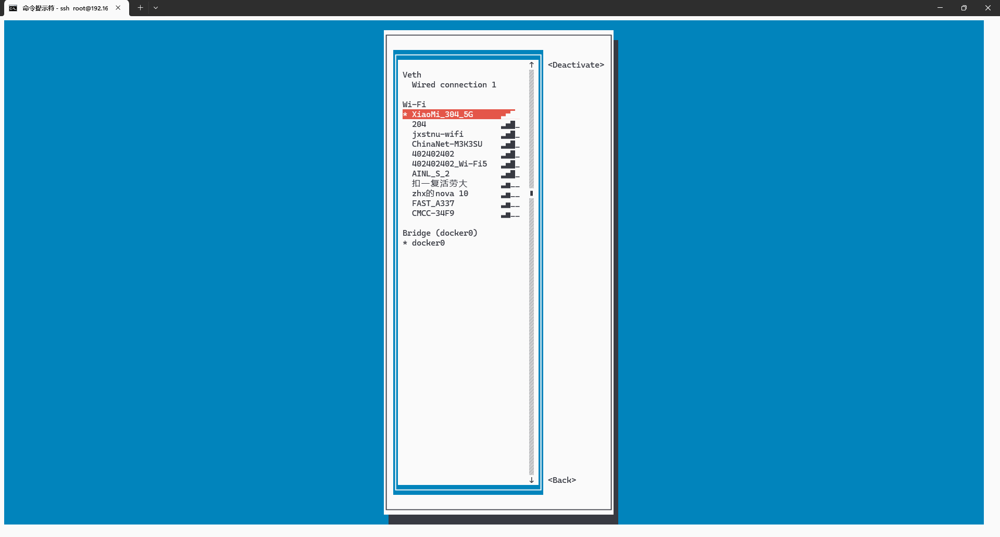

### 硬件说明

这个盒子名称很多，私家云二代、比特米盒、CumeBox2。配置如下：



相比玩客云，CPU 为 arm64 架构，多了一个 USB 口、两个 SATA 接口和板载双频 WIFI 。


首先刷机，大致流程：

- 短接主板触点使用 Amlogic USB Burning Tool 烧录工具给盒子线刷一个 android tv6.0 固件
- 通电开机进入 android tv，安装 apk 切换到外部（U 盘/TF 卡）引导
- 重启开机后进入U 盘/TF 卡上的 armbian 系统
- 用 dd 命令把 khadas-vim1 的固件 img 写入 emmc 

刷机详细过程可参考：[私家云二代/比特米盒/CumeBox2刷机Armbian教程 // 喵ฅ^•ﻌ•^ฅ (ruohai.wang)](https://ruohai.wang/202404/cumebox2-install-armbian/)


### Docker 部署

```bash
#换国内软件源
bash <(curl -sSL https://linuxmirrors.cn/main.sh) --source mirrors.tuna.tsinghua.edu.cn --protocol https --upgrade-software false

#从 Debian/Ubuntu 软件源安装 Docker
apt install apparmor-utils docker.io -y

#安装最新版本 Docker
curl -fsSL https://get.docker.com | bash
```

```bash
#运行 docker 命令，使用 OTG HID
#系统 /dev/video0 设备已经存在，所以新插入的 USB 采集卡从 /dev/video1 开始
docker run --name kvmd -itd --privileged=true \
    -v /dev:/dev -v /sys/kernel/config:/sys/kernel/config \
    -v /lib/modules:/lib/modules:ro \
    -e OTG=1 -e VIDEONUM=1 \
    -p 8080:8080 -p 4430:4430 -p 5900:5900 -p 623:623 \
    silentwind0/kvmd
    
#确认容器正常运行后可添加自动重启
docker logs kvmd
docker update --restart=always kvmd
```




### 整合包部署

整合包底包使用 khadas-vim1 固件修改 dtb 而来，进行了特别适配，网口、oled 小屏幕、WIFI 、OTG 都正常可用。

用 dd 命令把 One-KVM 的固件 img 写入 emmc 即可开始使用。

??? example "固件写入示例"

    

### 使用说明

**硬件连接**


**OLED 显示屏**

前面板的小 OLED 显示屏会循环显示欢迎语、温度和 IP 地址。




**WIFI 连接**

```bash
apt install network-manager -y

#在命令行文本图形界面中进行 WIFI 连接，支持双频 WIFI
#第一次连接后，盒子重启连接会自动连接上一次连接的 WIFI
nmtui
```



**软件截图**

