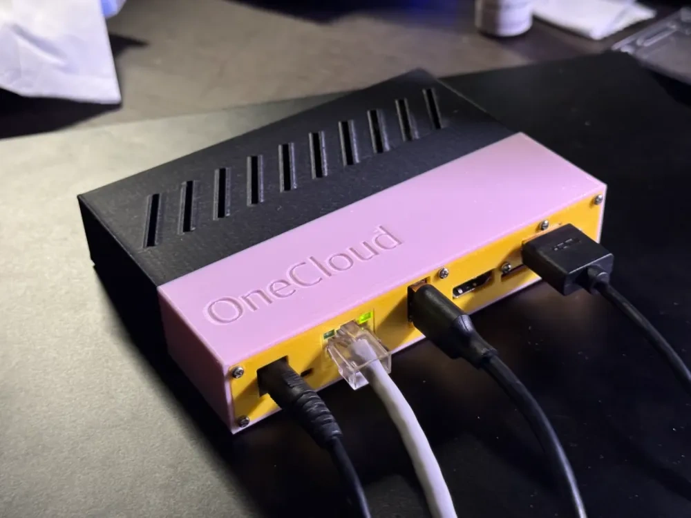
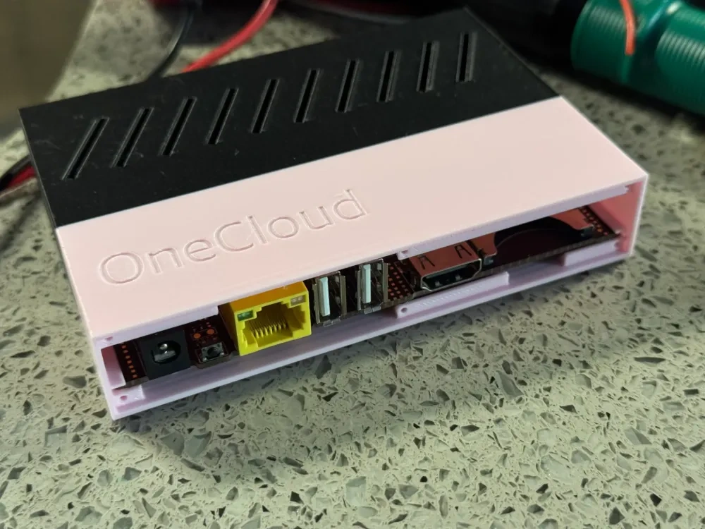
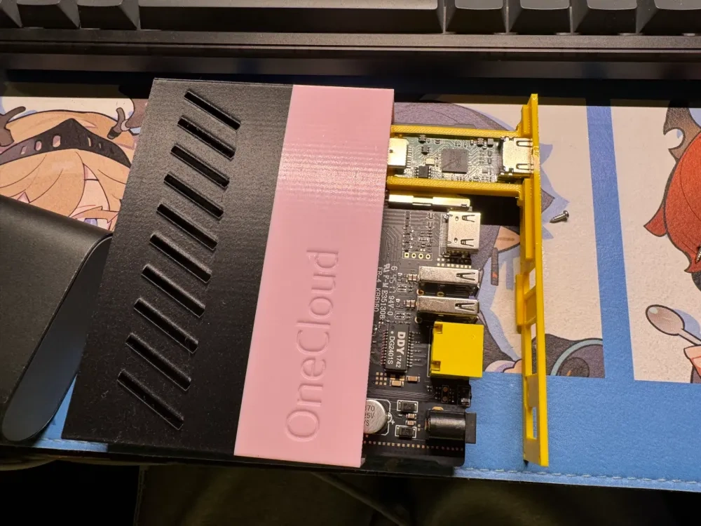
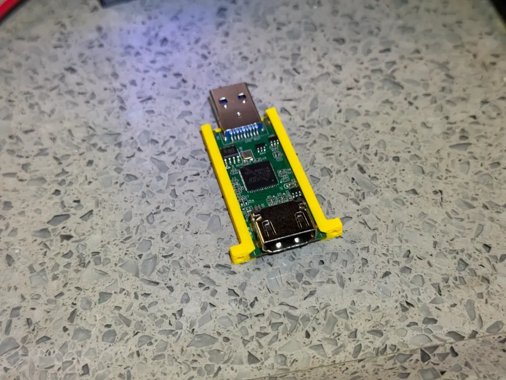
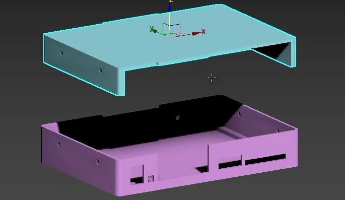

### OneCloud 玩客云 打印外壳，内置HDMI采集卡，可作KVM

- 作者：Tubashu
- 文件链接：https://makerworld.com.cn/zh/models/605235

### 玩客云外壳3D打印模型 

- 作者：喝西北风的娃
- 视频链接：https://www.bilibili.com/video/BV1Wy4y1c71j
- 文件链接：https://pan.baidu.com/s/1_jrmiiDIFf0XvhGNpeluXA?pwd=6666

### 光耦隔离小板
- 作者：浩龙的电子嵌入式之路
