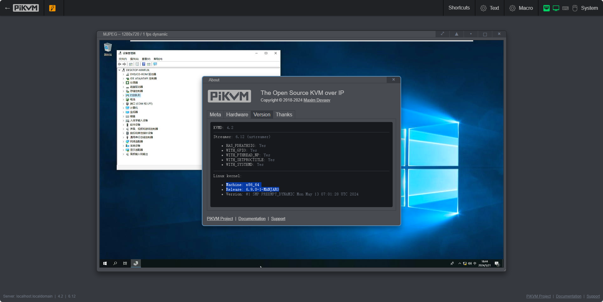

目前支持仅有pikvm-ch9329_amd64，后续将支持更多控制方式和处理器架构。使用示例：

```Bash
docker run -itd -p443:443 -p80:80 --name pikvm-docker --device=/dev/ttyUSB0:/dev/kvmd-hid --device=/dev/video0:/dev/kvmd-video pikvm-ch9329:0.61
```

