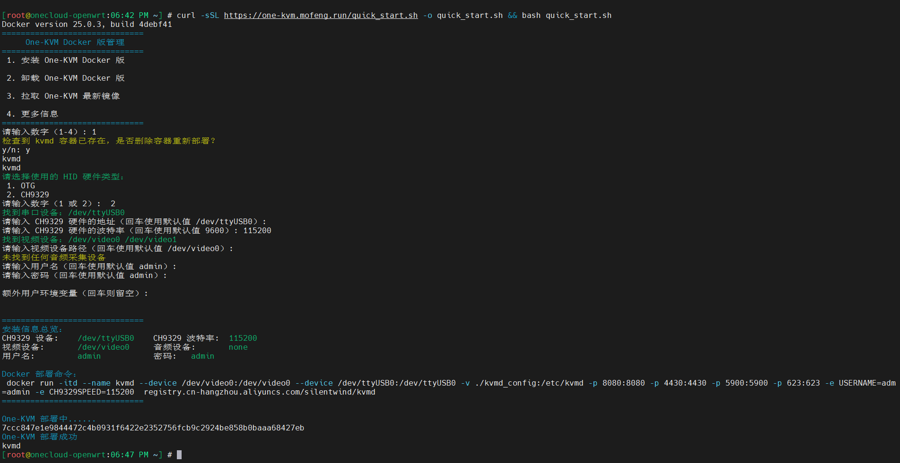

### 硬件准备

所需外设：Linux 主机、USB 采集卡、USB CH340+CH9329（若主机 OTG 不可用时可使用此硬件代替）

??? tip "如何开启 ARM 板 OTG 功能？"
    
    待更新。

??? tip "如何安装 Docker？"

    ``` bash
    #从 Debian/Ubuntu 软件源安装 Docker
    apt install docker.io -y

    #安装最新版本 Docker
    curl -fsSL https://get.docker.com | bash
    ```

???+ tip "OTG 与 CH9329 说明"
    OTG HID：现在大量的 ARM CPU 芯片都可以支持 USB OTG2.0/3.0 接口，该接口可能工作为 USB Host 模式用于连接USB设备。不过该接口也可以在 Linux 下作为 USB 从设备工作，此时可以将 ARM 板本身配置为键盘、鼠标、U 盘，从而将 OTG 接口作为虚拟 HID 设备使用。

    CH9329 HID： CH9329 是一款串口转标准 USB HID 设备(键盘、鼠标、自定义 HID)芯片， 在电脑上可被识别为标准的 USB 键盘设备、USB 鼠标设备或自定义 HID 类设备。可用作 One-KVM 的虚拟 HID 设备。

    虚拟存储驱动器（MSD）、虚拟 USB 网卡等虚拟USB设备等功能仅使用 OTG 端口模式时可用，请注意**使用 CH9329 HID 时不支持这些虚拟 USB 设备扩展功能**。
    
### Docker 部署

Docker 可以使用 OTG 或 CH9329 作为虚拟 HID ，支持 amd64、arm64、armv7 架构的 Linux 系统安装。

**脚本部署**

选择 One-KVM Docker 安装向导脚本安装可以帮助检查环境和快速安装。

```bash
curl -sSL https://one-kvm.mofeng.run/quick_start.sh -o quick_start.sh && bash quick_start.sh
```



**手动部署**

如果使用 OTG 作为虚拟 HID，可以使用如下部署命令：
``` bash
sudo docker run --name kvmd -itd --privileged=true \
    -v /lib/modules:/lib/modules:ro -v /dev:/dev \
    -v /sys/kernel/config:/sys/kernel/config -e OTG=1 \
    -p 8080:8080 -p 4430:4430 -p 5900:5900 -p 623:623 \
    silentwind0/kvmd
```

如果使用 CH9329 作为虚拟 HID，可以使用如下部署命令：
``` bash
sudo docker run --name kvmd -itd \
    --device /dev/video0:/dev/video0 \
    --device /dev/ttyUSB0:/dev/ttyUSB0 \
    --device /dev/snd:/dev/snd \
    -p 8080:8080 -p 4430:4430 -p 5900:5900 -p 623:623 \
    silentwind0/kvmd
```

命令默认从 Docker Hub 拉取镜像，若网络不畅无法连接，可以将命令尾端的 `silentwind0/kvmd` 替换为 `registry.cn-hangzhou.aliyuncs.com/silentwind/kvmd`，此地址为阿里云个人镜像托管服务杭州实例，拉取速度更快。

部署完成浏览器访问 https://IP:4430 ,首次访问由于自签 SSL 证书原因会遇到浏览器安全提醒，点击高级继续访问即可开始使用 One-KVM，默认账号密码为 `admin/admin`。如无法访问可以使用 `sudo docker logs kvmd` 命令查看日志尝试修复、提交 issue 或在 QQ 群内寻求帮助。

确定 Docker 容器运行正常后，可以使用如下命令使 One-KVM 容器开机自启。

```bash
#设置 Docker 服务开机自启
systemctl enable docker

#设置 One-KVM 容器自动重新启动
docker update --restart=always kvmd
```

### 更新版本

停止现有容器并删除现有容器，然后按照上述步骤重新部署。

```bash
#停止 One-KVM 容器
docker stop kvmd

#删除 One-KVM 容器
docker rm kvmd

#更新 One-KVM Docker 镜像
docker pull silentwind0/kvmd
```


### 设备映射
`--device /dev/snd:/dev/snd` 映射系统声卡设备，需要与 `-e AUDIONUM=0` 环境变量配合使用。

`--device /dev/video0:/dev/video0` 映射系统视频设备。若是 OTG 模式映射所有设备时，可能需要与 `-e VIDEONUM=0` 环境量配合使用。

`-p 8080:8080 -p 4430:4430 -p 5900:5900 -p 623:623` 将容器的端口映射到主机，用于向外暴露下列服务端口：<br>
 WEB 网页：8080、4430<br>
 VNC 控制台：5900<br>
 IPMI 控制：623

`-v ./kvmd_config:/etc/kvmd` 可挂载容器内配置文件目录，用于持久化配置文件，便于使用者手动修改配置文件。

`-v/var/lib/kvmd/msd:/var/lib/kvmd/msd` 挂载指定容器 MSD 目录，可用于存放需要挂载的系统镜像等文件。

### 环境变量

**账号密码**

`-e USERNAME=admin` `-e PASSWORD=admin` 设置用户账号和密码（包含 WEB VNC 和 IPMI），需要同时指定账号和密码，默认为 admin/admin，。

**设备指定**

`-e VIDEONUM=1` 设置 USB 采集卡地址编号，拼接方式为 "/dev/video"（此部分无需写入） + 环境变量值。默认为0代表 /dev/video0，如为1则代表 /dev/video1。
 
`-e AUDIONUM=0` 设置音频输入设备编号，拼接方式为 "hw:"（此部分无需写入） + 环境变量值。默认为0代表 hw:0，如为 CARD=MS2109 则代表 hw:CARD=MS2109。

??? tip "音频输入设备编号说明"

    Linux 系统音频设备可通过 `arecord -L` 或 `arecord -l` 命令查看。

    1. 使用声卡编号，例如：hw:0

    2. 使用声卡名，例如：hw:CARD=MS2109

    3. 使用设备文件，例如：hw:/dev/snd/controlC0

    从三种方式中任选其一设置环境变量即可在网页使用 H.264 音频。

`-e ATX=USBRELAY_HID` 使用 USB HID 继电器设备作为电源控制设备。

**OTG 相关**

`-e OTG=1` 启用 OTG 模式，默认为禁用。

`-e NOMSD=1` 禁用 MSD，默认在 ARM 主机上启用。

**CH9329 相关**

`-e CH9329SPEED=9600` CH9239+CH340 串口通信速度，默认为9600bps，可选值：`1200`、`2400`、`4800`、`9600`、`14400`、`19200`、`38400`、`57600`、`115200`。

`-e CH9329TIMEOUT=0.3` CH9239 HID 响应超时时间，超时后会刷新一条日志，默认为0.3秒。

**功能启用**

`-e NOSSL=1` 禁用 HTTPS，启用 HTTP，在 8080 端口提供 WEB 服务。

`-e NOAUTH=1` 禁用身份认证，默认为启用。

`-e NOWEBTERMWRITE=1` 禁用 WEB 终端输入，设置为只读模式，默认为启用。

`-e NOWEBTERM=1` 禁用 WEB 终端，默认为启用。

`-e NOVNC=1` 禁用 VNC，默认为启用。

`-e NOIPMI=1` 禁用 IPMI，默认为启用。