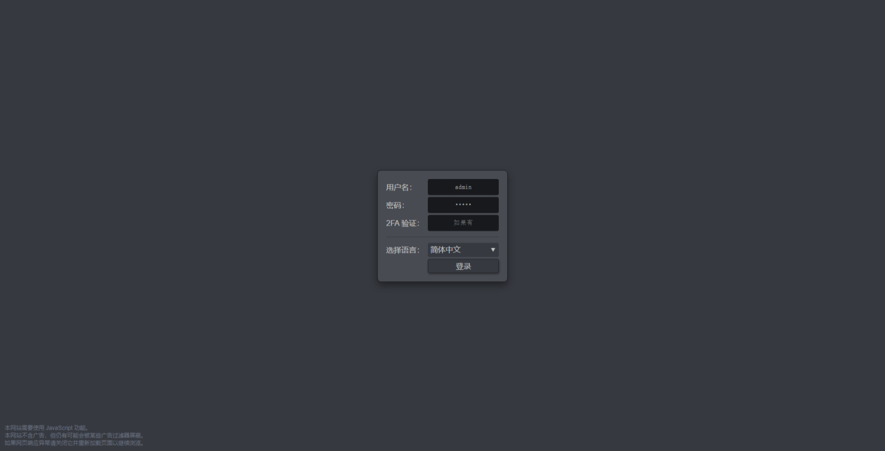
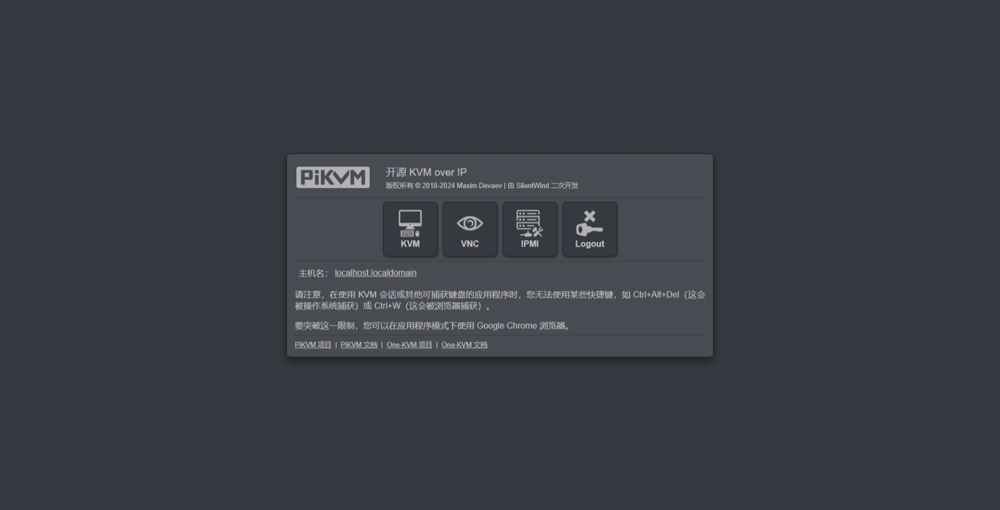

### 硬件清单

所需外设：USB采集卡、USB HID（CH340+CH9329）

宿主机系统：Linux

### Docker 部署

目前 Docker 版只能使用 CH9329 作为虚拟 HID ，支持 amd64、arm64、armv7 架构的 Linux 系统安装。

当前只有dev分支，尚未发布稳定版本，演示网站（账号密码：admin/admin）：https://kvmd-demo.mofeng.run/

部署命令：
```bash
sudo docker run --name kvmd -itd \
    --device /dev/video0:/dev/kvmd-video \
    --device /dev/ttyUSB0:/dev/kvmd-hid \
    -p 8080:8080 -p 4430:4430 -p 5900:5900 -p 623:623 \
    registry.cn-hangzhou.aliyuncs.com/silentwind/kvmd:dev
```

部署完成访问 http://IP:8080 即可开始使用，默认密码：admin/admin。
如无法访问可以使用 `sudo docker logs kvmd` 命令查看日志尝试修复、提交 issue 或在 QQ 群内寻求帮助。

如果暂时相关没有 USB 设备或只想要查看新版特性，可以使用以下命令启动一个无 USB 硬件的应用（演示模式）：
```bash
sudo docker run --name kvmd -itd \
    --device /dev/tty10:/dev/kvmd-hid \
    -p 8080:8080 -p 4430:4430 -p 5900:5900 -p 623:623 \
    registry.cn-hangzhou.aliyuncs.com/silentwind/kvmd:dev
```

### 参数说明
`-device /dev/video0:/dev/kvmd-video` 将主机上的 `/dev/video0` 设备映射到容器内的 `/dev/kvmd-video` ，支持USB UVC 设备，用于采集卡视频输入。

`--device /dev/ttyUSB0:/dev/kvmd-hid` 将主机上的 `/dev/ttyUSB0` 设备映射到容器内的 `/dev/kvmd-hid` ，支持串口设备，推荐使用 CH9329+CH340 一体线，用于虚拟键盘鼠标。

`-p 8080:8080 -p 4430:4430 -p 5900:5900 -p 623:623` 将容器的端口映射到主机，用于向外暴露下列服务端口：<br>
 WEB 网页：8080、4430<br>
 VNC 控制台：5900<br>
 IPMI 控制：623

`registry.cn-hangzhou.aliyuncs.com/silentwind/kvmd:dev` 为阿里云个人镜像托管服务地址，实例位于杭州，拉取速度较快。目前只有dev分支，尚未发布稳定版本。

### 演示截图

???+ note
    演示网站运行在云服务器上，实际效果因软硬件配置而异。

    演示网站：[https://kvmd-demo.mofeng.run](https://kvmd-demo.mofeng.run)<br>
    账号/密码：admin/admin




