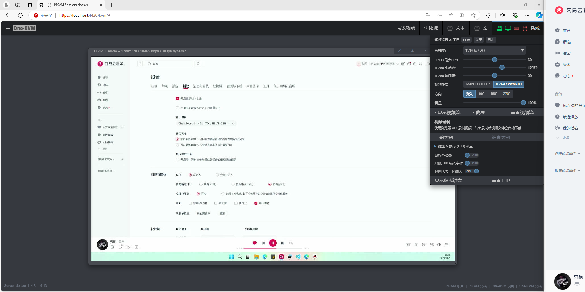

### HDMI Audio Support

!!! note "Audio feature overview"
    The latest One-KVM supports real-time HDMI audio transmission via H.264/WebRTC, with audio quality sufficient for smooth music playback. The system uses the Linux ALSA sound driver, while ustreamer and janus capture HDMI audio and transcode it to Opus.

#### Configuration

**Docker users**

Use the environment variable `-e AUDIONUM=0` to specify the audio device. See the [Docker environment variables](../start_install/docker_install.md#_3).

**Integrated image users**

Edit the audio configuration file `/etc/kvmd/janus/janus.plugin.ustreamer.jcfg`:

```yaml
video: {
	sink = "kvmd::ustreamer::h264"
}
audio: {
     device = "hw:0"
     tc358743 = "/dev/video0"
}
```

Configuration notes:

- `device`: audio device address
- `tc358743`: capture card video device path

#### Find audio devices

On Linux, use the following commands to list available audio devices:
```bash
arecord -L   # Detailed device list
arecord -l   # Brief device list
```

The following three methods are supported to specify the audio device:

1. By card index: `hw:0`
2. By card name: `hw:CARD=MS2109`
3. By device file: `hw:/dev/snd/controlC0`

Choose one method to enable HDMI audio.

#### Demonstration




