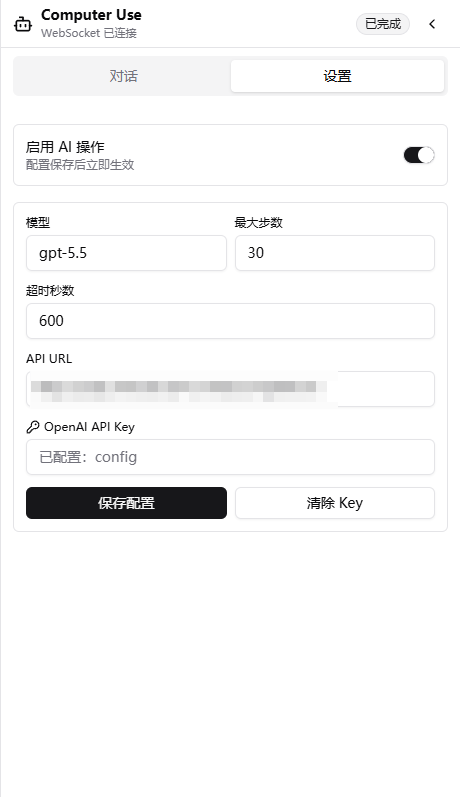
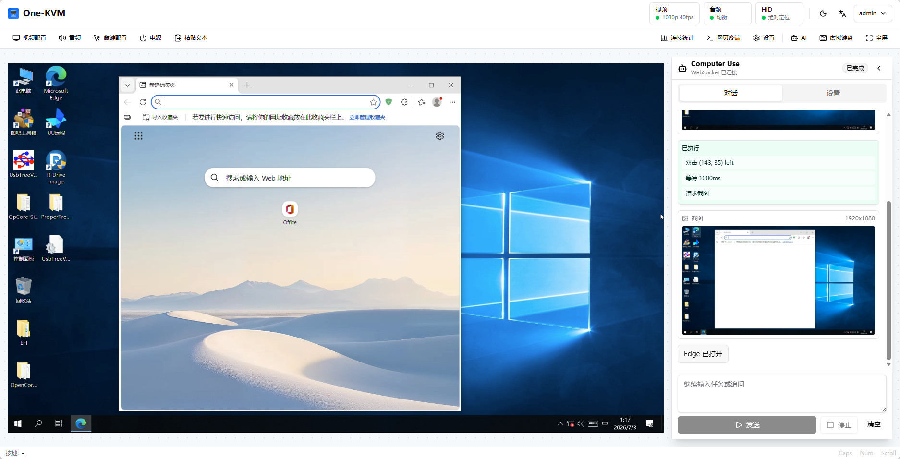

# CUA AI Operation

CUA (Computer Use Agent) can observe the current KVM screen from a natural-language task and execute mouse and keyboard actions. It is useful for simple remote desktop tasks such as opening software, clicking buttons, entering text, or following UI steps.

!!! note "Early version"
    CUA is still an early version. Its capabilities and stability will continue to improve.

!!! warning "Confirm before use"
    CUA directly controls the target machine's mouse and keyboard. Before running tasks that delete files, format disks, change system settings, or submit forms, make sure the instruction is clear and keep the session observable.

## Configuration

Open **AI -> Settings** to configure the default CUA parameters:

| Item | Description | Default |
| --- | --- | --- |
| Enable AI operation | Allows CUA tasks to start | Off |
| Model | OpenAI model name to use | `gpt-5.5` |
| Max steps | Maximum observe/action rounds for one task | `30` |
| Timeout seconds | Maximum runtime for one task | `600` |
| API URL | Full endpoint URL. URLs containing `/responses` use the Responses API; URLs containing `/chat/completions` use the Chat Completions compatible path | `https://api.openai.com/v1/responses` |
| OpenAI API Key | API Key used for model calls | Not configured |

## Usage

1. Open the KVM console and click **AI** in the top toolbar.
2. In **Settings**, enable AI operation, fill in the model, API URL, and OpenAI API Key, then click **Save config**.
3. Switch to **Chat** and describe the task you want to complete.
4. Click **Send**. CUA will capture the current screen, decide the next action, and execute mouse and keyboard operations automatically.
5. Click **Stop** at any time to interrupt the running task.

