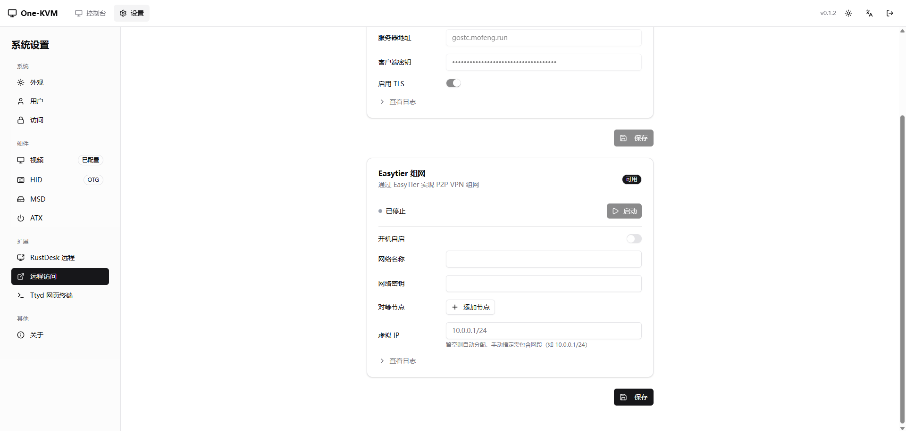
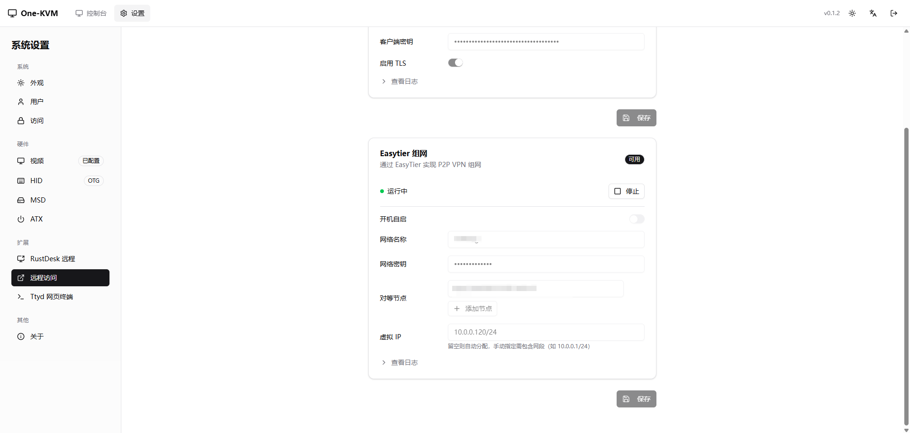
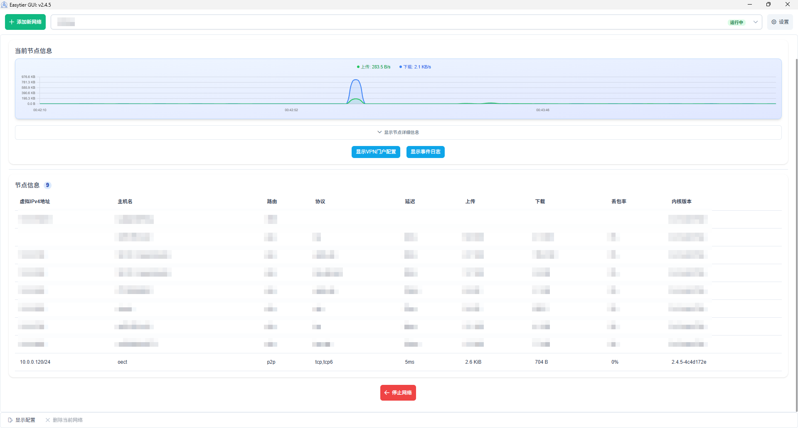

# EasyTier Mesh Networking

EasyTier provides P2P VPN networking so you can place One-KVM devices on the same virtual LAN. `easytier-core` must be installed (Extensions page shows "Available"), and you should prepare a network name and secret.

## Configuration

| Item | Description | Example |
| --- | --- | --- |
| Network name | Required, identifies the mesh | `one-kvm` |
| Network secret | Optional but recommended | `your-secret` |
| Peer nodes | Optional, bootstrap peers (multiple) | `tcp://1.2.3.4:11010` |
| Virtual IP | Optional, auto-assigned if empty | `10.0.0.2/24` |

## Public Peer Config

The public peer config does not require a password. It is hidden by default and displayed locally in your browser after you click the button.

!!! warning "Usage Notice"
    The public peers are provided for free with no guarantee of availability, stability, latency, or service quality. Do not abuse them, generate excessive traffic, attack services, occupy resources in bulk, or use them for illegal activity.

<button type="button" class="md-button md-button--primary" data-public-config="easytier">View EasyTier public peer config</button>

## Setup Steps

1. Open Settings -> Extensions -> Remote Access -> EasyTier
2. Fill in network name, secret, and peers (optional; you may use the public peers above)
3. Leave virtual IP empty for auto assignment, or include CIDR if set manually
4. Click **Save**, then **Start**

