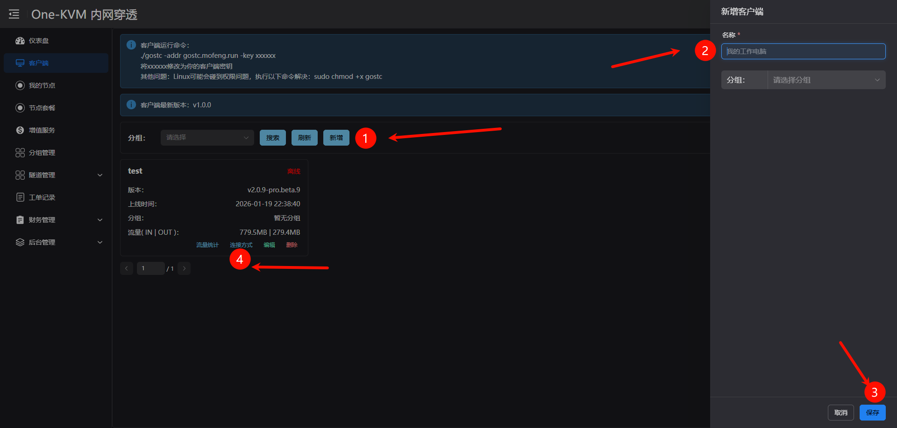
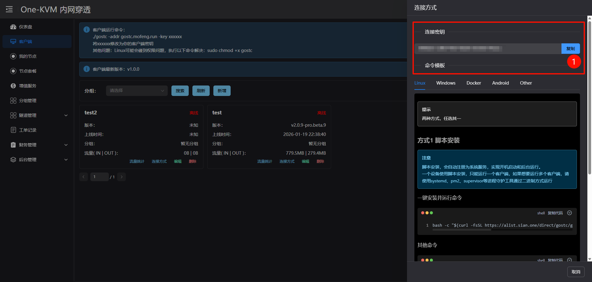
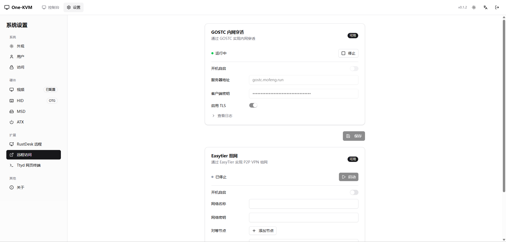
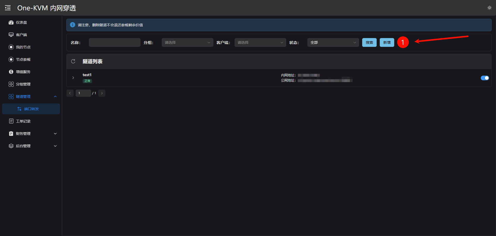
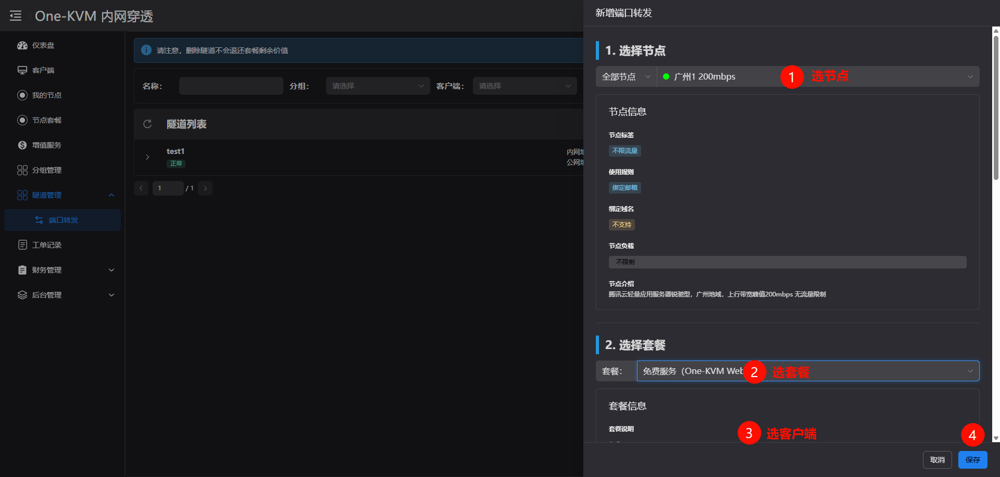
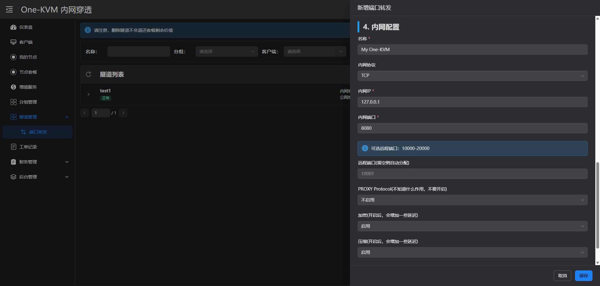
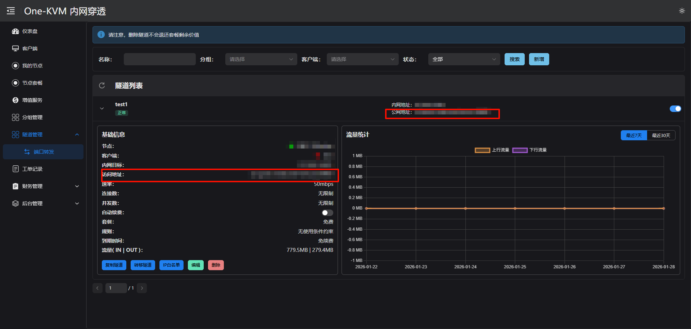

# GOSTC NAT Traversal

GOSTC is an FRP-based NAT traversal service. One-KVM includes a built-in client and can be configured from the web UI. `gostc` must be installed (Extensions page shows "Available"), and you need to register on the GOSTC service site to obtain a client key.

!!! tip "Service Sites"
    - One-KVM dedicated (self-hosted by the author, email verification required): `https://gostc.mofeng.run`
    - Official GOSTC service: `https://gost.sian.one/`

!!! warning "Usage Notice"
    This free service is for personal learning and testing only. Do not abuse it with heavy traffic, mass registrations, attacks, scraping, illegal content, or any commercial use. Please use resources responsibly to keep the service stable.

## Configuration

| Item | Description | Example/Default |
| --- | --- | --- |
| Server address | GOSTC domain or IP (no http/https) | `gostc.mofeng.run` |
| Client key | Generated on the service site | - |
| TLS | Enable if supported by the server | On |
| Auto start | Start with the system | Off |

## Setup Steps

1. Register and log in on the service site, complete email verification, then create a client and copy the key
2. Open Settings -> Extensions -> Remote Access -> GOSTC
3. Enter the server address and key, confirm the TLS setting
4. Click **Save**, then **Start**

    
    The connection key is the client key, not the node key.
    
    

## Add Port Forwarding on the Service Site

1. Click the Tunnel Management menu on the left, open the port forwarding page, and create a new tunnel

    

2. Select the node, plan, and client

    

3. Configure the internal target

    The service name can be anything. Set the internal address to `127.0.0.1` and the port to the One-KVM web port (usually 8080). You can keep other options as default. For lower latency, you may disable encryption and compression.

    

4. Click save to get the remote access address

    
