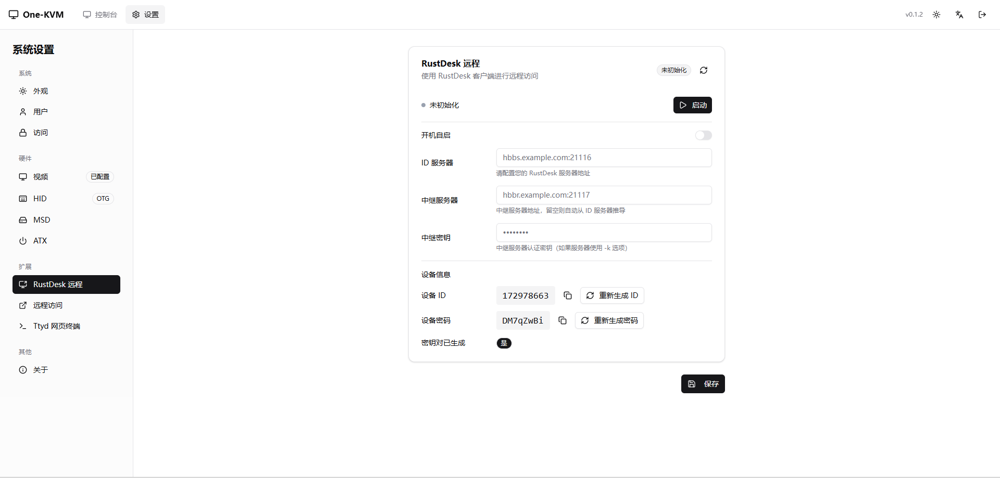
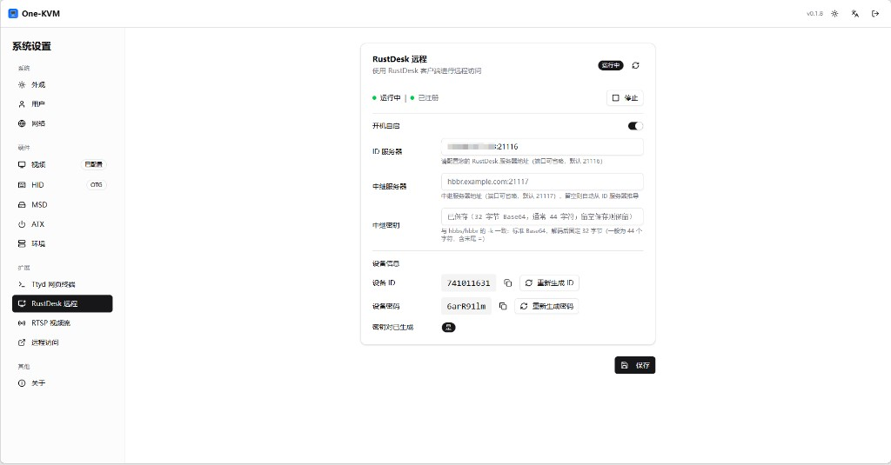
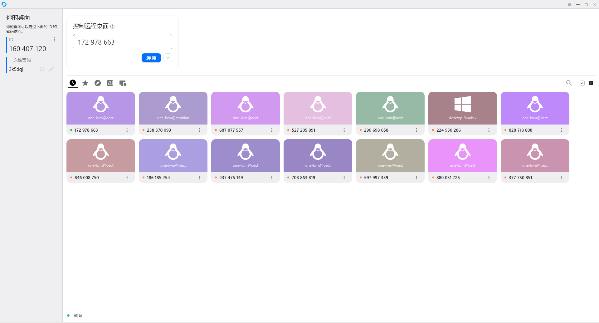
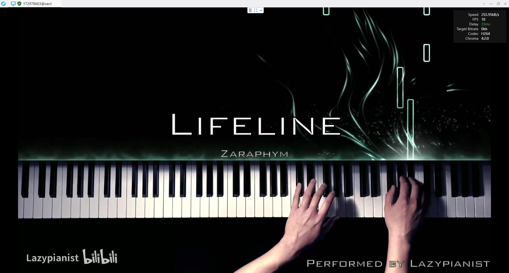
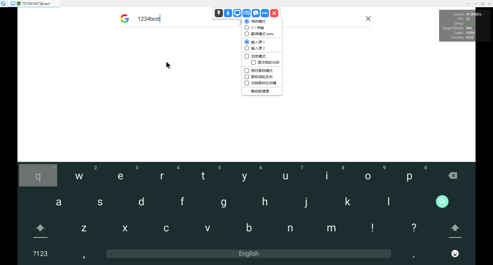
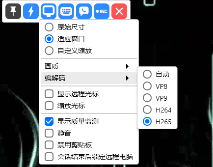
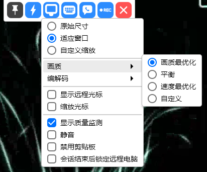
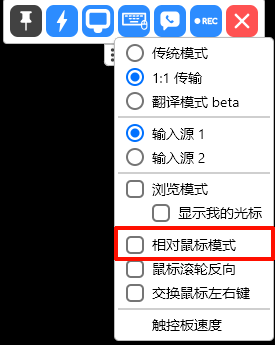

# RustDesk Remote Control

One-KVM includes a RustDesk endpoint, so you can connect using the RustDesk client.

If you want to self-host a RustDesk relay server, you can quickly deploy the `rustdesk/rustdesk-server-s6:latest` Docker container.

## Configuration

| Item | Description | Example |
| --- | --- | --- |
| Auto start | Start with the system | Off |
| Rendezvous server | hbbs address (port optional) | `hbbs.example.com` |
| Relay server | hbbr address (optional) | `hbbr.example.com` |
| Relay key | Required if server uses `-k` | `your-relay-key` |

!!! tip "Default Ports"
    If ports are omitted, One-KVM uses `21116` for rendezvous and `21117` for relay.

## Public Server Config

The public server config does not require a password. It is hidden by default and displayed locally in your browser after you click the button.

!!! warning "Usage Notice"
    The public servers are provided for free with no guarantee of availability, stability, latency, or service quality. Do not abuse them, generate excessive traffic, attack services, occupy resources in bulk, or use them for illegal activity.

<button type="button" class="md-button md-button--primary" data-public-config="rustdesk">View RustDesk server config</button>

## Setup Steps

1. Open Settings -> Extensions -> RustDesk Remote
2. Fill in the rendezvous server and server key
3. Click **Save**, then **Start**
4. Copy **Device ID** and **Device Password** from the device info panel
5. Connect from the RustDesk client using the ID and password

## RustDesk Client Features

!!! tip "RustDesk keyboard mode"
    If the controlled machine runs Linux or Android, set the RustDesk keyboard mode to legacy/traditional to get correct input.
    

Audio streaming is supported (requires an audio capture device), along with video format switching and video quality adjustment.

| | |
| --- | --- |
|  |  |

Relative mouse mode is also supported (requires One-KVM Rust >= 0.1.3 and RustDesk >= 1.4.5). Use this mode when the controlled machine runs Linux or Android.

