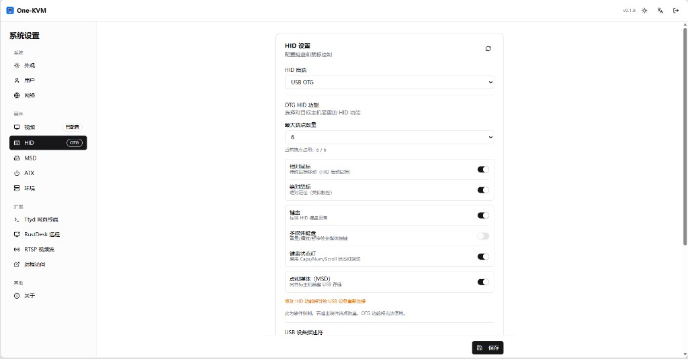
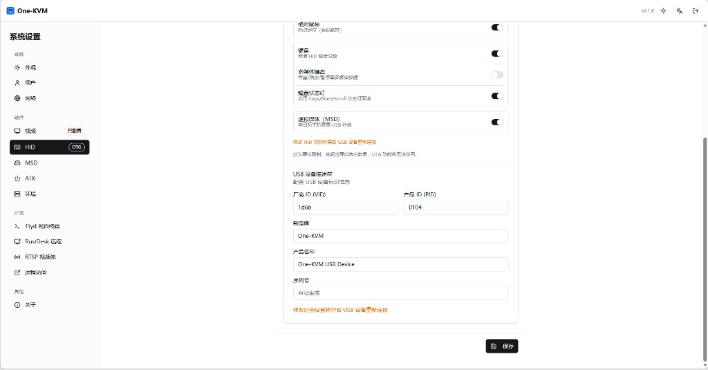

# Dynamic USB Configuration

One-KVM uses a **USB OTG Gadget** to enumerate a composite USB device to the target (keyboard, mice, consumer/multimedia keys, and optionally **virtual media / MSD**). These options apply only when the **HID backend** is **USB OTG**; they do not apply to **CH9329** serial HID or when HID is **disabled**.

## Configuration

Under **Settings → Hardware → HID**, when the backend is USB OTG:

- **OTG HID functions**: Toggle the capabilities exposed to the host. Before saving, at least one of **keyboard**, **relative mouse**, **absolute mouse**, or **multimedia (consumer) keyboard** must be enabled (**MSD alone** without any HID function is not allowed):
  - **Relative mouse**: classic relative movement (HID boot mouse style)
  - **Absolute mouse**: absolute positioning (tablet/touch-style usage)
  - **Keyboard**: standard HID keyboard
  - **Multimedia keyboard**: Consumer Control (volume, play/pause, etc.)
  - **Keyboard status LEDs**: sync Caps/Num/Scroll with the host; when **keyboard** is on, enabling this **adds one more endpoint**
  - **Virtual media (MSD)**: exposes USB mass storage to the target; **uses 2 endpoints**
- **Maximum endpoints**: **5**, **6**, or **Unlimited** — a software budget aligned with your UDC hardware. The UI shows **current endpoint usage** (estimated). Saving is blocked if the selection exceeds the limit. Some low-endpoint controllers may map to a more conservative default when config is loaded. Whether a given layout works in practice still depends on hardware limits—for example Allwinner SoCs often expose 5 endpoints and Amlogic 6.
- **USB device descriptor**: VID, PID, manufacturer, product name, and serial number (serial may be left empty for auto-generation)

## Steps

1. Open **Settings → Hardware → HID**
2. Set **HID backend** to **USB OTG**
3. Set **maximum endpoints** and enable the desired **OTG HID** toggles and **MSD** (watch the usage line)
4. Adjust **USB device descriptor** fields if you need different USB identity strings
5. Click **Save** to apply

!!! warning "USB re-enumeration"
    Changing OTG HID functions, MSD, or the USB descriptor will reconnect the USB device. This is expected.
