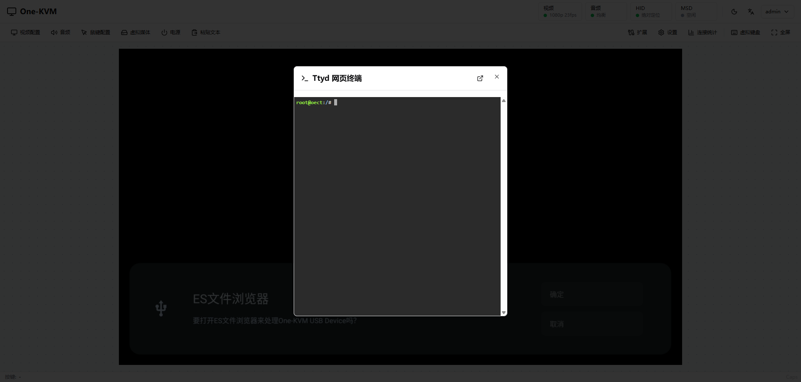

# Web Terminal (ttyd)

Access the One-KVM device shell in the browser via ttyd. It is useful for quick log checks or maintenance commands.

## Usage

`ttyd` is installed (the Extensions page shows "Available"), and you are logged in.

- Console toolbar (top right) -> Extensions -> Ttyd Web Terminal
- Settings -> Extensions -> Ttyd Web Terminal -> Open Terminal

If you see `/usr/bin/ttyd` not found, ttyd is not installed or the path is incorrect. Install it manually.
