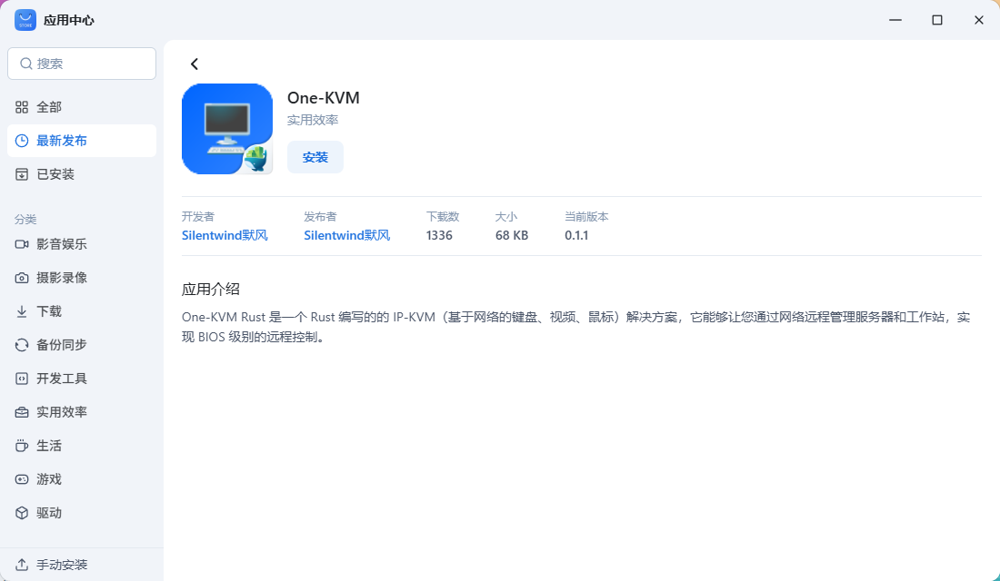
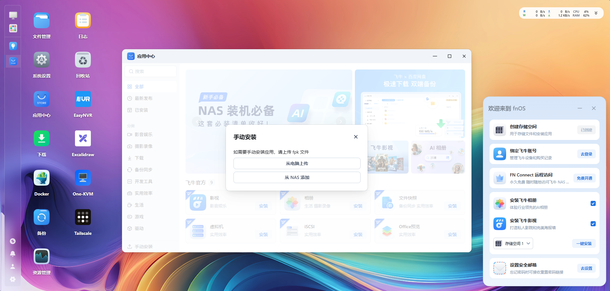
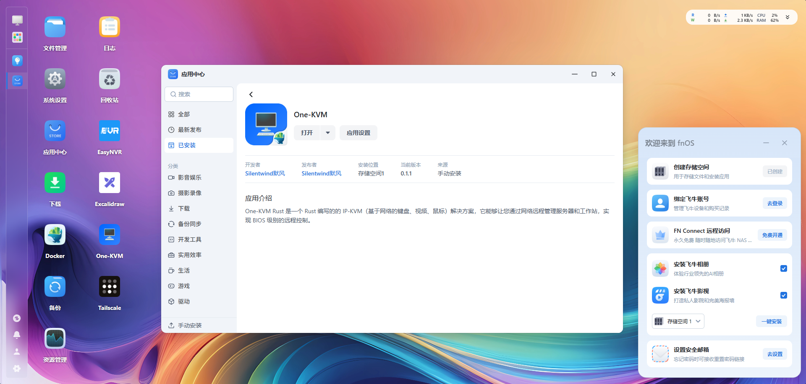

# FnNAS MAS Install

This guide explains how to install One-KVM directly on the Feiniu NAS (FnNAS) system.

## Prerequisites

- System requirements: FnNAS, with x86_64 and ARM support
- Hardware: connect a CH340 + CH9329 HID cable (for HID emulation) and a USB HDMI capture card.

## Install

### Install from App Store

The app is listed in the FnNAS App Store; you can install it from there.

### Manual install

Download the FnNAS package (`.fpk`) to the file system, then perform a manual install in the FnNAS App Store.

## Access the Web UI

Open a browser and visit `http://<device-ip>:8420`

!!! tip "First-time Access"
    On the first visit, the system will guide you through initial setup, including creating the admin account.

## Update the App

The One-KVM FnNAS app is Docker-based. To update, uninstall One-KVM in the FnNAS App Store and install it again; by default your data is preserved.
