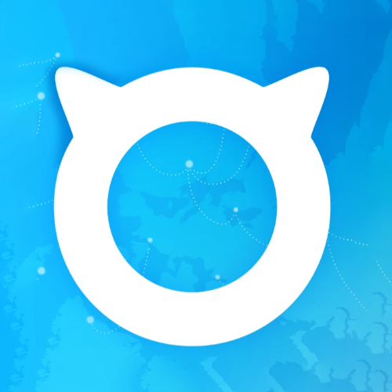

# One-KVM Rust Docs

One-KVM Rust is a lightweight IP-KVM solution written in Rust, enabling BIOS-level remote control of servers and workstations over the network.

**Project goals**: deliver an open, lightweight, easy-to-use IP-KVM solution.

- **Open**: not tied to a specific hardware profile; runs reliably in many environments.
- **Lightweight**: distributed as binaries with minimal dependencies and straightforward deployment.
- **Easy to use**: no hand-editing configuration files—all parameters are adjusted in the web UI.

-   :material-cog-off:{ .lg .middle } __Zero Config Files__

    ---

    Configure audio/video and mouse/keyboard devices in the web UI without editing config files

-   :material-usb-flash-drive:{ .lg .middle } __Virtual Media__

    ---

    Supports virtual disks and Ventoy USB mode for easier installs and booting

-   :material-puzzle:{ .lg .middle } __Extensions__

    ---

    Web terminal, RustDesk integration, GOSTC tunneling, EasyTier networking, and more

-   :material-language-rust:{ .lg .middle } __Rust Rewrite__

    ---

    Lightweight, safe, reliable, and high performance

> One-KVM Python is no longer maintained. For legacy materials, see the [One-KVM Python tutorial](python/index.md).

## Quick Start

[Docker install :material-arrow-right:](getting-started/docker-install.md){ .md-button .md-button--primary }

[DEB package install :material-arrow-right:](getting-started/deb-install.md){ .md-button .md-button--primary }

[FnNAS install :material-arrow-right:](getting-started/fnnas-install.md){ .md-button .md-button--primary }

[First-time onboarding :material-arrow-right:](ui/onboarding.md){ .md-button }

## Support

**Free NAT Traversal Service**

[GOSTC tunneling guide](feature_usage/gostc_tunnel.md)

[https://gostc.mofeng.run](https://gostc.mofeng.run)

**Bug Reports, Discussion, and Free Technical Support**

- GitHub Issues: [https://github.com/mofeng-git/One-KVM/issues](https://github.com/mofeng-git/One-KVM/issues)
- QQ Group: 569514148

**Prebuilt Hardware Kits**

The author does not currently sell prebuilt hardware kits due to limited time. If you need one, you can build it yourself or buy a third-party kit.

**[Yuanfang](https://runyf.cn/)** is a long-term sponsor. If you need a prebuilt kit, you can also check their store (Xianyu username: Xiaoyuan Technical Store).

## Downloads

CQU Open Source Mirror: [CQU Open Source Mirror](https://mirrors.cqu.edu.cn/) (click "Get Download Links" on the right side of the page → select One-KVM under "Common Software" → download the package).

Login-free download 1: [http://sd1.files.one-kvm.cn/](http://sd1.files.one-kvm.cn/) (sponsored by community members; direct links, EdgeOne CDN).

Login-free download 2: [https://pan.huang1111.cn/s/mxkx3T1](https://pan.huang1111.cn/s/mxkx3T1) (sponsored by the Huang1111 public-welfare program).

Baidu Netdisk: [https://pan.baidu.com/s/166-2Y8PBF4SbHXFkGmFJYg?pwd=o9aj](https://pan.baidu.com/s/166-2Y8PBF4SbHXFkGmFJYg?pwd=o9aj)

## Sponsorship

If One-KVM helps you, consider supporting the project so development and maintenance can continue.

[Sponsorship plan and acknowledgements](other/thanks.md)

## Sponsors

This project is supported by the following sponsors:

**Mirror download service**

- **[CQU Open Source Mirror](https://mirrors.cqu.edu.cn/)** — provides mirror download hosting

**File storage service**

- **[Huang1111 Public Welfare](https://pan.huang1111.cn/s/mxkx3T1)** — provides login-free download hosting

**Cloud service provider**

- **[LinFeng Cloud](https://www.dkdun.cn)** — sponsors this project's server

LinFeng Cloud offers premium network routes in China and abroad, high-frequency game servers, and high-bandwidth servers.

- **[Beita Network](https://my.beita.cc/?ref=github_onekvm)** — sponsors this project's server

  

  Remote desktops, consumer GPU servers, and dedicated physical servers with fully automated online delivery.
