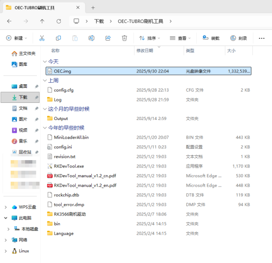
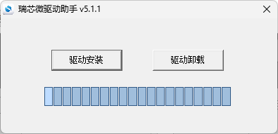
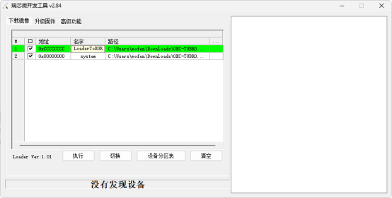
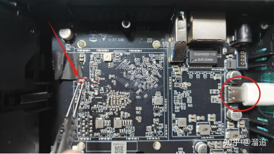
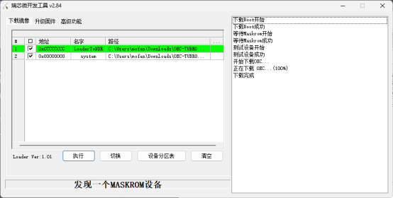

## Hardware Overview

The OEC TURBO uses an RK3566 CPU with 4 GB of RAM and 8 GB of internal storage. It provides Gigabit Ethernet, one USB Type-C port, one USB 3.0 port, and an internal SATA drive bay. Its open VPU driver allows One-KVM to support H.264 and H.265 hardware encoding on this device for a better video experience.

Docker and DEB package deployments are available and relatively easy to set up. To use the integrated image, [sponsor](../other/thanks.md) the author and contact them to obtain it.

## One-KVM

### Integrated Image Deployment

**File preparation**

Download and extract the OEC TURBO flashing tool and the One-KVM integrated image, then open the flashing tool directory. We recommend renaming the extracted One-KVM image to a shorter name, such as `OEC.img`, and placing it in the flashing tool directory so that the flashing progress remains visible.

If the Rockchip driver has not been installed before, run `OEC-TUBRO刷机工具\RK3566刷机驱动\DriverInstall.exe` to install it. Skip this step if the driver is already installed.

Open `RKDevTool.exe`, click the ellipsis button next to each path, and update the boot file and One-KVM system image paths. The boot file is `MiniLoaderAll.bin` in the flashing tool directory.

The image also works with other OECT variants and OEC devices, but you must replace `MiniLoaderAll.bin` with the appropriate boot file before flashing. See [Flashing Armbian on Netcenter OEC/OECT](https://blog.dmoe.top/posts/course-OECT-armbian) for details.

**Start flashing**

Disassemble the device and short the resistor on the board to enter MASKROM mode.

To disassemble a Netcenter OEC:

1. Push the bottom cover upward to open it.
2. At the SATA drive bay and USB Type-C side, remove the four screws.
3. Push the enclosure upward and remove the side panel. Unscrew the three screws securing the SATA connector, turn the connector over, and peel off the black tape protecting its ribbon cable. The SATA ribbon cable is thin and fragile, so do not pull it. Lift the black latch on the left to unlock the connector, then gently remove the ribbon cable.
4. Remove the eight screws from the inner enclosure. Insert a card into the gap on the left, carefully pry it open, and remove the inner enclosure.
5. Locate the resistor to be shorted on the front of the mainboard.

Short the resistor first, then connect the USB Type-C data cable. The device does not require its 12 V DC power supply while flashing. Release the shorting tool after approximately two seconds. When the application reports that a MASKROM device has been detected, click **Run** and wait for the image to finish flashing.

If a newer flashing tool reports that the system exceeds the flash size, select the forced address write option above the **Run** button and try again.

After flashing is complete, disconnect the USB Type-C cable and connect the 12 V DC power supply to start the system.

## Usage Notes

After the first boot, the system has approximately 5.1 GB of available storage.

**Hardware connections**

Connect the USB Type-C OTG port to the target machine. Connect the USB capture card to the standard USB 3.0 port.

!!! warning "Hardware safety warning"

    To avoid potential risks, such as the target device failing to boot or recognize devices, and in very rare cases hardware damage, we strongly recommend taking one of the following safety measures before using a USB cable:

    Option 1: Cut or remove the red 5 V power wire (VCC) in the USB cable, leaving only the data wires (D+/D−) and ground (GND), to prevent back-powering.

    Option 2: Insert a USB hub with an independent power switch in the USB link and make sure its power switch is off when connecting.

    Some low-power devices may be back-powered through the USB OTG port from the KVM device when main power is not connected. This can put the device into an abnormal state, and it may still fail to boot normally even after main power is connected later.

    **Unless you clearly understand the consequences, use the protections above to keep devices safe.**

**SSH remote login**

SSH is enabled by default on Armbian. The initial username and password are `root` / `1234`.

!!! warning "System upgrade warning"
    Do not use `apt upgrade` to upgrade the kernel and device tree. This may cause system problems and make OTG unavailable.

**USB function combinations**

| Combination | Result |
| ----------- | ------ |
| Keyboard (including status LEDs) + relative mouse + absolute mouse + multimedia keys | Passed |
| Keyboard (including status LEDs) + relative mouse + absolute mouse + multimedia keys + MSD | Passed |
| Keyboard (including status LEDs) + relative mouse + absolute mouse + multimedia keys + MSD + NCM/ECM | Unsupported |
| Keyboard (including status LEDs) + relative mouse + absolute mouse + multimedia keys + RNDIS | Passed |
| Keyboard (including status LEDs) + relative mouse + absolute mouse + multimedia keys + MSD + RNDIS | Unsupported |
| Keyboard (including status LEDs) + relative mouse + absolute mouse + RNDIS | Passed |
| Keyboard (including status LEDs) + relative mouse + absolute mouse + MSD + RNDIS | Passed |
| Keyboard (including status LEDs) + relative mouse + absolute mouse + MSD + NCM/ECM | Passed |

## Performance Test Report

- Run ID: `20260723-114600-087e44`
- Test device: OECT (`oec-turbo`)
- Video device: `/dev/video0` (1080p@60fps MJPEG, 1080p@60fps YUYV)
- HID device: OTG
- HTTP latency: p50=3.9ms, p95=4.8ms, max=4.8ms

### Video Performance

| Video input parameters        | Test frame rate | Latency statistics (median p50 / 95th percentile p95 / maximum max) |
| ----------------------------- | --------------- | ------------------------------------------------------------------- |
| 1080p@60fps MJPEG → MJPEG     | 59.9fps         | p50=80.5ms, p95=93.2ms, max=96.3ms                                  |
| 1080p@60fps MJPEG → H.264     | 52.7fps         | p50=154.1ms, p95=191.4ms, max=194.5ms                               |
| 1080p@60fps MJPEG → H.265     | 54.6fps         | p50=140.5ms, p95=169.2ms, max=169.7ms                               |
| 1080p@60fps YUYV → MJPEG      | 34.6fps         | p50=218.9ms, p95=235.8ms, max=237.5ms                               |
| 1080p@60fps YUYV → H.264      | 46.8fps         | p50=178.8ms, p95=184.3ms, max=184.6ms                               |
| 1080p@60fps YUYV → H.265      | 48fps           | p50=153.6ms, p95=169.7ms, max=172.8ms                               |

### HID Performance

| Input method | Latency statistics (median p50 / 95th percentile p95 / maximum max) |
| ------------ | ------------------------------------------------------------------- |
| OTG          | p50=3.4ms, p95=3.9ms, max=4.0ms                                    |

### MSD Performance

| Operation | Data        |
| --------- | ----------- |
| Write     | 10.94 MiB/s |
| Read      | 25.66 MiB/s |
