# Getting Started

Docker deployment and DEB package deployment are already available and are easier to use. If you choose the integrated image deployment method, you need to [sponsor](../other/thanks.md) the author and contact the author to obtain it.

## Preparation

The One-KVM VM image is a virtual disk file with One-KVM Rust preinstalled. Create a VM using this virtual disk file, then pass through the USB devices to use One-KVM. The example below uses VMware; VirtualBox is similar.

Required software: VMware or VirtualBox

Required hardware: USB HDMI capture card, CH340 + CH9329 USB combo cable

Minimum VM specs: 1 CPU core, 512 MB RAM

## VMware

### Create a VM

Extract the virtual disk file. Open VMware Workstation Pro, choose File -> New Virtual Machine. In the wizard, select Custom (Advanced) and click Next. Keep compatibility defaults and continue.

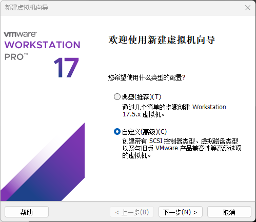

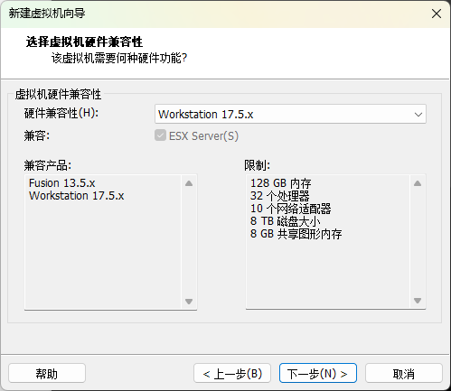

Select "I will install the operating system later", click Next, choose Linux as the guest OS, then click Next. Enter a VM name and location, then continue.

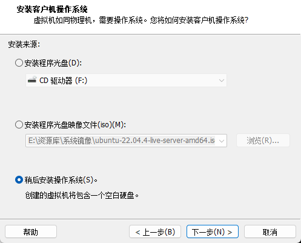

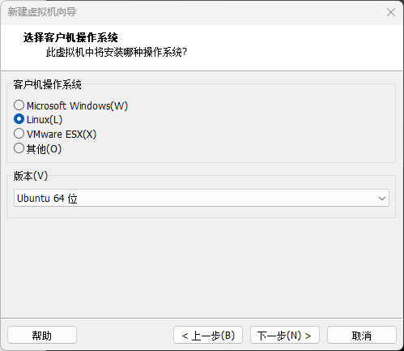

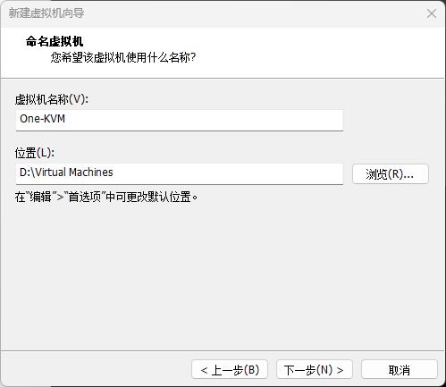

Configure CPU and memory as needed (minimum 1 core, 512 MB). Choose a network mode (bridged recommended to stay on the same LAN and avoid port forwarding). Keep default I/O controller and disk type.

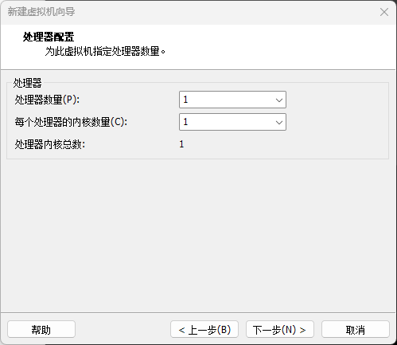

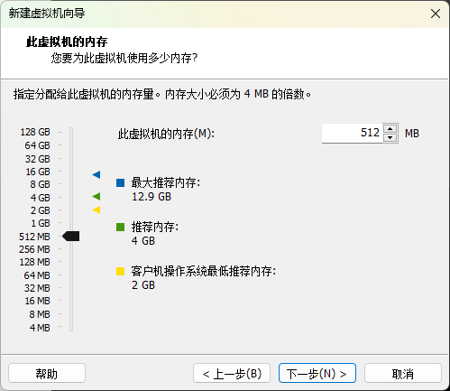

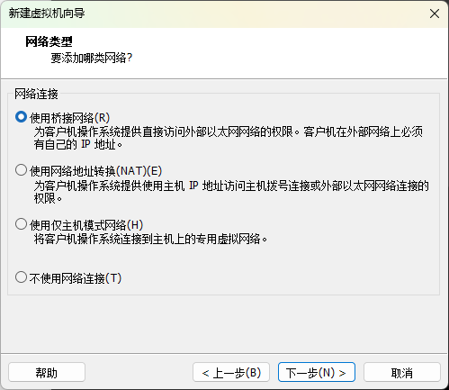

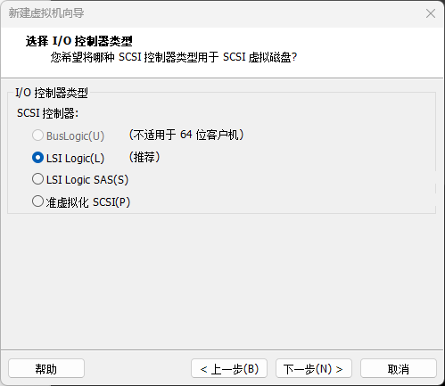

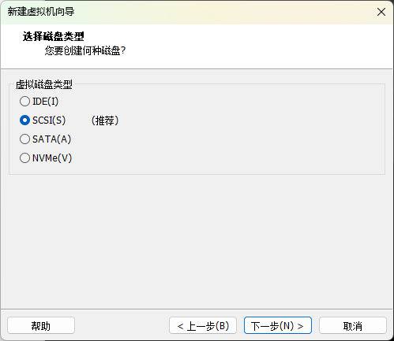

For disk selection, choose "Use an existing virtual disk" and select the extracted disk file. Keep the existing disk format. Finish the wizard (do not start the VM yet).

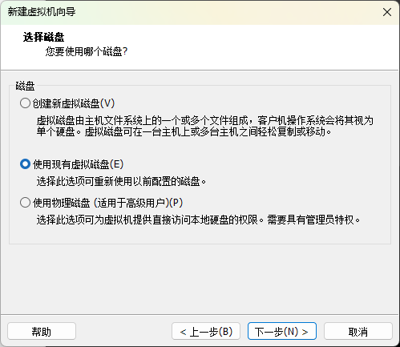

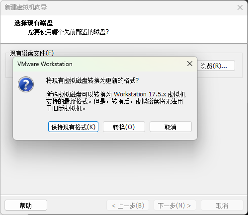

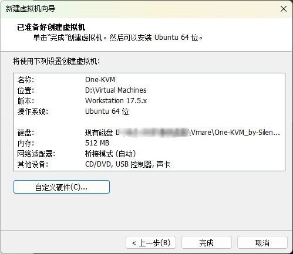

### Adjust VM Settings

On the VM home page, choose Edit virtual machine settings. Set USB controller compatibility to USB 3.1. In Options -> Advanced, set firmware type to UEFI. If the host has Hyper-V enabled, you can check "Disable side channel mitigations" to reduce performance loss (optional).

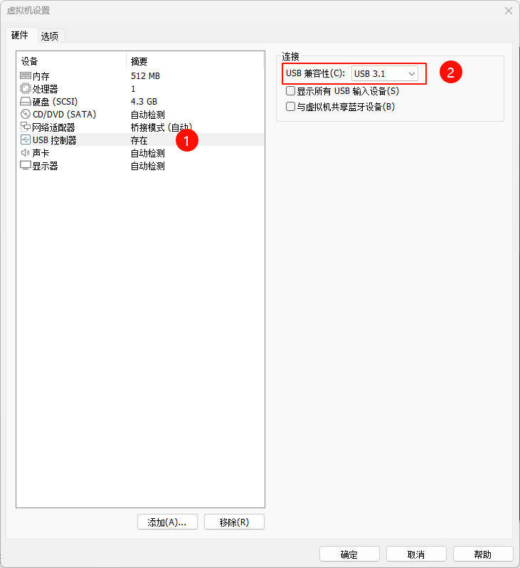

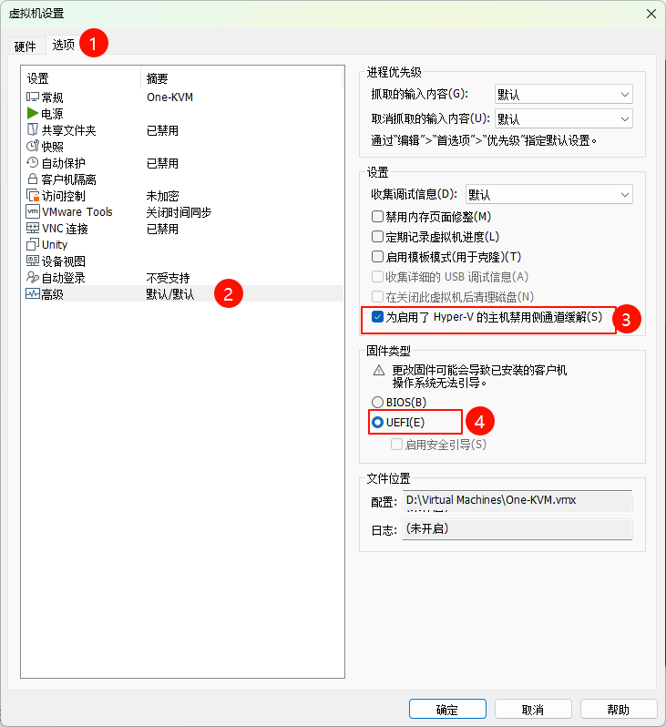

### Start the VM

After configuration, start the VM. Connect the USB HDMI capture card and CH340 + CH9329 USB combo cable to the host, then pass both devices through to the VM. You can now use One-KVM.

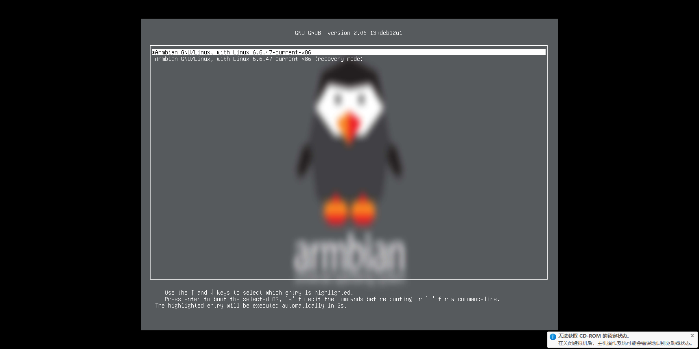

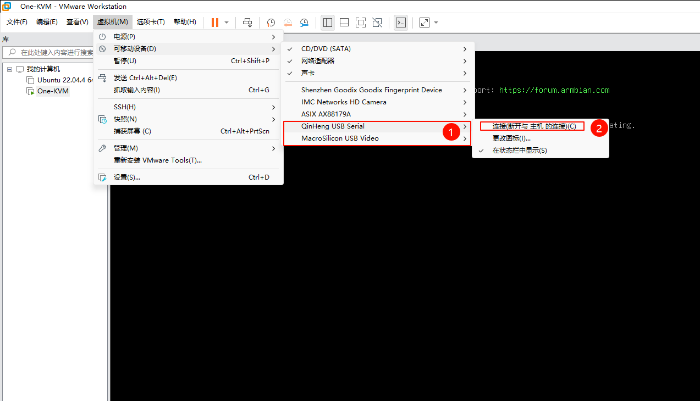

### Usage

Open `http://<VM IP>:8080` in your browser to access the web UI. Complete the onboarding flow, then you can start using it.

### Other

If your VMware VM uses bridged networking but does not get an IP, it may be bridging to the wrong NIC. Use the Virtual Network Editor to choose the correct adapter.

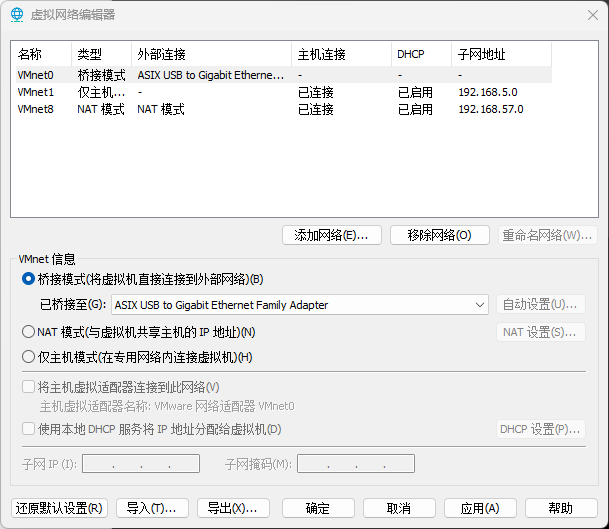
