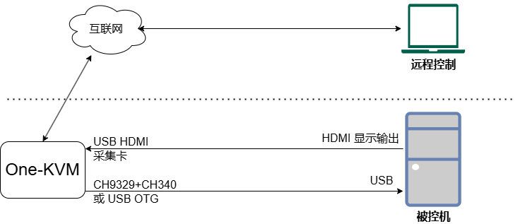
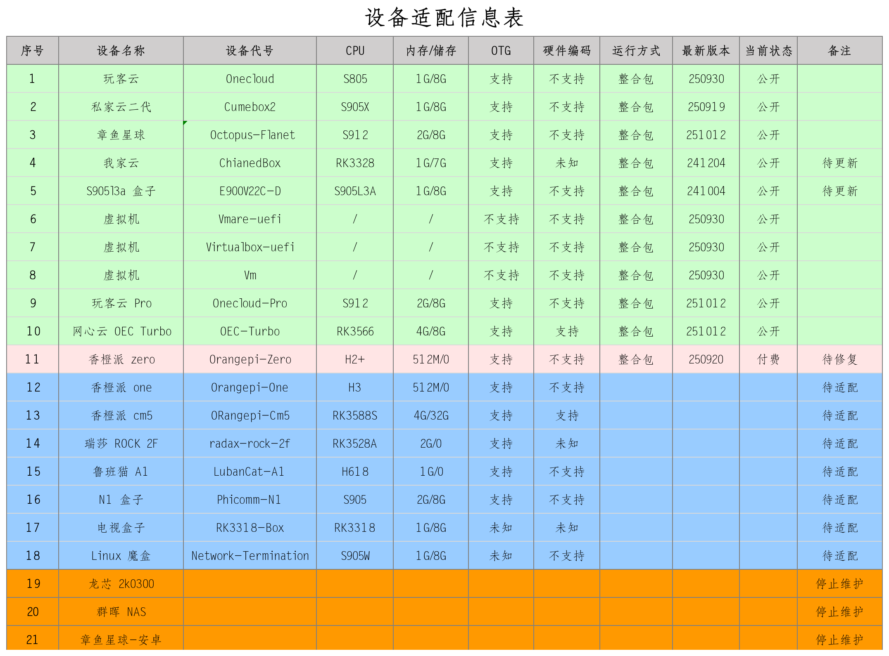
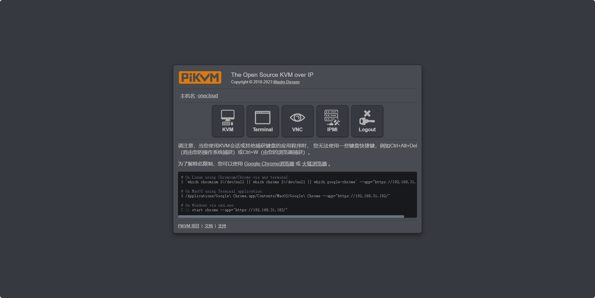
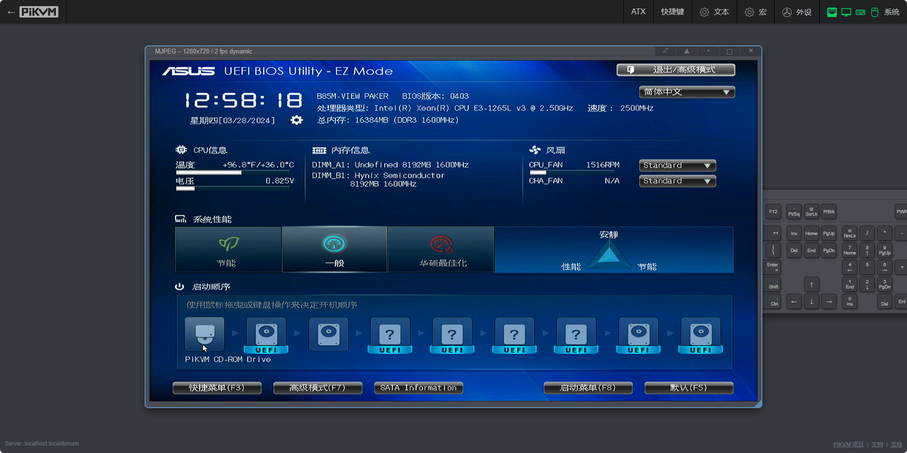
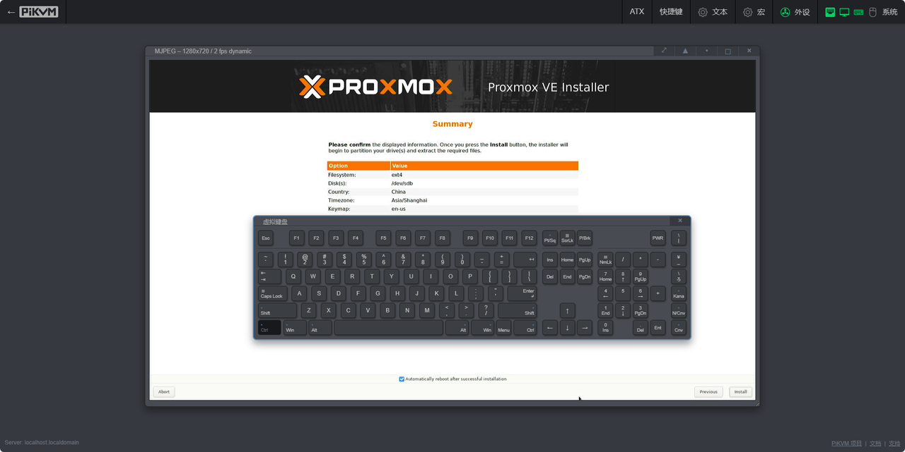
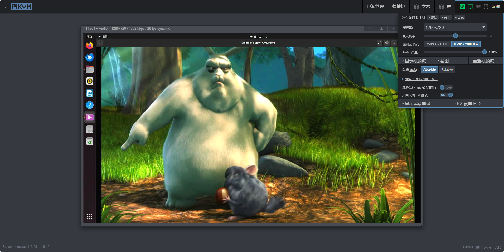
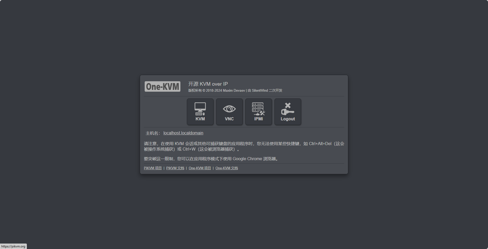
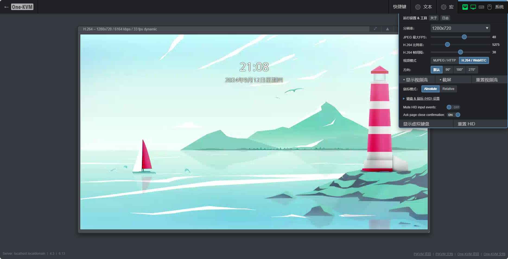
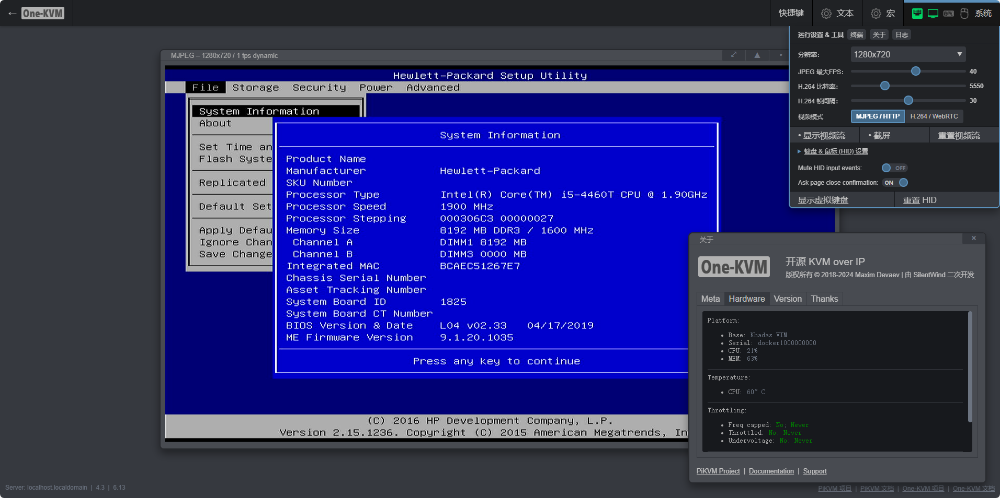

### How It Works

### Software Features

!!! tip "Note"
    This table only compares how the One-KVM project adapts to these KVM software options and does not represent official product features.

| Feature | One-KVM (PiKVM) | BliKVM | JetKVM |
| :----------------: | :--------------: | :---------: | :-----: |
| Open source | √ | √ | √ |
| Simplified Chinese Web UI | √ | √ | √ |
| Remote video stream formats | MJPEG/H.264 | MJPEG/H.264 | H.264 |
| H.264 video encoding | CPU/GPU | CPU | CPU/GPU |
| Remote audio stream | √ | x | x |
| Remote mouse/keyboard control | OTG/CH9329 | OTG | OTG |
| VNC control | √ | x | x |
| ATX power control | GPIO/USB relay | x | x |
| Virtual storage mounting | √ | √ | √ |
| WOL (wake-on-LAN) | √ | √ | √ |
| Web clipboard | √ | √ | x |
| OCR | √ | √ | x |
| Web terminal | √ | √ | x |
| Docker deployment | √ | √ | √ |

### Supported Platforms

- Architectures: x86_64, ARMv7, ARM64
- Platform: Docker
- Hardware: USB UVC capture card, CH9329 + CH340 or OTG port

**Supported Hardware**

> Paid images require a paid membership to access. See the [Sponsorship plan](./thanks.md).

**USB Capture Card Compatibility**

| USB capture card compatibility |  |  |  |  |
| :------------------------------------: | :----------: | :------------: | :------------: | :----------: |
| **Model/Chipset** | **USB Interface** | **Linux Support** | **One-KVM Support** | **Status** |
| MS2109 | USB2.0 | √ | √ | Recommended |
| MS2130 | USB3.0 | √ | √ | Recommended |
| MS2130S | USB3.0 | √ | √ | Recommended |
| MS2131 | USB3.0 | √ | √ | Recommended |
| Tengfei TFDGK05 | USB2.0 | √ | × | / |
| Mituo Matrix MT-UH02 | USB2.0 | × | × | / |

### Downloads

High-speed direct download: [http://sd1.files.one-kvm.cn/](http://sd1.files.one-kvm.cn/) (sponsored by community members; direct links, EdgeOne CDN; multi-threaded download recommended)

High-speed direct download: [https://pan.huang1111.cn/s/mxkx3T1](https://pan.huang1111.cn/s/mxkx3T1) (sponsored by Huang1111 Public Welfare)

Baidu Netdisk (login required): [https://pan.baidu.com/s/166-2Y8PBF4SbHXFkGmFJYg?pwd=o9aj](https://pan.baidu.com/s/166-2Y8PBF4SbHXFkGmFJYg?pwd=o9aj)

<!-- Screenshots are similar, removed from this page and moved to hardware-specific pages.
**OneCloud**

**Synology x86_64**

**CumeBox 2**

More platforms are not listed here.
-->
