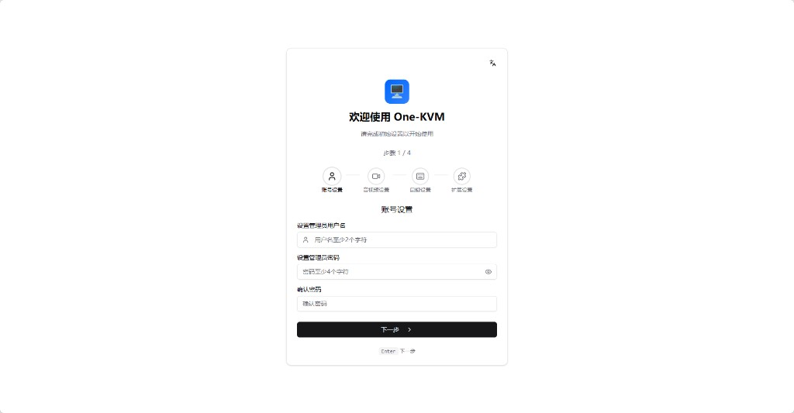
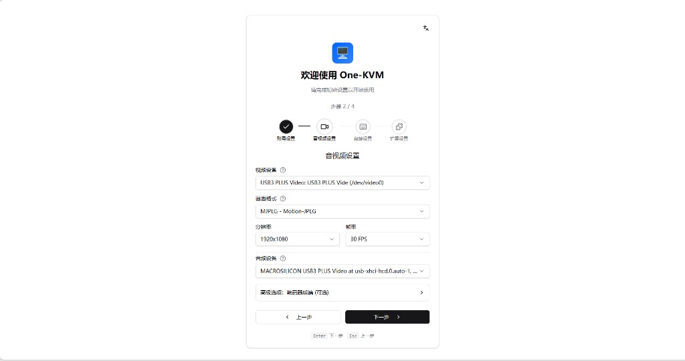
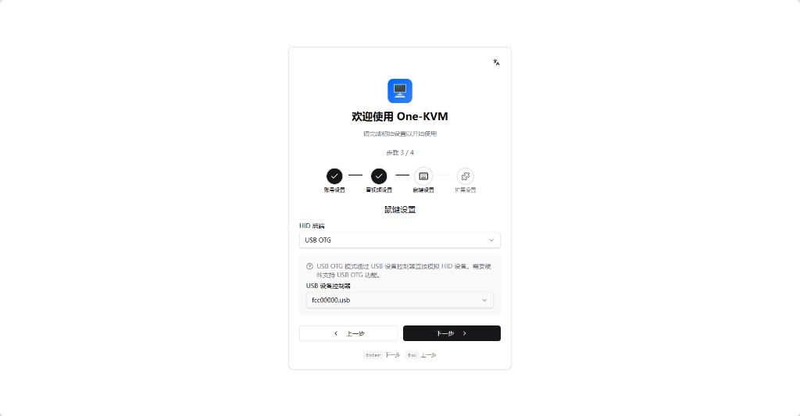
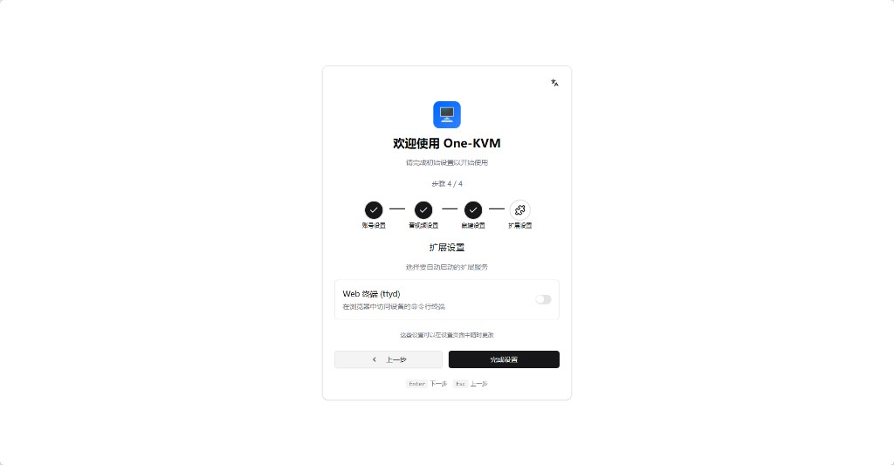

# Onboarding

When you access One-KVM for the first time, the system shows the onboarding page to help you complete the initial setup.

## Welcome

The first step introduces the main features and the setup flow.

## Setup Steps

### 1. Create the Admin Account

Create the administrator account first:

- **Username** - The login username
- **Password** - Set a secure password
- **Confirm Password** - Enter the password again to confirm

!!! tip "Password tips"
    Use a strong password with at least 8 characters, including uppercase/lowercase letters, numbers, and symbols.

### 2. Audio/Video Device Setup

- Select the video capture device
- Select the input format from the capture device
- Set the initial resolution and frame rate
- Select the audio device
- Select the encoder (optional)

### 3. HID Device Setup

- Select the HID backend
- Choose and configure the HID backend device and parameters

### 4. Extension Setup

- Select extensions to start automatically

## Finish Setup

After confirming everything, click "Finish". The system saves the configuration to the database, initializes hardware modules, and signs you in, then redirects to the KVM console.

All settings take effect immediately after onboarding. To change them later, use the [Settings page](settings.md). To rerun onboarding, delete the database file and restart the service.