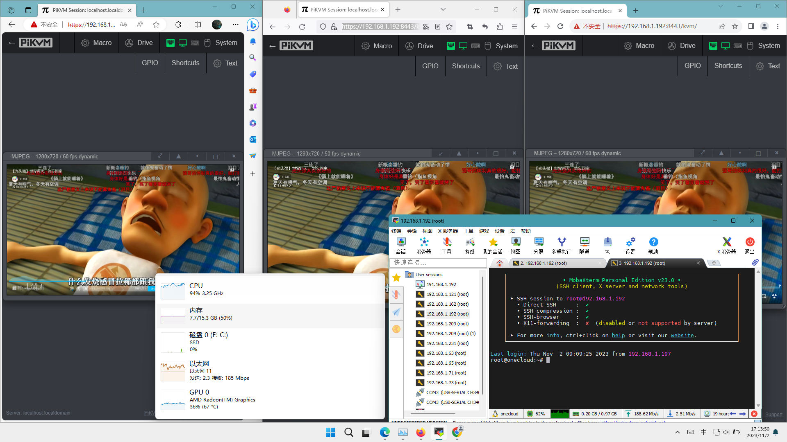
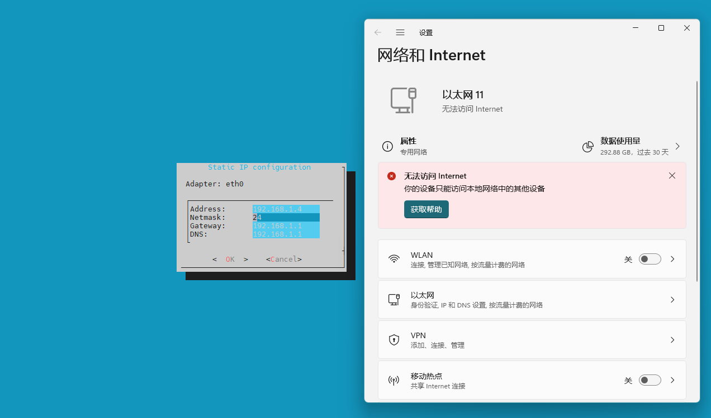
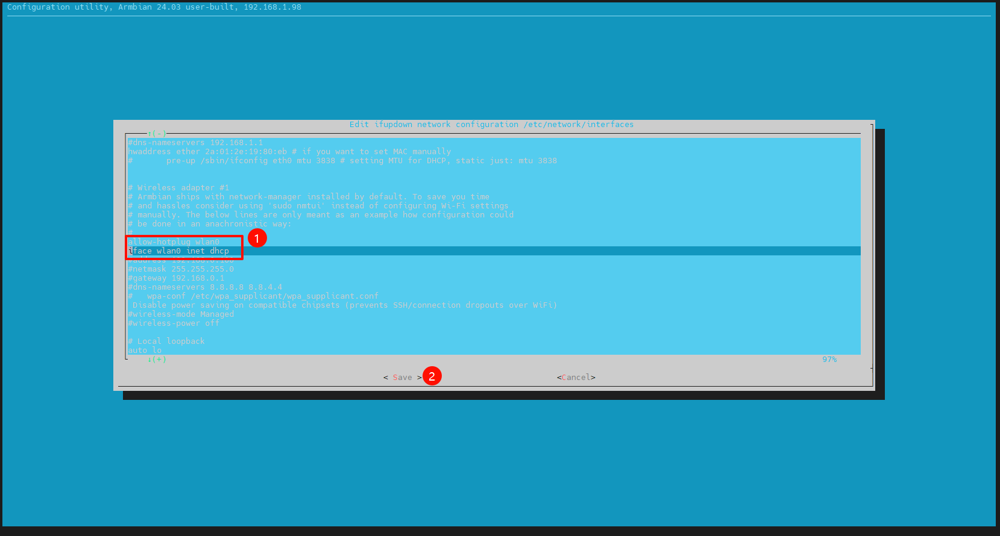
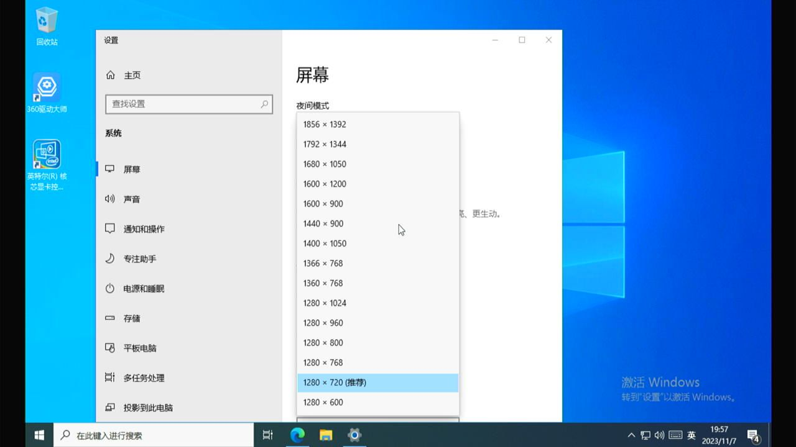
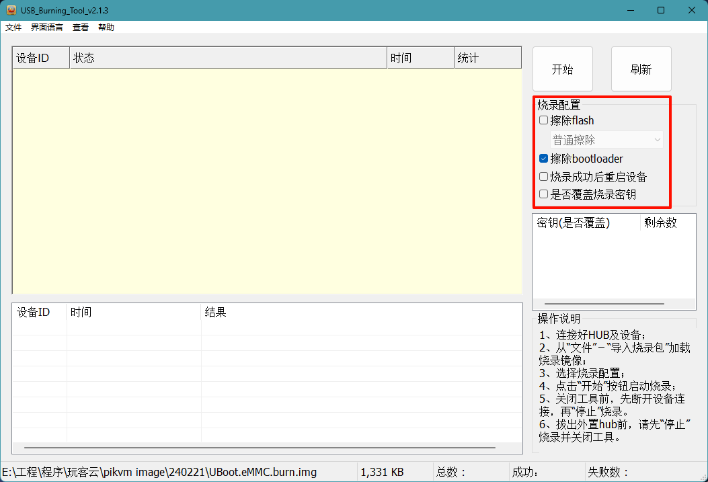
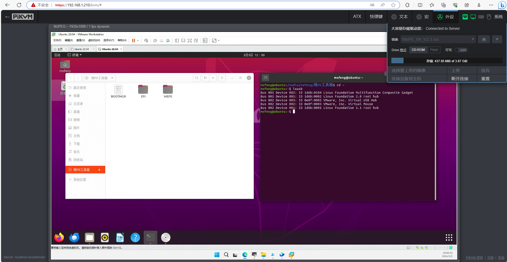
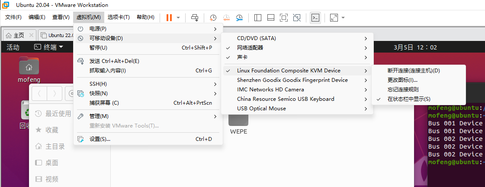
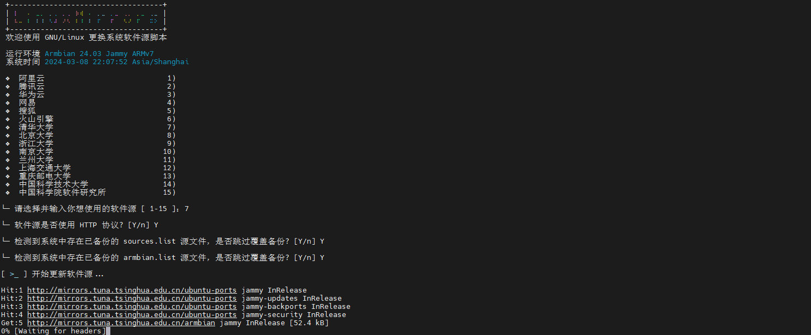
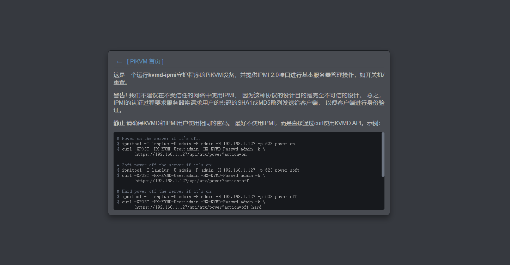
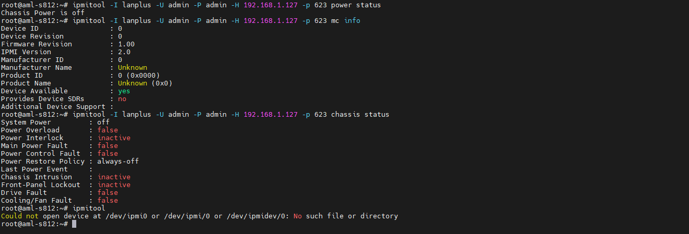

1. **PiKVM官方的功能说明文档在哪？**

    如果您需要对功能进行高级配置，非常建议查阅官方文档，官方项目文档的的FAQ和功能配置讲解非常详细，包含示例易于上手。官方文档（英文）：[PiKVM Handbook](https://docs.pikvm.org/)。

1. **为什么网页视频感觉非常卡顿？**

    **提升使用体验的方法**：
    使用mjpeg格式，使用720p60帧或1080p30帧，右上角sysytem调整至最大帧率。720p可以点击网页视频右上角的“•”自动缩放画面与原画面分辨率相同。演示图为3终端720p60fps演示效果：
    

1. **如何在****公网****中访问局域网的One-KVM？**

     如果路由器有公网IP地址，可以使用端口映射转发443端口。在其他情况下，可以使用内网穿透服务（如Tailscale和FRP），只需几个简单的命令即可在One-KVM上配置。

1. **如何修改软件端口和账户密码？**

    修改端口可以编辑 /etc/kvmd/nginx/目录下的conf后缀文件将相关端口修改所需端口（443是网页运行的端口），然后运行systemctl restart kvmd kvmd-nginx 生效。

    **注意**：HDMI终端和SSH终端可以直接以root用户登录。但PiKVM网页终端的默认登入用户是kvmd-webterm低权限账户（无密码），没有root权限且无法使用`sudo`提权，若需要执行特权命令请先在终端执行`su root`命令并输入密码切换为root账户。
    修改账号密码示例：
    ```bash
    #切换为root账户
    su root
    #添加用户 请将silentwind替换为你的用户名
    kvmd-htpasswd set silentwind
    #输入密码
    #删除用户
    kvmd-htpasswd del admin
    #列出所有用户
    kvmd-htpasswd list
    #重启服务，使修改立刻生效
    systemctl restart kvmd kvmd-nginx
    ```

1. **如何给玩客云设置静态****IP****？**

    使用终端图形化工具`armbian-config` 或`nmtui`，可能没有预装需手动安装 `apt install armbian-config` 。

    示例：`armbian-config` 依次选中进入Network-->IP-->eth0-->Static修改网络设置。
    

1. **如何给玩客云更换MAC地址（更换动态IP）?**

    可以修改/etc/network/interfaces配置文件中的MAC地址。
    ```bash
    #快捷命令，依次执行如下命令即可
    MAC="$(echo 2a:01:`openssl rand -hex 4 | sed 's/\(..\)/\1:/g; s/.$//'`)"
    echo $MAC
    #此配置文件替换命令仅首次执行有效，多次需要手动替换MAC地址
    sed -ie "s/#hwaddress ether/hwaddress ether $MAC/g" /etc/network/interfaces
    reboot
    ```

1. **如何使用USB无线网卡连接WIFI？**

    作者和hzytic大佬编译发布的镜像都已包含常见无线网卡驱动，USB无线网卡即插即用。
    ```bash
    #开启WiFi功能，armbian-config-->NetWork-->Advanced，取消注释wlan0网卡
    armbian-config
    nmtui
    ```
    
    

1. **可以使用One-KVM进行游戏或是看剧吗？**

    不能，受限于USB2.0端口HDMI-USB采集卡采集的是有损压缩视频，画面质量最高为1080p30fps，且没有音频，无法提供高质量且流畅的视频体验。
    若有此类需求，建议尝试串流软件。

1. **可以在触屏设备上使用One-KVM上吗？**

    不建议，可以在触屏设备浏览器上观看视频画面，但WEB界面可能无法正确响应部分触屏点击事件。
    推荐使用VNC应用程序，注意不要使用RealVNC（不兼容）。

1. **如何添加自己的SSL证书？**

    如果需要使用自己的证书，请替换 /etc/kvmd/nginx/ssl中的密钥，必要时编辑 /etc/kvmd/nginx/ssl.conf并重新启动kvmd-nginx服务。

1. **访问 One-KVM 主页时，提示 500 错误?**

    可能原因：错误的 YAML 语法或者硬件外设不满足。可执行 `systemctl status kvmd kvmd-otg` 或是 `kvmd --run` 查看详细报错信息。

1. **为什么网页视频会有无法消除的黑边？**

    请检查你的被控机系统设置。调整被控机分辨率与网页匹配可能会有帮助。
    

1. **如何启用免拆机USB线刷功能?**

    最新版使用了由蓝蓝定制的UBoot，会在系统启动时检测重置按钮（电源口和网口之间的小孔）是否被按下，只需按住重置键的同时插入电源即可自动进入刷机过程。

    对于其他系统（如5.9内核版本），可以刷蓝蓝最新Uboot（网盘路径：/玩客云/PiKVM相关软件/UBoot.eMMC.burn.img）。单独刷写UBoot时需要取消勾选“擦除falsh”，以便保留Linux系统数据。
    

1. **如何通过One-KVM控制VMare虚拟机？**

    难点是VMware直接使用主机USB HID的方法：
    ```yaml
    #在虚拟机的配置文件.vmx里增加下面一行
    usb.generic.allowHID = "TRUE"
    ```
    
    
    
   
1. **如何给Armbian更换APT源？**

    ```bash
    bash <(curl -sSL https://gitee.com/SuperManito/LinuxMirrors/raw/main/ChangeMirrors.sh) --source mirrors.tuna.tsinghua.edu.cn --updata-software false --web-protocol http
    ```
    

1. **如何启用One-KVM中的IPMI 2.0接口？**

    此服务默认关闭，如需要可手动开启。启动方法：
    ```bash
    pip intsall pyghmi
    systemctl start kvmd-ipmi
    ```
    
    

1. **如何改变玩客云前面板LED灯颜色？**

    对于5.9内核系统，有`green_on`,`red_on`,`bule_on`,`green_off`,`red_off`,`bule_off`命令可用。

    对于6.x高内核的系统，可以使用如下命令控制LED的亮灭。
    ```bash
    echo 0 > /sys/class/leds/onecloud:red:alive/brightness
    echo 0 > /sys/class/leds/onecloud:blue:alive/brightness
    echo 0 > /sys/class/leds/onecloud:green:alive/brightness
    ```
