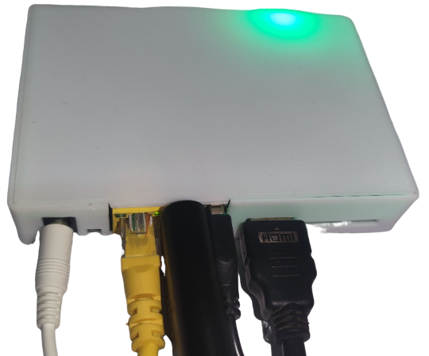
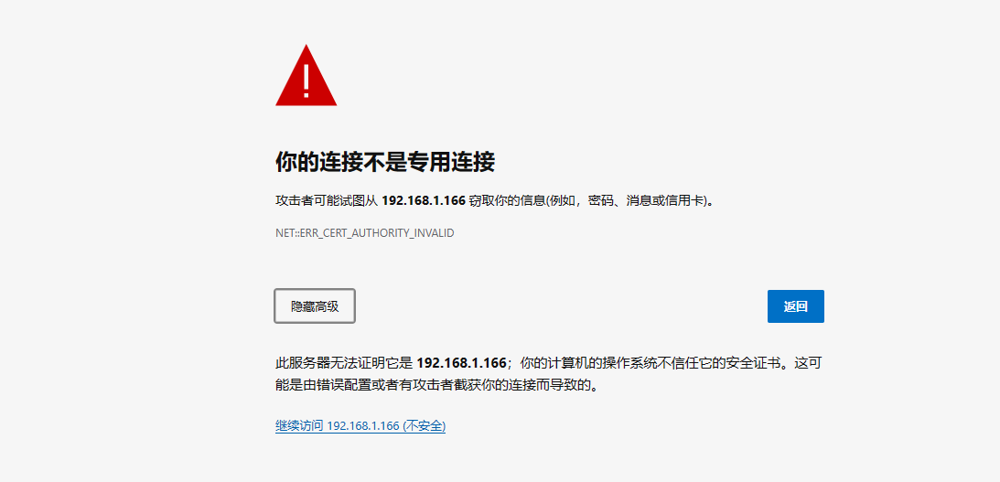
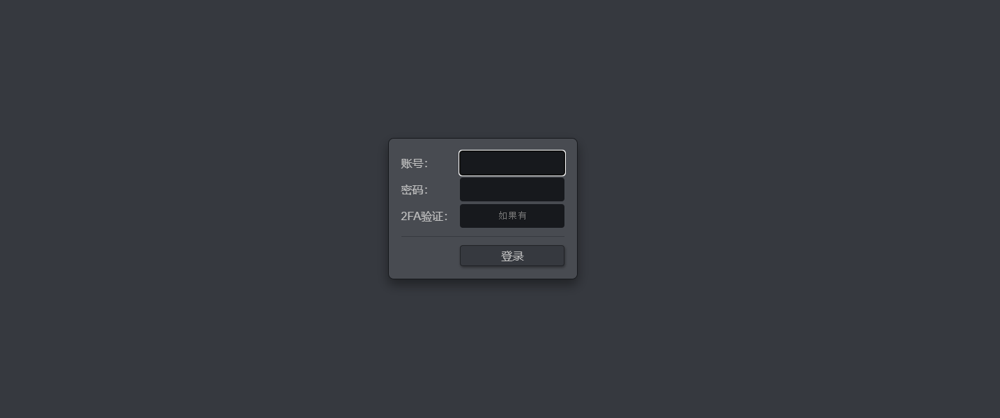
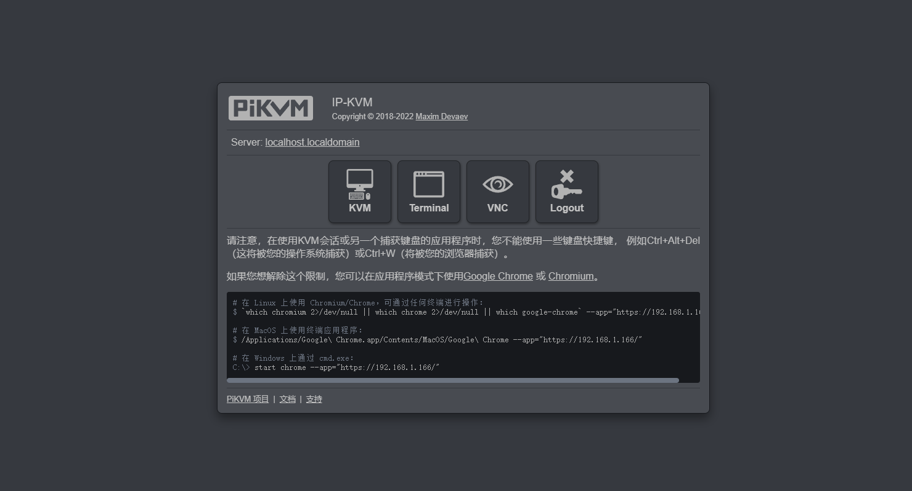
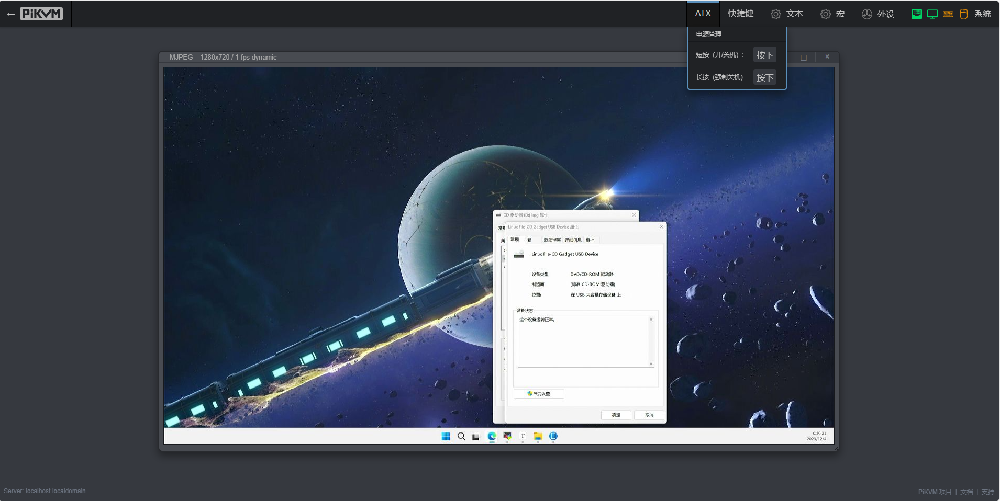

### IP地址

玩客云刷入直刷镜像后默认上网方式为 DHCP 自动获取 IP，主机名为 `onecloud`。启动时由玩客云前面板LED灯会有红灯转为绿灯，启动后在浏览器访问玩客云IP即可。

### KVM网页

软件运行在443端口，访问80端口会自动跳转到443端口。由于软件SSL证书为自签证书，不被浏览器信任是正常情况，请无视风险继续访问。若有需要可自行更换Nginx SSL证书。

!!! tip
    初始WEB和VNC账号密码都为admin/admin且同步，root用户密码通常为用户自行设置，若未设置可尝试1234。 ssh默认端口：22 web默认端口：80，443 vnc默认端口：5900 janus ws端口(默认关闭)：5009

!!! tip
    排障指南： 网页视频黑屏提示无No Singal，请检查硬件是否正确连接或松动； 网页端黑屏无任何画面或彩色竖条，请检查是否有被控机HDMI信号输入； 进系统画面显示正常，bios界面黑屏或渲染异常，请尝试在BIOS界面开启CMS兼容模式； 虚拟鼠标错位或移动范围异常可尝试在网页右上角切换鼠标相对模式； 画面显示片刻黑屏，刷新网页重复此现象，可以尝试使用火狐浏览器； 如果以上情况都不符合请尝试重启玩客云自动复位，仍旧无法解决可在Github提issue或加入One-KVM交流群反馈。

