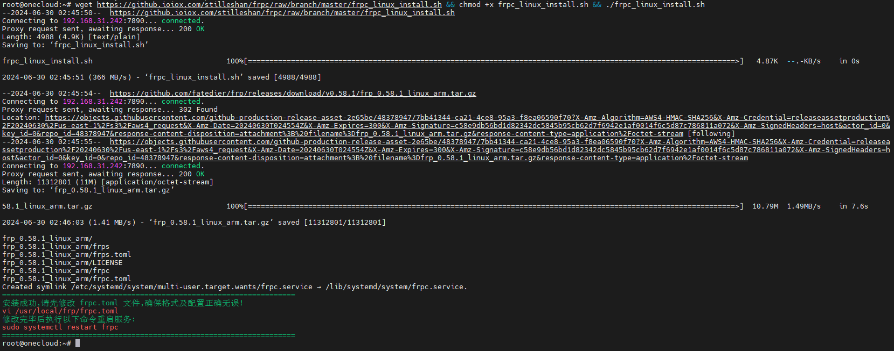
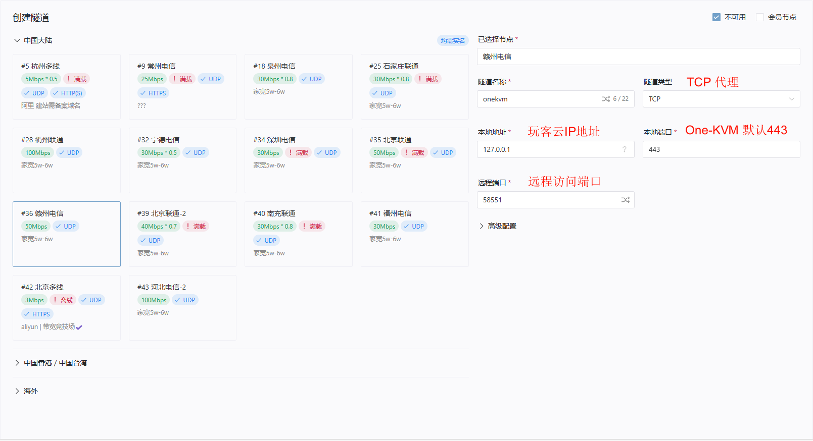
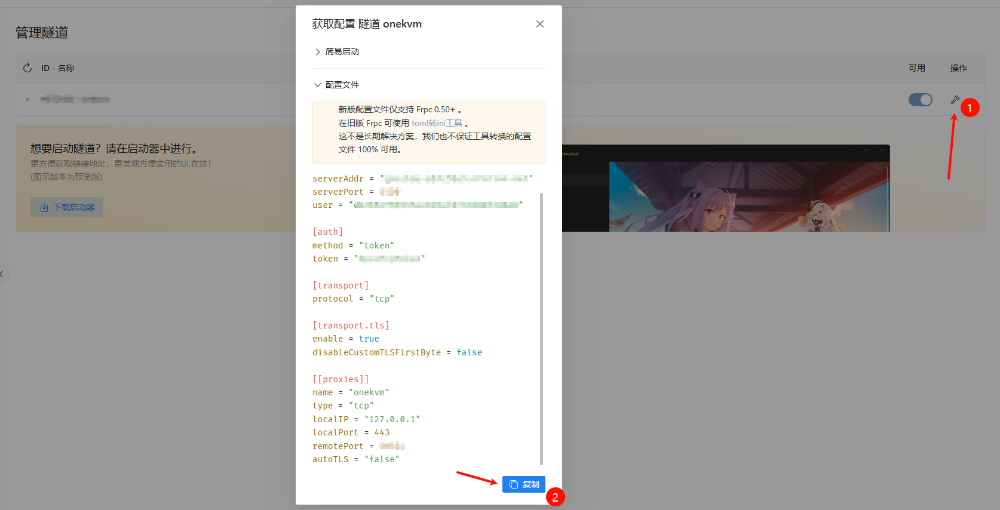
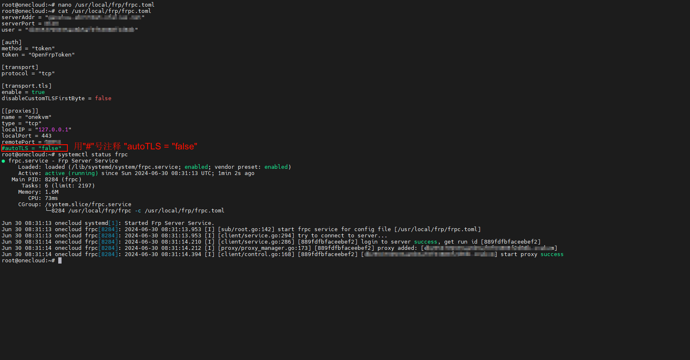
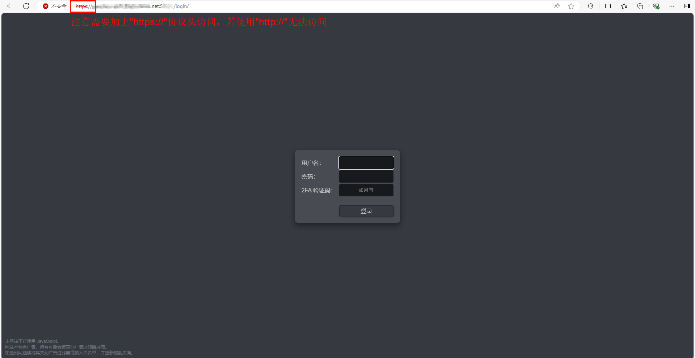

> frp 是一个专注于内网穿透的高性能的反向代理应用，支持 TCP、UDP、HTTP、HTTPS 等多种协议。可以将内网服务以安全、便捷的方式通过具有公网 IP 节点的中转暴露到公网。

### Frpc 安装

```bash
#Frpc 一键安装脚本
wget https://raw.githubusercontent.com/stilleshan/frpc/master/frpc_linux_install.sh && chmod +x frpc_linux_install.sh && ./frpc_linux_install.sh
```



### Frpc 配置

如果使用自建服务器方案则需要在有公网IP的服务器上安装 Frps 服务程序；如果使用第三方 Frp 服务提供商，需要新建一条隧道来映射内网主机端口。对于One-KVM，可以使用 TCP 隧道，映射127.0.0.1地址（或One-KVM所在主机的局域网地址）和443端口。

这是第三方 Frp 服务提供商 OpenFrp 新建Frp 隧道的简单示例。





然后修改 `/usr/local/frp/frpc.toml` 填入你 Frp 服务商提供的配置文件或自建 Frps 服务器的配置文件。

```bash
# 修改 frpc.toml ，若有"atuoTLS"选项则需要使用"#"注释掉
nano /usr/local/frp/frpc.toml

# 重启 frpc 服务即可生效
sudo systemctl restart frpc
# 查看 frpc 服务运行状态
sudo systemctl restart frpc
```



### Frpc 访问

在 Frps 正确运行后，在浏览器访问服务商提供的带端口的域名（或自建 Frps 服务器地址）即可打开One-KVM 网页。

??? note "网页远程访问需要使用"https://"协议头"
    注意，远程访问 One-KVM 网页时需要手动在网址栏添加"https://"协议头，否则默认的"http://"协议头会返回错误"400 Bad Request The plain HTTP request was sent to HTTPS port"。

    
