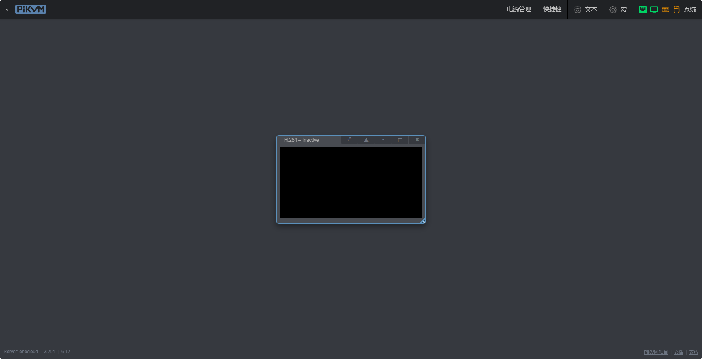
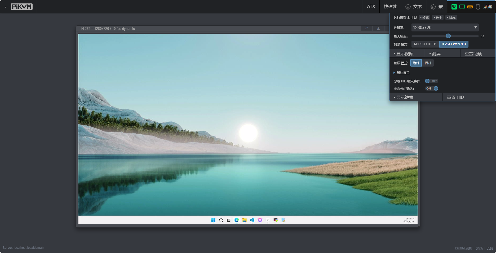
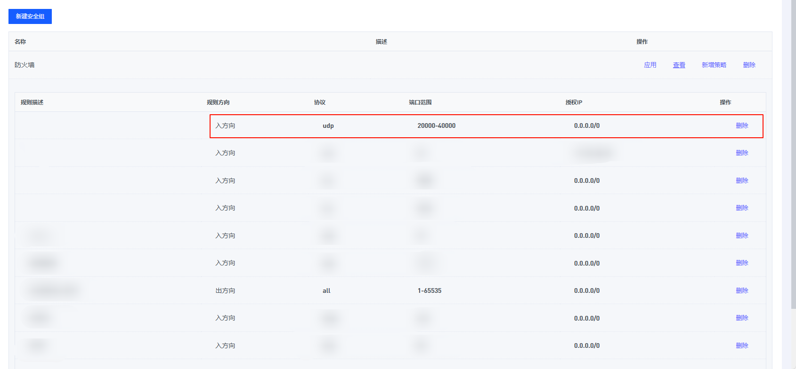
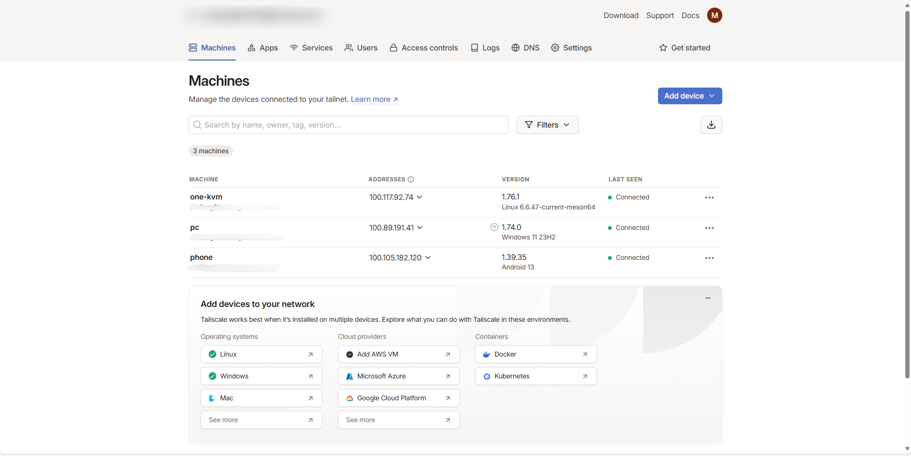
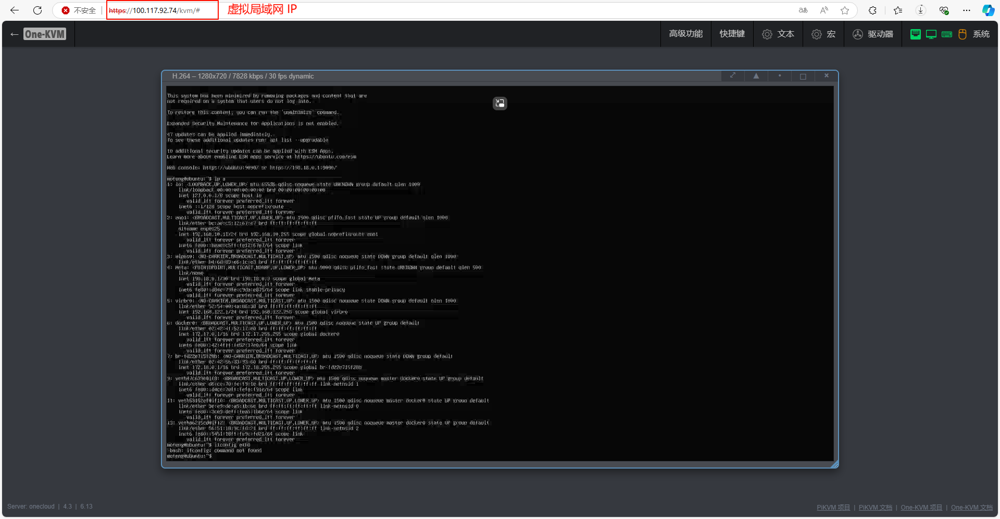
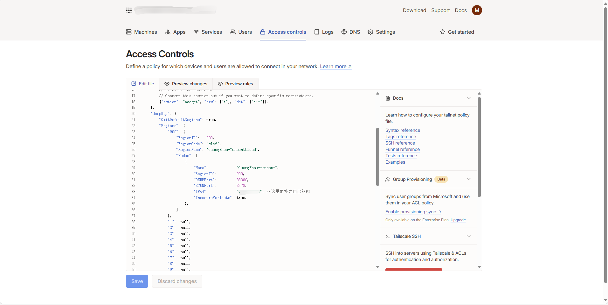

### H.264 介绍

H.264，也被称为 MPEG-4 AVC（Advanced Video Coding），是一种广泛使用的视频压缩标准，尤其适用于需要高效压缩比的应用场景，比如互联网流媒体传输、蓝光光盘视频等。

H.264 视频相较 MJPEG 视频拥有完整音频和低码率的特点，可以在更低的带宽下运行。由于 PiKVM 官方的H.264视频功能仅适配树莓派 GPU，所以在其它设备上使用H.264功能暂时无法硬编码（对于玩客云设备，Armbian 系统也没有可用的 VPU 驱动）。

下面是 One-KVM 项目中关于 H.264 视频的两种解决方案：libx264、ffmpeg。


??? Libx264

    Libx264 是一个用于编码 H.264 视频的开源库，是由 VideoLAN 和其他贡献者开发的，并且由于其高效的编码质量和速度，在很多视频处理软件中都有使用。

    作者已将其与 ustreamer 集成，在 Docker 版容器中默认启用此功能，相比后面的 ffmpeg 方案性能更好使用更加方便。此 ustreamer 分支可查看 [https://github.com/mofeng-git/ustreamer](https://github.com/mofeng-git/ustreamer)。

    H.264/WebRTC 网页视频可能需要额外映射 20000-40000 UDP 端口。

??? FFmpeg

    **此方法已停止维护仅做归档使用**

    此功能由群友 自.知 设计，使用 ffmpeg 进行软编码。由于为 CPU 软件编码，在玩客云设备上此功能效果较差。

    **使用**

    整合包 One-KVM_Armbian_by-SilentWind_for-Onecloud_24.6.18 中已预装此功能，更早的版本中没有预装此功能（若需要手动安装可参照文末教程）。由于玩客云 CPU 性能较差，所以 `kvmd-ffmpeg` 服务默认为关闭状态（网页表现如下），避免影响其他服务的流畅性。

    

    如需要可执行如下命令可手动开启。

    ```bash
    #启动 kvmd-ffmpeg 服务
    sudo systemctl start kvmd-ffmpeg
    #设置 kvmd-ffmpeg 服务开机自启
    sudo systemctl enable kvmd-ffmpeg
    ```

    在玩客云上，H.264 视频非常卡顿，使用体验较差。

    

    **安装**

    ```bash
    #此功能默认未安装，开启需要执行 kvmd_h264_install.sh 脚本
    git clone  --branch 9b97e01b340484fb1c75916531b2c63aea3e8046 https://github.com/mofeng-git/One-KVM.git
    cd One-KVM 
    sudo bash kvmd_h264_install.sh

    #停止 kvmd-ffmpeg 服务
    sudo systemctl stop kvmd-ffmpeg
    sudo systemctl disable kvmd-ffmpeg
    ```

### H.264/WebRTC 异地使用

端口映射、异地组网两种方式任选其一即可，推荐使用异地组网方式。

**端口映射**

在防火墙映射 20000-40000 udp 端口，演示站就是使用的这个方法。

此方法局限性较大，需要映射太多端口，不推荐使用。



**异地组网**

这里以 Tailscale 异地组网为例，首先安装客户端：[Download · Tailscale](https://tailscale.com/download/linux)，这里可以直接在 One-KVM 主机上安装 Tailscale，安装命令如下。

```
curl -fsSL https://tailscale.com/install.sh | sh
#登录同一 Tailscale 账号
tailscale up

#一些工具命令
#查看虚拟局域网设备列表
tailscale status
#查看网络状态和中继服务器状态
tailscale netcheck
#查看当前设备虚拟局域网 IP
tailscale ip
```

然后进行多设备组网，下图是一个实例。



然后使用虚拟局域网 IP 访问即可使用 One-KVM 的 H.264/WebRTC 功能。



由于 Tailscale 官方中继服务器位于境外，网络联通性比较差，推荐使用自建中键服务器，可以参考这篇文章： [自建 Tailscale 中继服务器 | Anubis的小窝](https://anubis.cafe/6fdf334e)




### 视频演示


