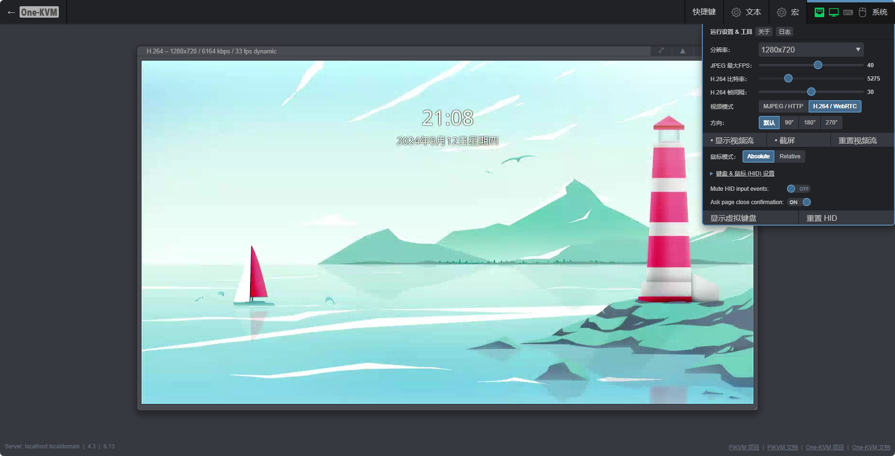

One-KVM 是基于廉价计算机硬件和 PiKVM 软件二次开发的 BIOS 级远程控制项目。可以实现远程管理服务器或工作站，无需在被控机安装软件调整设置，实现无侵入式控制，适用范围广泛。

<div class="grid cards" markdown>

-   :material-clock-fast:{ .lg .middle } __安装迅速__

    ---

    使用 Docker 或整合包，即刻完成部署，开箱即用

-   :material-camera-control:{ .lg .middle } __非侵入式控制__

    ---

    无需在被控机安装软件，实现非侵入式控制

-   :material-view-headline:{ .lg .middle } __功能丰富__

    ---

    KVM 远程控制、ATX 电源管理、 USB 虚拟外设、VNC、H.264/WebRTC 等

-   :material-open-source-initiative:{ .lg .middle } __开源开放__

    ---

    基于 [PiKVM](https://github.com/pikvm/pikvm)，以 GPLv3 开源许可证在 [GitHub](https://github.com/mofeng-git/One-KVM) 开源 

</div>

## 在线体验

演示网站：[https://kvmd-demo.mofeng.run](https://kvmd-demo.mofeng.run)<br>
账号/密码：身份认证已禁用，无需登录

演示网站部署在云服务器上，故没有视频画面。



## 快速开始

```bash
sudo docker run --name kvmd -itd \
    --device /dev/video0:/dev/kvmd-video \
    --device /dev/ttyUSB0:/dev/kvmd-hid \
    -p 8080:8080 -p 4430:4430 -p 5900:5900 -p 623:623 \
    registry.cn-hangzhou.aliyuncs.com/silentwind/kvmd:dev
```
以上仅作为体验使用，详细部署文档请查阅： [Docker 部署](https://one-kvm.mofeng.run/docker_install/)。

## 社区

- Github Issue：[https://github.com/mofeng-git/One-KVM/issues](https://github.com/mofeng-git/One-KVM/issues)

- QQ 交流群：569514148

## 赞助

如果 One-KVM 对你有帮助，欢迎赞助作者，以支持作者继续开发和维护此项目。

[为爱发电](https://afdian.com/a/silentwind){ .md-button }

##

## 状态

[](https://star-history.com/#mofeng-git/One-KVM&Date)


