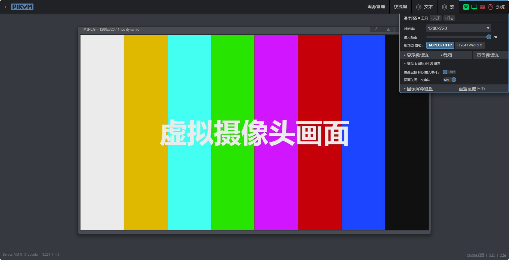

# 介绍

One-KVM是基于廉价计算机硬件（目前为玩客云和X64兼容机）和PiKVM软件的硬件级远程控制项目。KVM over IP可以远程管理服务器或工作站，实现无侵入式控制，无论被控机为什么操作系统或是否安装了操作系统，具有更广泛的适用性。此项目基于 [PiKVM](https://github.com/pikvm/pikvm)，和基于远控软件的远程管理方式不同，无需在被控电脑安装任何软件，实现无侵入式控制。

# 运行效果

!!! note
    演示网站运行在X64云服务器上，实际效果因软硬件配置而异。

演示网站：[PiKVM X64 DEMO](https://1.12.77.48/) 
账号/密码：admin/admin

!!! note
    此为在玩客云设备上的演示效果，实际效果因软硬件配置而异。

.PNG)

### 其他

Github地址：[https://github.com/mofeng-git/One-KVM](https://github.com/mofeng-git/One-KVM) （欢迎点个Star）

为爱发电：[https://afdian.net/a/silentwind](https://afdian.net/a/silentwind)

QQ交流群：569514148 （One-KVM交流群）
