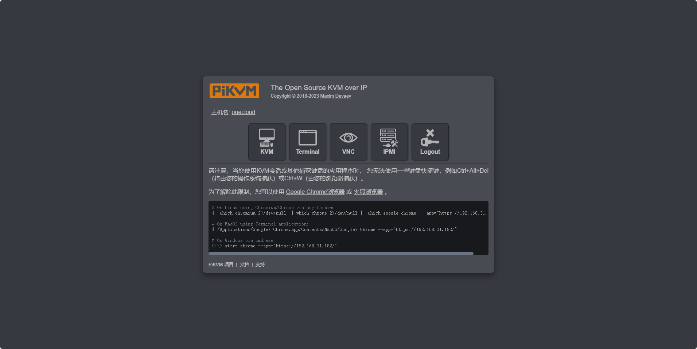

### 介绍

One-KVM是基于廉价计算机硬件（目前为玩客云和X64兼容机）和PiKVM软件的硬件级远程控制项目。KVM over IP可以远程管理服务器或工作站，实现无侵入式控制，无论被控机为什么操作系统或是否安装了操作系统，具有更广泛的适用性。此项目基于 [PiKVM](https://github.com/pikvm/pikvm)，和基于远控软件的远程管理方式不同，无需在被控机电脑安装任何软件，实现非侵入式控制。

-   :material-clock-fast:{ .lg .middle } __快速安装__

    ---

    使用打包好的镜像，数分钟即可完成部署，开始使用

-   :material-camera-control:{ .lg .middle } __非侵入式控制__

    ---

    无需在被控机安装软件或调整设置，可以实现非侵入式控制

-   :material-view-headline:{ .lg .middle } __丰富的功能__

    ---

    已实现 KVM 远程控制、ATX 电源管理、 USB 虚拟外设、VNC、H.264/WebRTC 等

-   :material-open-source-initiative:{ .lg .middle } __开源免费__

    ---

    此项目以 GPLv3 开源许可证在 [GitHub](https://github.com/mofeng-git/One-KVM) 上完全开源 

### 软件安装

推荐使用 Docker 安装部署 One-KVM，具体步骤请参考 [Docker 部署](/docker_install)。

### 运行效果

???+ note
    演示网站运行在云服务器上，实际效果因软硬件配置而异。

    演示网站：[https://kvmd-demo.mofeng.run](https://kvmd-demo.mofeng.run) 
    账号/密码：admin/admin

???+ note
    此为在玩客云设备上的演示效果，实际效果因软硬件配置而异。

    

    
    
    
    
    
    
    
    
    
    

### 其他

Github地址：[https://github.com/mofeng-git/One-KVM](https://github.com/mofeng-git/One-KVM) （欢迎点个Star）

为爱发电：[https://afdian.net/a/silentwind](https://afdian.net/a/silentwind)

QQ交流群：569514148 （One-KVM交流群）
