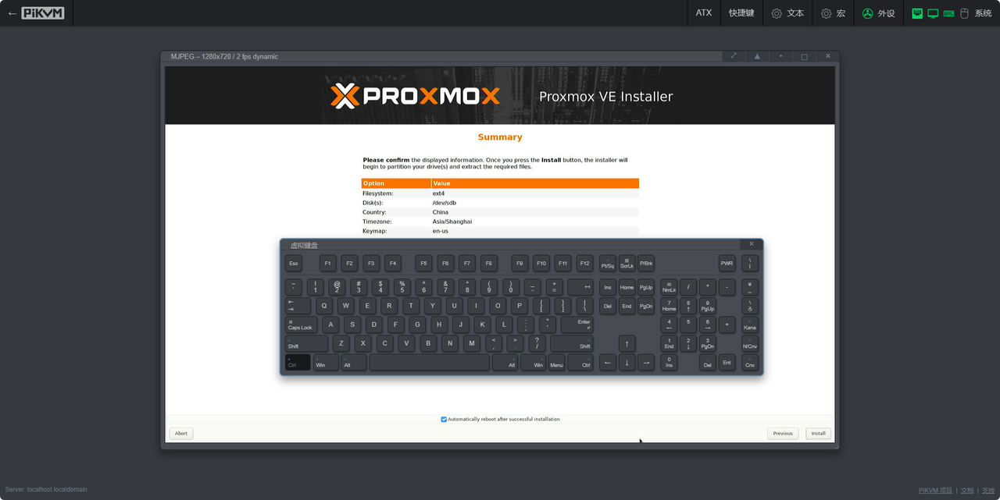

### 介绍

One-KVM是基于廉价计算机硬件（目前为玩客云和X64兼容机）和PiKVM软件的硬件级远程控制项目。KVM over IP可以远程管理服务器或工作站，实现无侵入式控制，无论被控机为什么操作系统或是否安装了操作系统，具有更广泛的适用性。此项目基于 [PiKVM](https://github.com/pikvm/pikvm)，和基于远控软件的远程管理方式不同，无需在被控电脑安装任何软件，实现无侵入式控制。

主要功能对比，TinyPilot 社区版本、PiKVMv3版本出现在这里仅做比较目的。

|      功能      |      One-KVM ARM       |      One-KVM X86       | TinyPilot 社区版本 | PiKVMv3版本  |
| :------------: | :--------------------: | :--------------------: | :----------------: | :----------: |
| HTML5界面语言  |        简体中文        |        简体中文        |        英文        |     英文     |
|    BIOS控制    |           √            |           √            |         √          |      √       |
|    视频捕捉    |           √            |           √            |         √          |      √       |
|    音频捕捉    |           ×            |           ×            |         √          |      √       |
|  鼠键捕获类型  |          OTG           |         CH9329         |        OTG         |     OTG      |
|  从剪贴板粘贴  |           √            |           √            |         √          |      √       |
|    OCR识别     |           √            |           √            |         ×          |      √       |
|    LAN唤醒     |           √            |           √            |         ×          |      √       |
|    VNC支持     |           √            |           √            |         ×          |      √       |
| 虚拟存储驱动器 |           √            |           ×            |         ×          |      √       |
|   ATX开关机    |           √            |           ×            |         ×          |      √       |
|    板载WiFi    |           ×            |           ×            |         √          |      √       |
|   视频流格式   | MJPEG  H.264（软编码） | MJPEG  H.264（软编码） |    MJPEG, H.264    | MJPEG, H.264 |
| 最大视频分辨率 |       1920x1080        |       1920x1080        |     1920x1080      |  1920x1080   |

### 运行效果

!!! note
    演示网站运行在X64云服务器上，实际效果因软硬件配置而异。

演示网站：[PiKVM X64 DEMO](https://1.12.77.48/) 
账号/密码：admin/admin

!!! note
    此为在玩客云设备上的演示效果，实际效果因软硬件配置而异。

.PNG)

### 其他

Github地址：[https://github.com/mofeng-git/One-KVM](https://github.com/mofeng-git/One-KVM) （欢迎点个Star）

为爱发电：[https://afdian.net/a/silentwind](https://afdian.net/a/silentwind)

QQ交流群：569514148 （One-KVM交流群）
