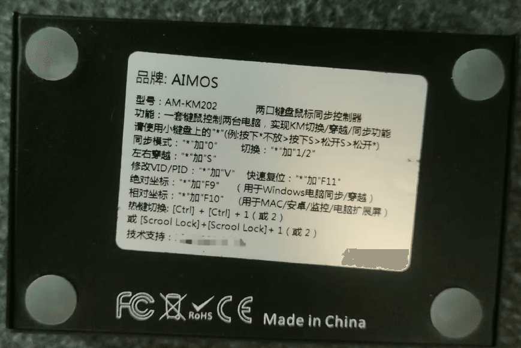
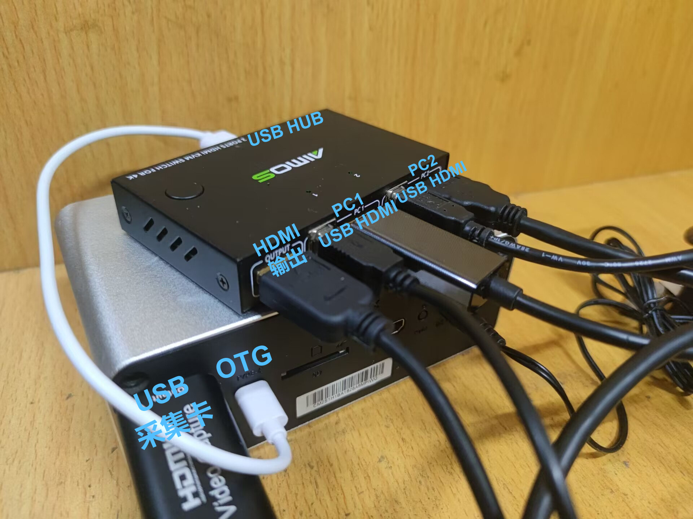
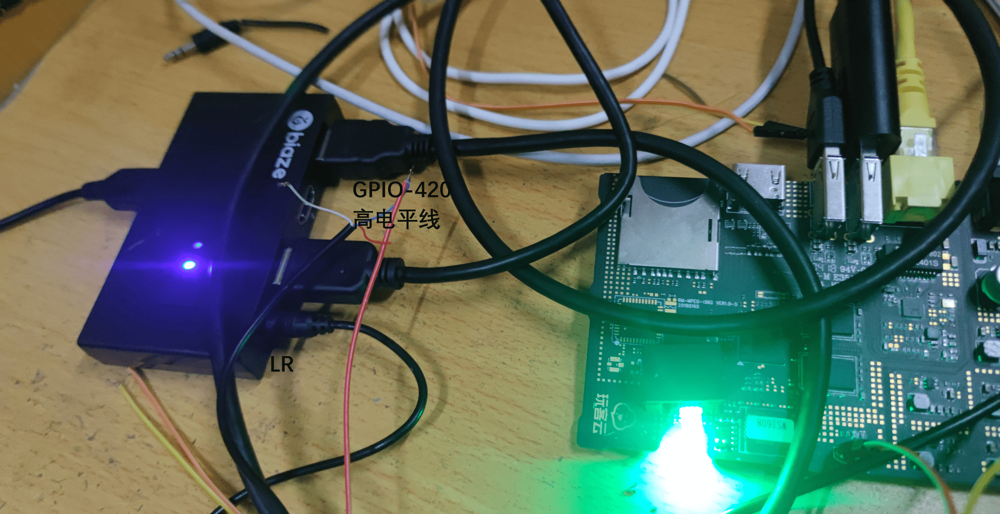

**热键切换**

硬件要求：需要使用支持热键控制的KVM切换器，以 AIMOS AM-KM202 为例进行说明。

硬件连接如下，可以在网页通过热键（虚拟键盘快捷键）进行视频画面和 USB 控制切换，实现一控多。

演示视频：

**GPIO 切换**

!!! warning
    此方法仅在玩客云上测试，只供参考，不保证完全可用。

通过玩客云GPIO控制KVM切换器切换显示，实现One-KVM一控多。

硬件要求：需要使用支持lr（音频口/红外口）控制的KVM切换器，接入音频线。

简要方法：将音频线剥开并测量对应电压，将高电平的一根线材与玩客云GPIO-420相连，即可通过网页的ATX电源管理菜单触发GPIO-420电平变化控制KVM切换器，从而实现通过One-KVM网页管理的一控多用途。

