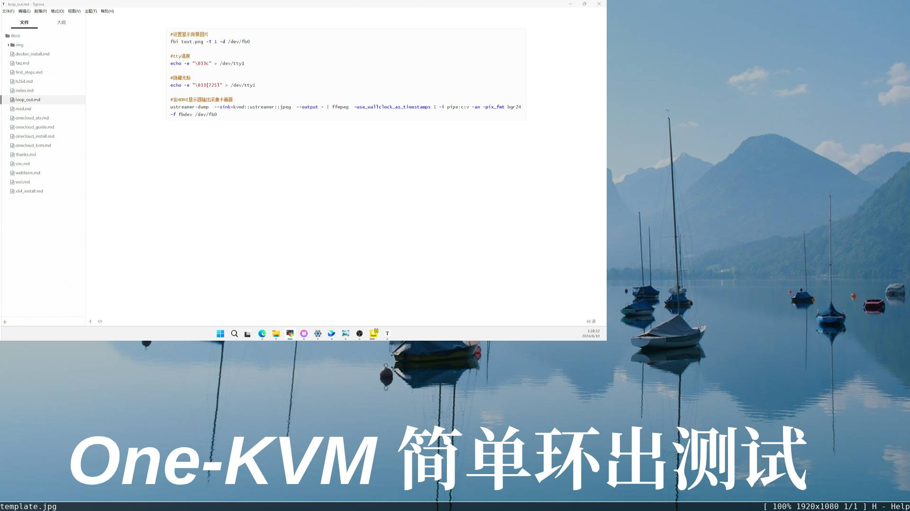

#### 实现玩客云HDMI环出

!!! warning
    此为实验性功能，仅通过初步测试，不保证完全可用。

```bash
#设置显示背景图片
fbi text.png -T 1 -d /dev/fb0

#tty清屏
echo -e "\033c" > /dev/tty1

#隐藏光标
echo -e "\033[?25l" > /dev/tty1

#在HDMI显示器输出采集卡画面
ustreamer-dump  --sink=kvmd::ustreamer::jpeg  --output - | ffmpeg  -use_wallclock_as_timestamps 1 -i pipe:c:v -an -pix_fmt bgr24 -f fbdev /dev/fb0
```


