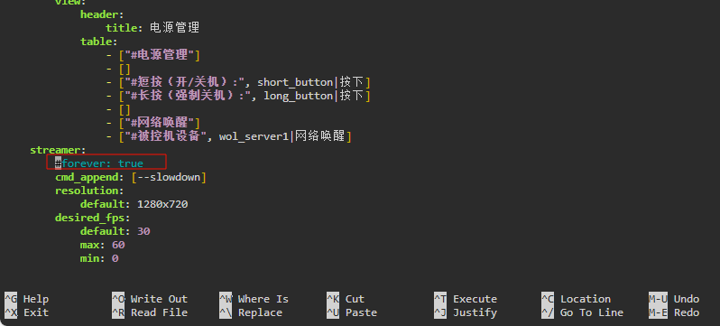

# HDMI环出

此功能使用设备自身的显示接口输出 USB 采集卡采集的画面。

### 使用

最新包 One-KVM_Armbian_by-SilentWind_for-Onecloud_24.6.18 中已预装此功能，更早的版本中没有预装此功能（若需要手动安装可参照文末教程）。 `kvmd-display` 服务默认为关闭状态，避免影响其他服务运行。如需要可执行如下命令可手动开启。

```bash
#取消注释“#forever: true”选项并应用
sudo nano /etc/kvmd/override.yaml
sudo systemctl restart kvmd
#启动 kvmd-display 服务
sudo systemctl start display
#设置 kvmd-display 服务开机自启
sudo systemctl enable kvmd-display
```




### 安装

```bash
#此功能默认未安装，开启需要执行 kvmd_display_install.sh 脚本
git clone --depth=1 https://github.com/mofeng-git/One-KVM.git
cd One-KVM 
sudo bash kvmd_display_install.sh

#停止 kvmd-ffmpeg 服务
sudo systemctl stop kvmd-display
sudo systemctl disable kvmd-display
```

