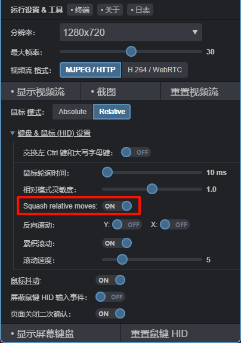

### 介绍

在 One-KVM 网页上，虚拟鼠标设备有两种模式：绝对模式和相对模式。在绝对模式下，输入设备传输光标移动的准确坐标（X、Y），类似于触摸屏或绘图板的工作方式；在相对模式下，只传输与当前位置的相对偏移（dX,dY），输入设备本身并不知晓，这就类似于普通的鼠标。

默认情况下，One-KVM 使用绝对定位模式，这对用户和软件来说最为方便。但是，BIOS/UEFI 可能有时不能完美支持这种模式。在这种情况下，可以在设置中将鼠标模式切换为相对模式。

使用相对模式时，点击一次 One-KVM 中的视频流窗口时，浏览器将独占你的鼠标，直到按 Esc 键时才浏览器会释放鼠标。

虚拟鼠标使用相对模式时会产生大量事件，这些事件在网络上的传输速度可能很慢，或者使得 BIOS/UEFI 驱动程序感知速度很慢。为解决这一问题，程序使用矢量和对鼠标事件进行了优化。要激活这些优化，选哟在菜单 "系统"->"Squash mouse moves"（压制鼠标移动）中启用该模式。如果遇到鼠标加速问题，可以尝试禁用。这是目前比较好的折中方案。

此外， VNC 服务目前还不支持虚拟鼠标的相对模式，原因是推荐的客户端都不支持 QEMU 指针运动变化扩展，此外移动浏览器也不支持虚拟鼠标的相对模式。