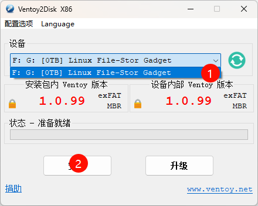
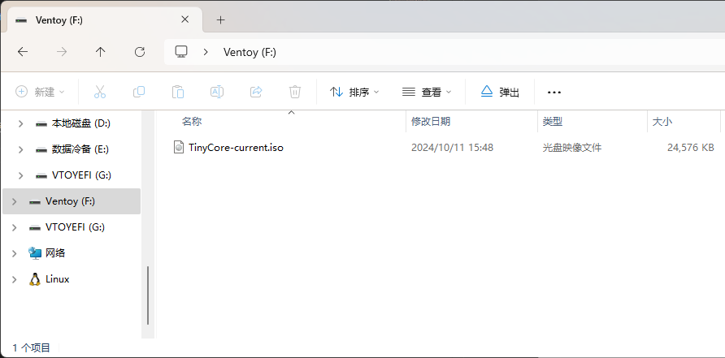
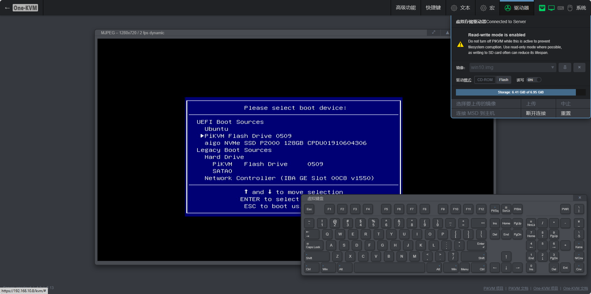
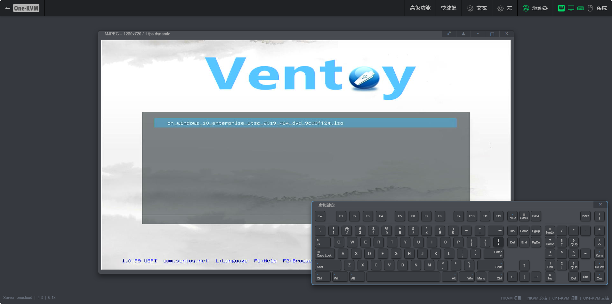

**MSD**（Mass Storage Drive），即大容量储存设备，可以实现远程上传文件，挂载镜像等功能。由于Linux限制，CD-ROM格式大小最大为2.2G，FALSH格式大小无限制。

!!! info 
      最大 CD-ROM 镜像文件大小为 2.2 GB，这是 Linux 内核限制。

!!! warning 
      对于玩客云 请不要在USB双公线（OTG线）与被控机断开或被控机关机时使用解除镜像挂载功能（ 断开连接），否则会因USB OTG 端口操作不可用致使内核疯狂持续报错，日志服务占用CPU 100%，系统稳定性下降。这时除非USB OTG连接恢复正常，MSD功能会一直保持不可用状态。

-----

### 新建 MSD 分区并启用 MSD

!!! tip 
      整合包 201004 版本以后，MSD功能默认启用（使用 /var/lib/kvmd/msd 目录），可任意指定目录（若无权限可执行 `chown kvmd -R /var/lib/kvmd/msd/` 使自定义目录可写），无需新建分区。

      若仍然新建分区挂载，需在 `/etc/kvmd/override.yaml` 中注释 msd 的子选项 `remount_cmd: /bin/true` 为 `#remount_cmd: /bin/true`，使 MSD 分区具有正确的权限。
      

下面三种方式任选其一即可，对于新手第三种方法更为推荐，使用虚拟磁盘文件做 MSD 分区，无需对物理磁盘进行分区，操作更加安全和简单。

??? 使用玩客云EMMC空间
    作者在安装篇的网盘的链接中提供了包含此软件的系统镜像（网盘路径：/One-KVM 相关/gparted_on_armbain_usbdisk.zip），刷入U盘后将U盘插到玩客云网口旁的USB口插电启动，连接ssh（root/1234）输入`gparted`即可启动磁盘分区软件。

    如果没有打开如图所示的Gparted软件界面请检查你的ssh终端是否支持X11转发功能。

    在打开的Gparted界面右键 /dev/mmcblp1p2 选择 Resize/Move 来调整分区，在Free space following框中输入新建分区的大小（可输入4096），再将分出来的空闲空间格式化为ext4格式，最后点击主界面选项卡下的“√”应用刚才的选择即可。

    

    


??? 使用SD卡

    建议不要使用杂牌储存卡（部分杂牌储存卡反应为Windows正常、Linux能识别但无法访问和读写）。

    ```bash
    #查看TF卡位置
    fdisk -l
    #将其格式化为ext4文件格式（将sdx替换为你的设备地址）
    mkfs.ext4 /dev/sdx
    ```

??? 使用虚拟磁盘文件

    通过新建一个新的 img 文件用作 MSD 文件系统，此方法通过已测试。

    ```bash
    #虚拟磁盘创建示例代码，512单位为 1M 的倍数，这个数字可以替换成你所需要的容量
    dd if=/dev/zero of=/root/diska.img bs=1M count=512
    mkfs.ext4 /root/diska.img
    ```


**挂载分区**

请确认要挂载的分区路径，不要出错（如/dev/mmcblk1、/dev/mmcblk0p3、/root/diska.img） ，这里以 /dev/mmcblk0 为例。
```bash
#查看系统所有分区
df -h

#在文件末尾添加如下挂载，如为/dev/mmcblk0需自行替换
nano /etc/fstab

/dev/mmcblk0p3 /var/lib/kvmd/msd  ext4  nofail,nodev,nosuid,noexec,rw,errors=remount-ro,data=journal,X-kvmd.otgmsd-root=/var/lib/kvmd/msd,X-kvmd.otgmsd-user=kvmd  0 0

#如果挂载操作报错请检查并修正错误
mount /dev/mmcblk0p3

#开启MSD功能，到/etc/kvmd/override.yaml修改msd选项为otg
nano /etc/kvmd/override.yaml
systemctl restart kvmd-otg kvmd
```

   
-----

### 手动上传镜像

One-KVM  将镜像文件存储在一个特殊的分区中，该分区挂载在 `/var/lib/kvmd/msd` 目录。如果该分区无法写入说明该分区是只读的，可执行下列命令。

```bash
#使 MSD 分区可写
sudo kvmd-helper-otgmsd-remount rw

#手动上传镜像文件到 /var/lib/kvmd/msd 目录

#使 MSD 分区制度
sudo kvmd-helper-otgmsd-remount ro
```

-----

### 可写闪存驱动器

在 PiKVM 上模拟闪存驱动器（flash）时，您可以允许目标主机将文件写入镜像。停止驱动器后，可以在本地主机上下载并打开此映像。 如果您需要从目标主机获取一些文件，这也可以实现。

使用此功能必须提前准备好虚拟闪存驱动器的文件系统镜像，这可以在本地主机或网页终端中完成。

#### 制作 ventoy 可引导镜像

对于 20241004 （不包含）以下版本，操作目录时需要先执行 `kvmd-helper-otgmsd-remount rw` 手动将内部存储重新挂载为读写模式。

1. 在 `/var/lib/kvmd/msd` 目录创建一个空的镜像文件，大小按需设置。本例中文件名为flash.img，大小为 4096MB。

   ```bash
   dd if=/dev/zero of=/var/lib/kvmd/msd/flash.img bs=1M count=4096 status=progress
   ```
2. 网页菜单选择驱动器 --> 镜像 --> flash.img，并将驱动模式由 cd-rom 切换为 flash，单击连接 MSD 至主机。

3. 被控机打开 ventoy ，选择虚拟的磁盘安装软件。
    

4. 将系统镜像放入 ventoy 分区文件夹。


结束后此 flash 镜像制作完成，在需要的时候挂载引导即可。



