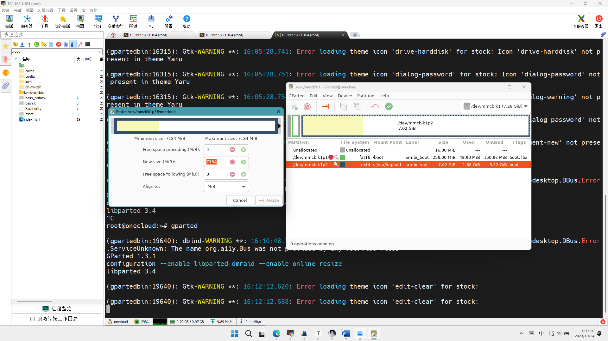
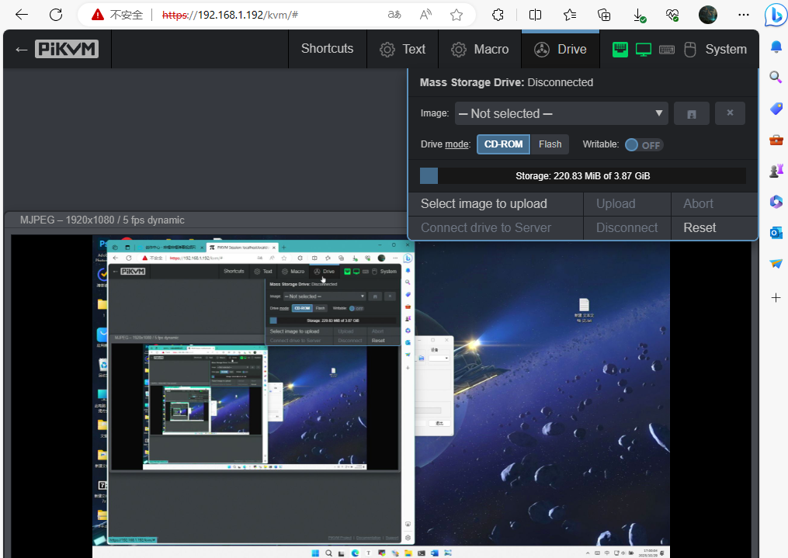

**MSD**（Mass Storage Drive），即大容量储存设备，可以实现远程上传文件，挂载镜像等功能。由于Linux限制，CD-ROM格式大小最大为2.2G，FALSH格式大小无限制。

!!! info 
      最大 CD-ROM 镜像文件大小为 2.2 GB，这是 Linux 内核限制。

!!! warning 
      对于玩客云 请不要在USB双公线（OTG线）与被控机断开或被控机关机时使用解除镜像挂载功能（ 断开连接），否则会因USB OTG 端口操作不可用致使内核疯狂持续报错，日志服务占用CPU 100%，系统稳定性下降。这时除非USB OTG连接恢复正常，MSD功能会一直保持不可用状态。

-----

### 新建 MSD 分区并启用 MSD

#### **使用玩客云EMMC空间**

作者在安装篇的网盘的链接中提供了包含此软件的系统镜像（网盘路径：/PiKVM相关软件/gparted_on_armbain_usbdisk.zip），刷入U盘后将U盘插到玩客云网口旁的USB口插电启动，连接ssh（root/1234）输入`gparted`即可启动磁盘分区软件。

如果没有打开如图所示的Gparted软件界面请检查你的ssh终端是否支持X11转发功能。

在打开的Gparted界面右键 /dev/mmcblp1p2 选择 Resize/Move 来调整分区，在Free space following框中输入新建分区的大小（可输入4096），再将分出来的空闲空间格式化为ext4格式，最后点击主界面选项卡下的“√”应用刚才的选择即可。





**挂载分区**

请注意EMMC系统分区是/dev/mmcblk1还是/dev/mmcblk0，这里以/dev/mmcblk0为例

```Bash
#查看系统所有分区
df -h

#在文件末尾添加如下挂载，如为/dev/mmcblk0需自行替换
#挂载虚拟磁盘文件不同于挂载分区，一定要以 "rw" 方式挂载
nano /etc/fstab

/dev/mmcblk0p3 /var/lib/kvmd/msd  ext4  nofail,nodev,nosuid,noexec,rw,errors=remount-ro,data=journal,X-kvmd.otgmsd-root=/var/lib/kvmd/msd,X-kvmd.otgmsd-user=kvmd  0 0

#如果挂载操作报错请检查并修正错误
mount /dev/mmcblk0p3

#开启MSD功能，到/etc/kvmd/override.yaml修改msd选项为otg
nano /etc/kvmd/override.yaml
systemctl restart kvmd-otg kvmd
```

#### 使用TF卡（SD卡）

建议不要使用杂牌储存卡（部分杂牌储存卡反应为Windows正常、Linux能识别但无法访问和读写）。

```bash
#查看TF卡位置
fdisk -l
#将其格式化为ext4文件格式（将sdx替换为你的设备地址）
mkfs.ext4 /dev/sdx

nano /etc/fstab
#在文件末尾添加如下挂载（将sdx替换为你的设备地址）
/dev/sdx  /var/lib/kvmd/msd  ext4  nofail,nodev,nosuid,noexec,ro,errors=remount-ro,data=journal,X-kvmd.otgmsd-root=/var/lib/kvmd/msd,X-kvmd.otgmsd-user=kvmd  0 0

#挂载分区（将sdx替换为你的设备地址），如失败报错请检查设备地址和挂载内容是否出错
mount /dev/sdx

#开启MSD功能，到/etc/kvmd/override.yaml修改msd选项为otg
nano /etc/kvmd/override.yaml
systemctl restart kvmd-otg kvmd
```

#### 使用IMG镜像

此方法通过已测试，可以使用。

```bash
#虚拟磁盘创建示例代码
dd if=/dev/zero of=/root/diska.img bs=1M count=512
mkfs.ext4 /root/diska.img

nano /etc/fstab
#在文件末尾添加如下挂载（将/root/diska.img替换为你的虚拟磁盘路径）
/root/diska.img /var/lib/kvmd/msd  ext4  nofail,nodev,nosuid,noexec,ro,errors=remount-ro,data=journal,X-kvmd.otgmsd-root=/var/lib/kvmd/msd,X-kvmd.otgmsd-user=kvmd  0 0

#挂载分区（将/root/diska.img替换为你的虚拟磁盘路径），如失败报错请检查设备地址和挂载内容是否出错
mount /root/diska.img

#开启MSD功能，到/etc/kvmd/override.yaml修改msd选项为otg
nano /etc/kvmd/override.yaml

systemctl restart kvmd-otg kvmd
```

-----

### 手动上传镜像

One-KVM  将镜像文件存储在一个特殊的分区中，该分区挂载在 `/var/lib/kvmd/msd` 目录。该分区默认是只读的，如果启用了 MSD 功能，或要上传新的映像，则会自动重新挂载以允许写入，这样做可以在突然断电时保护数据不受损害。

```bash
#使 MSD 分区可写
sudo kvmd-helper-otgmsd-remount rw

#手动上传镜像文件到 /var/lib/kvmd/msd 目录

#使 MSD 分区制度
sudo kvmd-helper-otgmsd-remount ro
```

-----

### 可写闪存驱动器

在 PiKVM 上模拟闪存驱动器（flash）时，您可以允许目标主机将文件写入镜像。，停止驱动器后，可以在本地主机上下载并打开此映像。 如果您需要从目标主机获取一些文件，这将非常有用。

使用此功能必须提前准备好虚拟闪存驱动器的文件系统镜像，这可以在本地主机或网页终端中完成。

这是一个示例，创建了一个 FAT32 文件系统的镜像文件。

1. 手动将内部存储重新挂载到读写模式：
   ```bash
   kvmd-helper-otgmsd-remount rw
   ```

2. 创建一个空的镜像文件 所需大小（本例中为 512MB）并将其格式化为 FAT32：`/var/lib/kvmd/msd`
   ```bash
   dd if=/dev/zero of=/var/lib/kvmd/msd/flash.img bs=1M count=512 status=progress
   loop=$(losetup -f)
   echo -e 'o\nn\np\n1\n\n\nt\nc\nw\n' | fdisk /var/lib/kvmd/msd/flash.img
   losetup -P $loop /var/lib/kvmd/msd/flash.img
   mkfs.vfat ${loop}p1
   losetup -d $loop
   chmod 666 /var/lib/kvmd/msd/flash.img
   ```

3. 将内部存储重新挂载回安全只读模式：
   ```bash
   kvmd-helper-otgmsd-remount ro
   ```
