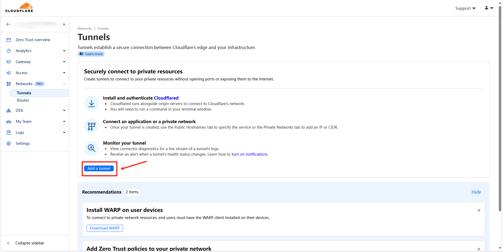
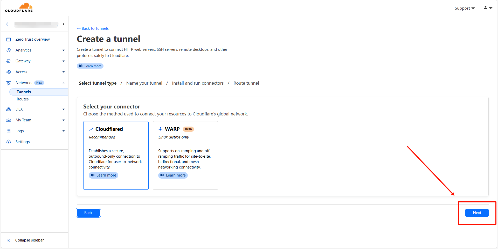
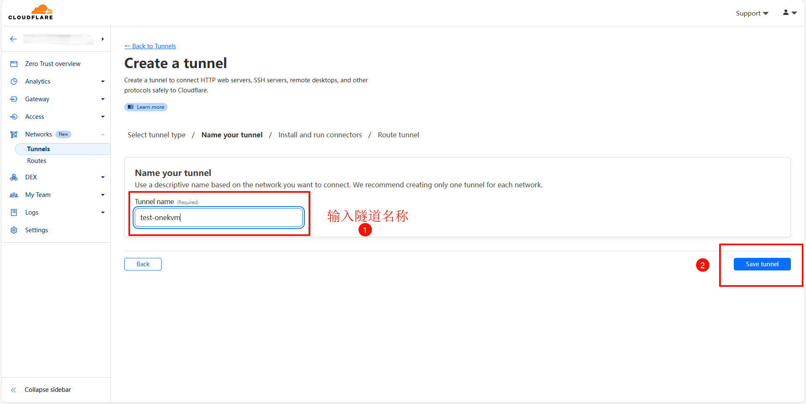
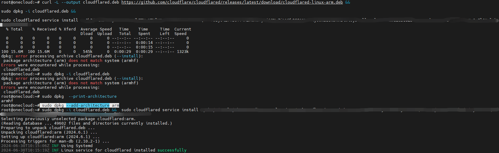
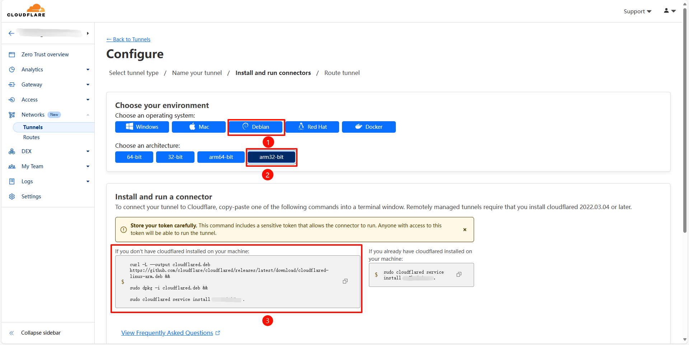
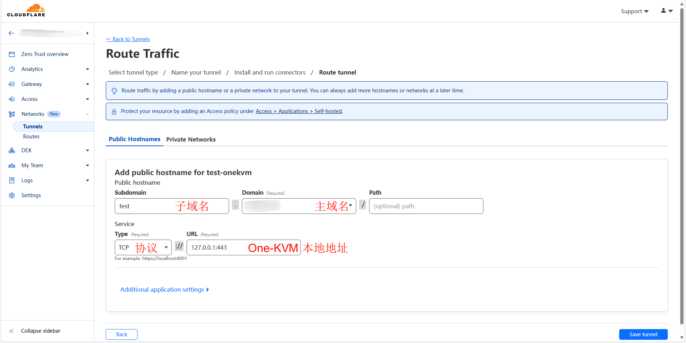
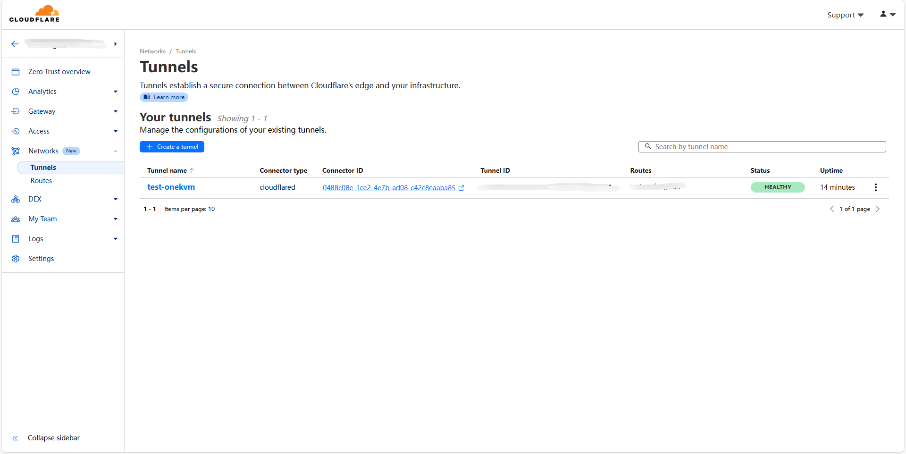

> Cloudflare Tunnel 为您提供了一种将资源连接到 Cloudflare 的安全方法，无需公共路由 IP 地址。使用 Tunnel，您不会将流量发送到外部 IP — 相反，基础设施中的轻量级守护程序 (cloudflared) 会创建与 Cloudflare 全球网络的仅出站连接。Cloudflare Tunnel 可以将 HTTP Web 服务器、SSH 服务器、远程桌面和其他协议安全地连接到 Cloudflare。这样，您的源站就可以通过 Cloudflare 提供流量，而不会受到绕过 Cloudflare 的攻击。

### cloudflared 隧道

要使用 Cloudflare Tunnel，需要你在Cloudflare 已经添加了域名，更多的详细内容可以参考 [Cloudflare Tunnel 中文文档](https://cloudflared.cn/)。

首先，进入 Cloudflare Zero Trust，在侧栏中点击 Network，展开后再点击 Tunnels。然后在 Select  connector to private resources 处选择 Add a tunnel，然后点击 Next。





选择 Add a Tunnel，点击Next，填入一个隧道名称，然后点击 Save Tunnel。



之后可以看到这个安装命令，选择对应的系统和架构，点击命令栏可以复制命令。

注意，如果你是在 armhf 架构上的设备（如玩客云）上，由于 Cloudflared arm32-bit 软件包为 arm 架构，需要在执行 Cloudflare 网页所给命令前，执行如下命令添加此架构软件包的安装支持。

```
sudo dpkg --add-architecture arm
```





点击 Public Hostnames 的 tab，点击 Add a public hostname，之后选择 TCP 协议填入 One-KVM 的内网 IP 和端口，填写完成后点击 Save tunnel 保存配置。主域名只能使用已经添加到 Cloudflare 的域名。



最后就可以看到正在运行的 Cloudflare Tunnel 了。



??? note "网页远程访问需要使用"https://"协议头"
    注意，远程访问 One-KVM 网页时需要手动在网址栏添加"https://"协议头，否则默认的"http://"协议头会返回错误"400 Bad Request The plain HTTP request was sent to HTTPS port"。

    