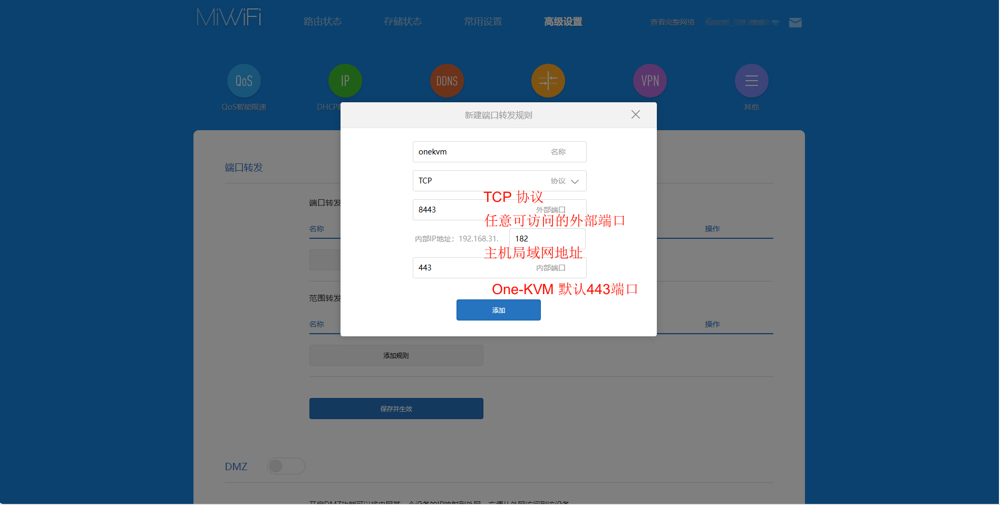

如果需要从互联网访问 One-KVM，最简单的方法是在路由器上设置转发端口。在这种情况下，需要运营商给路由器分配了公网 IPv4 或公网 IPv6 地址。

### 端口转发配置

!!! tip "安全建议"
    要配置端口转发将 One-KVM 服务暴露到公网上时，强烈建议您设置强密码并启用双因素认证以防止未授权访问。<br>
    如果没有公网 IP 地址，可以考虑使用 Frp、Tailscale 等工具实现端口映射或异地组网。

One-KVM 整合包版本的 Web 界面默认使用以下端口：

- HTTP：80 端口（会自动重定向到 HTTPS）
- HTTPS：443 端口

One-KVM Docker 版本的 Web 界面默认使用以下端口：

- HTTP：8080 端口（会自动重定向到 HTTPS）
- HTTPS：4430 端口

通常情况下，只需要转发 443 或 4430 端口即可访问 Web 管理界面。

以下是在小米路由器管理后台配置端口转发的示例。



!!! note "使用 HTTPS 协议访问"
    访问 One-KVM 网页界面时，必须使用 `https://` 协议头，例如：
    ```
    https://your-domain:port
    ```
    使用 `http://` 将会收到 "400 Bad Request" 错误

    