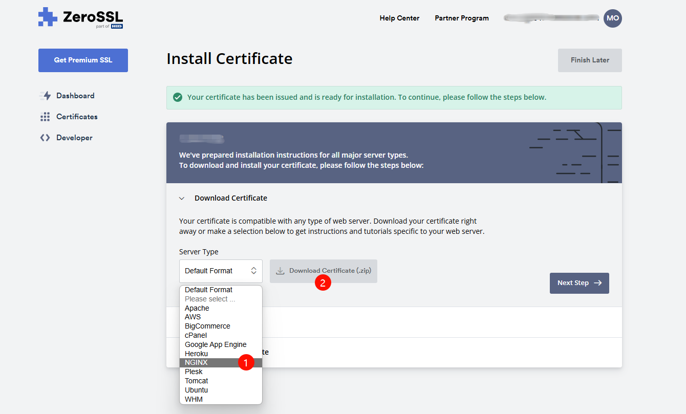

### 更换 SSL 证书

!!! note "One-KVM 默认使用自签名证书"
    One-KVM 默认使用自签名证书，存放在 `/etc/kvmd/nginx/ssl/` 目录下。由于是自签名证书，浏览器会提示不安全。您可以替换为受信任的 SSL 证书来解决这个问题。

以下以 ZeroSSL 免费证书为例，演示如何更换 SSL 证书：

1. 在 ZeroSSL 控制台添加您的域名或 IP，完成域名验证
2. 下载 NGINX 格式的证书文件包



3. 将下载的证书文件重命名并上传：

    - 将证书文件重命名为 `server.crt`
    - 将私钥文件重命名为 `server.key`
    - 上传至 One-KVM 的 `/etc/kvmd/nginx/ssl/` 目录

4. 重启 kvmd-nginx 服务使新证书生效：
```bash
sudo systemctl restart kvmd-nginx
```


!!! tip "其他证书提供商"
    如果您使用其他证书提供商，操作步骤类似，主要确保证书和私钥文件重命名正确并放置在正确的目录即可。