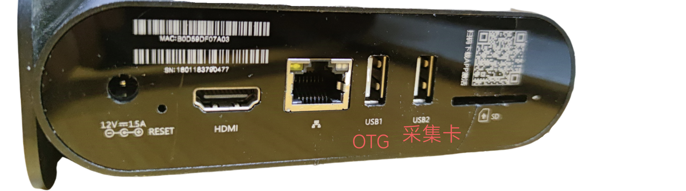
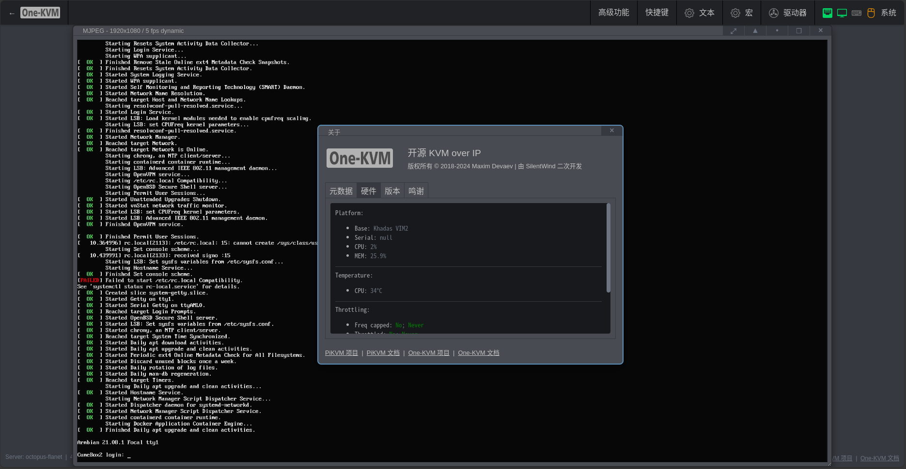

### 硬件介绍

章鱼星球为 2345 联盟出品的 ARM 盒子，现其客户端程序已无法使用。

配置：S912 八核 CPU，2G + 8G 内存和储存。

接口：1个千兆网口，2个 USB2.0，1个 HDMI，1个 TF卡槽。

### 整合包部署

大致流程：

- 通电使用 USB_Burning_Tool 晶晨刷机软件线刷精简版 android tv 固件

- 将整合包写入 U 盘中，插入章鱼星球盒子二维码旁的 USB 口（USB2）

- 待安卓系统启动后通过 `adb connect yourip` 命令连接安卓系统，通过 `adb reboot update` 命令重启引导启动 U 盘中的系统（仅第一次需要执行命令，后续插 U 盘可自动从 U 盘启动）

- U 盘中的系统启动后，ssh连接进入终端，用 `armbian-install` 命令选择202型号和1分区把 One-KVM 的固件 img 写入 emmc

???+ help "关于使用 USB1 口启动方法"

    有使用者反馈机器无法从 USB2 口启动 U 盘系统，这种情况可使用如下方法使用 USB1 口启动 U 盘系统。  
    整合包写入 U 盘后，编辑 U 盘 BOOT 分区根目录下文件 uEnv.txt 将 "FDT=/dtb/amlogic/meson-gxm-khadas-vim2.dtb" 一行替换为 "FDT=/dtb/amlogic/meson-gxm-q200.dtb"，再编辑 U 盘 ROOTFS 分区 etc 目录下 rc.local 文件在第二行开头添加"#"注释保存。  
    在成功使用 USB1 口启动 U 盘系统并登录后需要再次编辑 /etc/rc.local 文件删除第二行开头的"#"注释符号，保存此文件后再执行 `armbian-install` 将系统写入 EMMC。

安装示例：

### 使用说明

!!! tip
    部分低功耗设备在未接通电源时可能通过 USB 线从章鱼星球 OTG 口取电并启动至异常状态，再接通电源也无法启动。要解决此问题，您可以剥开 USB 线剪断红色5V细电线。

**SSH**

Armbian 系统默认开启 SSH，SSH 初始用户密码为 root/1234。

**硬件连接**

网口旁 USB 口为 OTG 口接 USB 双公线，二维码旁 USB 口为普通 USB 口接 USB HDMI 采集卡。

**软件截图**

